# arrow-rs Parquet reader for Ray Data V2 — case, design, findings

**Status:** prototype, wired into the DataSource V2 path, flag-gated. **Local and S3
correctness** are validated on macOS (S3 via a moto server). A first **Linux
(Anyscale workspace) measurement phase ran and mostly invalidated its own metric**
rather than the implementation (§3.5.1) — its salvage: a Ray-free probe and per-worker
traces confirming arrow-rs ≤ PyArrow on the very layouts the metric flagged, and a
hardened harness. The suite now measures ONE thing: **per-task absolute USS over time
vs Ray's own per-task provisioning assumption** (§3.5.1); the full Linux + real-S3
rerun on that metric is the next experiment. Nothing committed upstream.

**Purpose of this doc:** hand this to a reviewer cold. It states *exactly* the case we
target, *exactly* what we built, every design choice and its rejected alternative, the
real (Ray-integrated) benchmark numbers, the optimizations and fixes by phase, and —
most importantly — the open holes we want critiqued. It is self-contained: it assumes
you know Ray Data and Parquet at a high level but nothing about this work.

> **Note on an older version of this file.** A previous version reported 7–29× memory /
> 4–5× speed wins "over S3." Those came from a *standalone* Rust benchmark binary
> (`main.rs`) that decoded-and-dropped over S3 — not from Ray. Every number in *this*
> document comes from the **real Ray-integrated reader** running locally on macOS. The
> S3 story is deferred to a later phase and is explicitly **not** claimed here.

---

## 0. The 60-second version

- **What we target:** the single painful Parquet layout Ray's own reader can't
  parallelize — **one big row group in a lone fragment** — flat schema, on **local or S3**.
  Everything else (nested/dictionary/extension schemas, other filesystems) falls back to
  PyArrow, transparently and by design.
- **Why arrow-rs helps:** PyArrow must **materialize the whole decoded row group** to
  emit any batch, so its peak RSS is dictated by the file. arrow-rs **streams
  byte-budgeted batches** (~8 MiB each), so its decode working set is a knob we set, not
  a property of the file.
- **Headline finding (real integrated reader, macOS, 800 MB single-row-group file,
  `iter_batches`):** arrow-rs peaks at **519 MB vs PyArrow's 2332 MB (4.5× less)** and
  finishes in **5.14 s vs 8.15 s (1.6× faster)**. The memory win is the robust result;
  the speed win is a *consequence* of it (less memory pressure on the materialization
  path).
- **The one honest speed regression:** on a *pure-decode-bound* scan (touch every column,
  throw the output away) arrow-rs's raw decode is slower — but this is **single-thread and
  schema-dependent**: at the thread count a Ray worker actually gets (`pa.cpu_count()==1`)
  it's **parity on moderate strings and ~1.5× slower on wide strings** (§5.7). PyArrow's
  bigger apparent lead is multi-threaded column decode, which **Ray disables per worker**
  (parallelism comes from processes). Wherever output is materialized (§5.1) or spread
  across processes (§5.6), it reverses.
- **Chosen local default: K = 1.** Intra-fragment K-split costs memory (+140 MB going
  K=1→4 on the huge case) for negligible local speed. K-split's value is an S3
  phenomenon (concurrent GETs hide network latency); there is no latency to hide
  locally. K-split stays in the crate, gated to the lone-big-fragment case, reserved for
  the S3 phase.
- **How we judge memory (the metric of record, §3.5.1):** one graph per config — every
  read task's **absolute worker USS over time** against **E = 2 × target_max_block_size**,
  Ray's own per-task provisioning assumption (`context.py:44`). No baseline subtraction,
  no summary scalars; the question is whether tasks stay near the line Ray schedules by.
  This replaced an incremental metric that produced a false regression on Linux and was
  dissected in §3.5.1/§5.10.
- **What's unproven:** the full Linux suite + real-S3 numbers on that metric (the
  deciding run), projection/predicate pushdown, nested/dictionary/decimal schemas, and
  whether the K-split concurrency can be redesigned to win locally too (§7).

---

## 1. The exact case we target

Ray Data's V2 Parquet reader chunks work **row-group-aligned** and fans row-group
sub-fragments across a small thread pool (`RAY_DATA_READ_FILES_NUM_THREADS`, default 4).
That pool is Ray's only intra-file parallelism, and it **cannot split a single row
group** — the chunker treats a row group as atomic. So when a file is written as *one
big row group* (common: Spark/pandas defaults, `row_group_size` = row count), that whole
group is a lone fragment handed to a single worker, and PyArrow decodes it essentially
single-threaded while holding the entire decoded group resident.

That is the case we route to arrow-rs. Concretely, `_arrow_rs_supported()` admits a
fragment **only** if all of these hold:

- **local or S3 filesystem** (`LocalFileSystem` / `S3FileSystem`) — every other
  filesystem (GCS, ABFS, HTTP, …) falls back. The S3 path recovers the full connection
  config (endpoint, credentials, region, addressing style) from the pyarrow
  `S3FileSystem` via `fs.__reduce__()`, so credentialed / MinIO / moto / custom-endpoint
  buckets decode identically to PyArrow (§5.9);
- **flat columns only** — no nested / dictionary / extension types;
- **no `int96` timestamp coercion**, no forced `dictionary_columns`;
- **non-empty, non-dotted projection** — empty projection (count-style scans) and nested
  projections fall back;
- **no per-fragment schema evolution** — a column whose per-fragment type differs from
  the unified schema, or is absent from the fragment, falls back (PyArrow does the
  null-fill / cast).

Anything failing the gate transparently calls `super()._iter_fragment_tables(...)`
(PyArrow). **Correctness is therefore never at risk** — the gate only narrows *where the
arrow-rs path runs*, never what the output is. The cost of the gate is that benchmarks
must confirm the arrow-rs path actually ran (it does — see the `test_native_path_actually_runs`
test and the parity tests).

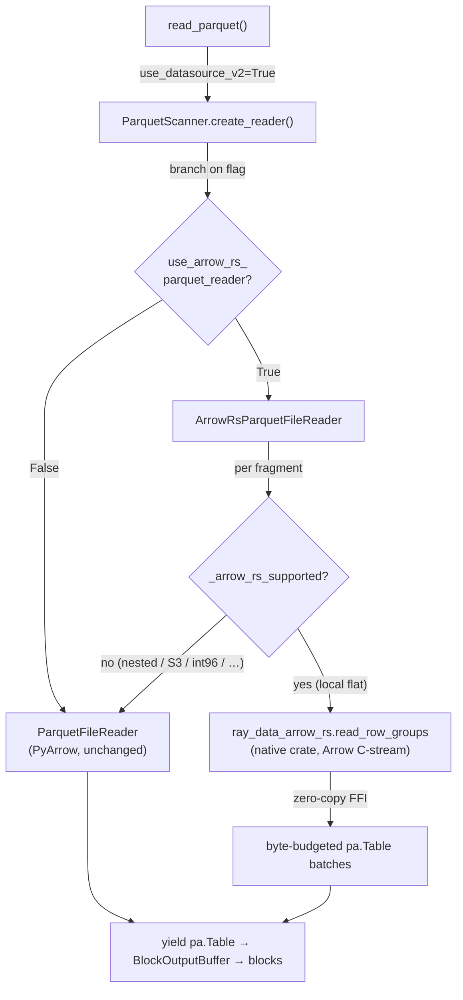

---

## 2. Where we plug in (the integration seam)

Three edits, all mirroring the existing `use_datasource_v2` flag pattern:

1. **`context.py`** — new `DataContext.use_arrow_rs_parquet_reader` field, env
   `RAY_DATA_USE_ARROW_RS_PARQUET_READER`, default `False`. Only takes effect under
   `use_datasource_v2=True`.
2. **`scanners/parquet_scanner.py`** `create_reader()` — branch on the flag; return
   `ArrowRsParquetFileReader` (same constructor args) or `ParquetFileReader`. The
   arrow-rs import is lazy (inside the reader), so a missing native module never breaks
   the default path — but if the flag is on and the module import fails, we **raise with
   a build hint** rather than silently falling back (silent fallback would corrupt
   benchmark attribution).
3. **`readers/arrow_rs_parquet_file_reader.py`** — the reader (below).

The reader subclasses `ParquetFileReader` and overrides **only** three methods:
`_iter_fragment_tables` (the decode step), `_resolve_batch_size` (byte-budget sizing),
and `_on_batch_read` (no-op). Everything else — row-group fan-out, projection
resolution, `path`/`row_hash` synthesis, `limit` slicing, block sizing, per-fragment
retry — is inherited unchanged. This is the smallest possible seam: we swap the decode
kernel and nothing else.

A Ray "block" *is* a `pyarrow.Table`, and the reader contract is just
`Iterator[pa.Table]`, so no block-layer or executor changes are needed. The native crate
returns an Arrow **C-stream** consumed zero-copy via `pa.RecordBatchReader.from_stream`.

---

## 3. Memory: how Ray schedules on it, why PyArrow OOMs, and how we measured it

This is the crux of the whole project, so it gets its own section. The short version:
**Ray decides how many read tasks to run based on a memory number that does not include
PyArrow's decode explosion.** So Ray keeps admitting tasks while each worker quietly eats
gigabytes of heap Ray never counted — until the node OOM-kills. arrow-rs makes that
hidden number small and flat, so Ray's estimate and reality reconverge.

### 3.1 How Ray decides how many tasks to run (the scheduling memory model)

Ray Data's streaming executor admits a new task only when the operator's resource request
fits the remaining budget. The gate is `ReservationOpResourceAllocator.can_submit_new_task`
(`_internal/execution/resource_manager.py:776`):

```python
return (
    op.incremental_resource_usage().satisfies_limit(budget)
    and budget.object_store_memory
        >= (op.metrics.obj_store_mem_max_pending_output_per_task or 0)
)
```

So a task is admitted iff **(CPU/GPU slots fit) AND (object-store budget ≥ estimated
pending output bytes)**. That's the entire memory model. And note *which* bytes:

- The per-task object-store **max** requirement is hardcoded to infinity —
  `_internal/execution/operators/task_pool_map_operator.py:261`:
  ```python
  # we don't know how much data each task can output.
  object_store_memory=float("inf"),
  ```
- The estimate it *does* use, `obj_store_mem_max_pending_output_per_task`, is derived from
  `average_bytes_per_output` — a **lagging average of logical output bytes**
  (`_internal/execution/interfaces/op_runtime_metrics.py:755`), where each block's size is
  `table.nbytes` (`_internal/arrow_block.py:355`: `return self._table.nbytes`).

`table.nbytes` is the **logical Arrow-buffer size of the finished block** — the thing that
gets placed in the shared plasma object store. There is **no term anywhere in the
admission predicate for the worker's process heap / RSS**. Ray schedules purely on
CPU slots + the size of the *output blocks* it expects to land in the object store.

Ray does, however, state what it *assumes* a task's footprint is. The comment justifying
the 128 MiB default block size (`context.py:44`) does the provisioning arithmetic
explicitly: *"With streaming execution and num_cpus many concurrent tasks, the memory
footprint will be about 2 \* num_cpus \* target_max_block_size ≈ RAM \*
object_store_fraction \* 0.3."* That is, Ray's design assumes each task occupies about
**E = 2 × target_max_block_size** (256 MiB by default). This E is the reference line the
benchmark draws on every per-task memory graph (§3.5.1): a reader whose tasks stay near E
makes Ray's assumption true; a reader whose tasks tower over it is the hidden heap that
OOMs nodes. It is Ray's number, not ours.

### 3.2 Why PyArrow OOMs the node

The output block is not where the memory goes. A read task is a Ray generator that builds
each block in the **worker's private heap**, then `yield`s it into shared plasma
(`_internal/execution/operators/map_operator.py:887`). Ray only ever accounts for the
*post-yield* object-store size. The **decode working set** — everything the worker
allocates to produce that block — lives in private heap and is invisible to the gate.

For PyArrow that working set is the whole row group: to emit even one small batch,
`iter_batches` materializes the **entire decoded row group**, whose size is a property of
the file you don't control. So the real picture is:

```
what Ray budgets   = table.nbytes of the output block   (logical, ~128 MiB coalesced)
what the worker uses = whole decoded row group + scratch (can be GBs, invisible)
```

When those diverge, here is the precise failure — and it is worth stating carefully,
because the admission gate ANDs a CPU check with the object-store check
(`resource_manager.py:783-790`), so the memory term can only make admission *stricter*, never
looser. The object-store gate exists to **throttle read concurrency down** when output
blocks are large. Because the decode heap is absent from the estimate, that throttle
**never engages** — so concurrency stays pinned at the CPU cap (`num_cpus`, since a
task-pool read op sets no max-concurrency by default), while each of those `num_cpus`
workers balloons to a multi-GB decode working set in private heap. `num_cpus` × a multi-GB
hidden working set overruns physical RAM, and because it's process heap (not object-store,
which *can* spill) the result is a hard kernel **OOM-kill, not a spill**. The failure is
**bounded and knowable** — exactly `num_cpus` concurrent big decodes — not unbounded
admission; which also means the size of the win **scales directly with core count** (more
cores → more simultaneous big decodes → more overcommit).

The plot below is one 800 MB single-row-group file read with `iter_batches`. Red/blue solid
= actual worker private heap (USS) over time; **black dashed = plasma object-store occupancy
(`object_store_bytes_used`, measured).** PyArrow's heap **spikes to 4.4 GB** while plasma
occupancy tops out near 1.4 GB — a ~3× gap of memory that never enters the admission
estimate — and it sawtooths, never settling. arrow-rs holds a flat ~680 MB.


> **Careful about the dashed line.** It is *measured plasma occupancy*, which is a good
> proxy for "what Ray sees" but is **not literally the scheduled quantity**. The number the
> gate actually uses is `obj_store_mem_max_pending_output_per_task` (a lagging average of
> `table.nbytes`, `op_runtime_metrics.py:755`), which we do not yet log. Directly tracing
> that estimate — to prove the gate is blind rather than infer it from plasma — is a planned
> instrumentation fix (§7). The claim is correct; this plot supports it by proxy, not by
> direct measurement.

Both readers on one axis (solid = actual private heap, dashed = plasma occupancy).
PyArrow's heap (4388 MB) towers over plasma (~1400 MB); arrow-rs's heap (678 MB) is small.
Side-by-side per-worker versions of every plot are in `agents_assets/`
(`*__iter_batches.png`, `*__decode_drop.png`).

### 3.3 The decode-heavy, output-light case (real workloads)

The gap is starkest when the consumer decodes a lot but retains almost nothing — so the
decode working set is the whole story and there's no output block to equalize the two
readers. The honest versions of this are real workloads, not a synthetic probe: an
**aggregation** (`ds.sum("i0")`) and a **selective filter** (`ds.filter(expr="i0 > hi")`,
keeping a sliver). Both force a full decode; both emit ~nothing. 4 M int rows, one big row
group:


- **`sum(i0)` → 1.07× (505 → 472 MB).** Near parity. The aggregation streams and the output is
  one scalar, so neither reader carries a big working set past the decode — arrow-rs's flat
  decode transient gives it only a slight edge. Honest: no dramatic win when the decode unit
  is small relative to nothing-retained.
- **`filter(i0 > hi)` → 2.37× (829 → 349 MB).** The filter is a downstream operator, so the
  read decodes *all* 4 M rows and the filter drops all but 6. PyArrow materializes the whole
  decoded group plus the filter pipeline; arrow-rs decodes byte-budgeted batches and releases
  each as the filter consumes it. This also **honestly exercises the no-predicate-pushdown
  limitation** (§4.7): arrow-rs decodes rows it immediately throws away — and *still* wins on
  peak memory, because the decode transient never accumulates.

Two framing notes so this isn't over-read:

- **This is not a *distinct* mechanism from §3.2** — it's the same "decode heap is invisible to
  the object-store gate" point on a realistic consumer. Concurrency stays pinned at `num_cpus`
  and each of those workers decodes off-budget; a retain-nothing consumer just makes the
  decode transient the *only* thing on the heap, so the readers' floors show through cleanly.
- **The earlier synthetic `decode_drop` probe** (a `map_batches` returning a row count) is kept
  only as a decode-CPU isolator in §5.1/§5.5, not as a memory claim — its "plasma ≈ 0" was
  partly a Read↔map fusion artifact (`plan_read_op.py:127`), and a real `count()`
  short-circuits to footer metadata without decoding at all.

### 3.4 Why arrow-rs is flat (the mechanism)

A Parquet file is `file → row groups → column chunks → pages`; a row group is the natural
decode unit. PyArrow decodes a whole one at a time. arrow-rs instead sizes each decode
batch **by bytes, not rows**: it reads the row group's uncompressed size / row count from
the footer and picks a row count so `rows × bytes_per_row ≈ decode_budget_bytes` (~8 MiB).
A wide-string group gets few rows/batch, a numeric group many — both land near the budget.
Each batch is dropped as Python pulls the next, so the decode transient is **flat across
schemas and file sizes**, and is a knob we set rather than a property of the file.

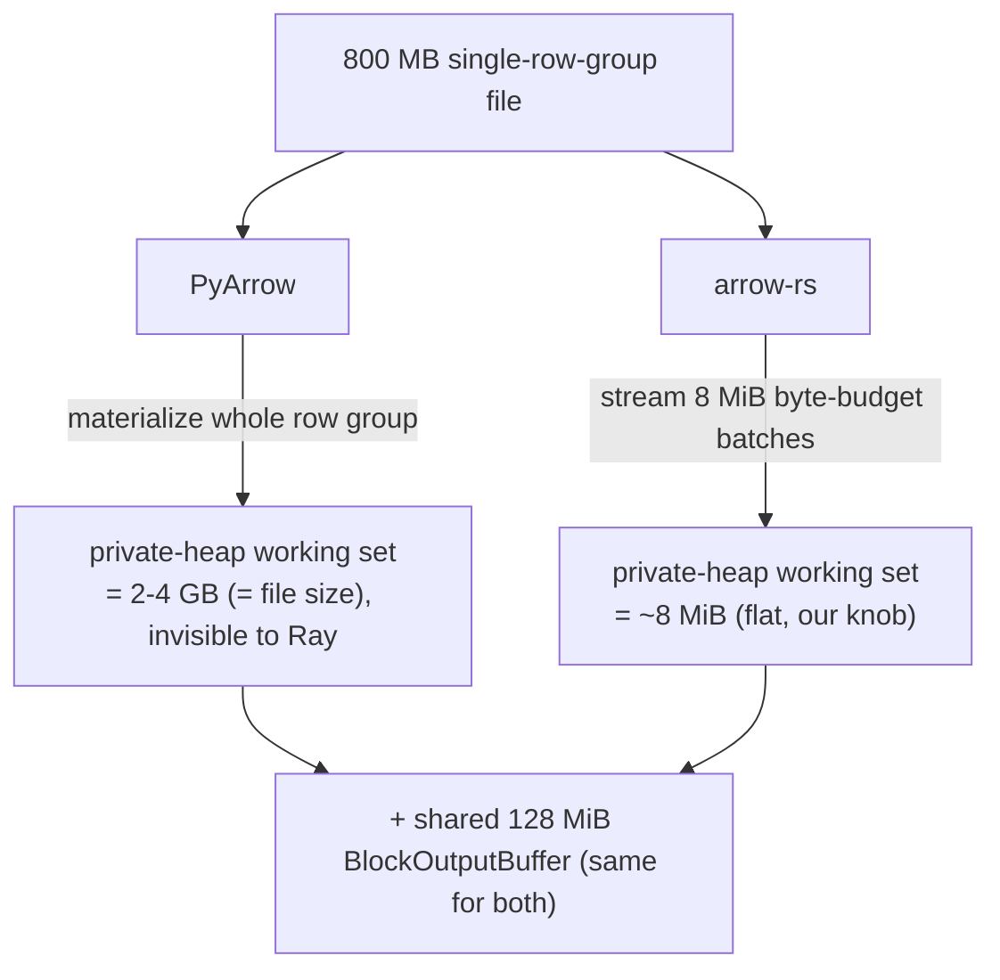

The retained-output-block term (the coalesced ~128 MiB block that Ray *does* see) is
identical for both readers — it's the downstream `BlockOutputBuffer`. arrow-rs's entire win
is on the invisible decode-transient term. And critically, arrow-rs's private heap ends up
**smaller than the object store Ray already tracks** — so it converts an unbounded,
invisible explosion into mostly-visible, spillable, object-store-accounted memory. That is
the structural win, beyond the raw ratio.

**Where arrow-rs neither helps nor hurts:** when a file has many small row groups, Ray's
own thread pool spreads them across workers so no single worker ever holds a big group.
Both readers stay flat and near-identical there (370 vs 407 MB below — the gap is just
import floor), which is the correct "not worse" outcome:


### 3.5 How we measured this, and why

**The quantity: per-worker private heap (USS).** Node OOM is driven by resident physical
memory, and the piece Ray *doesn't* model is each worker's **private** heap — the decode
working set — not shared pages. So we measure **USS** (unique set size: pages resident only
in that process), which excludes shared libraries and the shared plasma object-store
segment. This is exactly the quantity that (a) causes the OOM and (b) is absent from the
admission gate. It is also literally the field Ray's own `MemoryProfiler` samples
(`_internal/util.py:1792` uses `memory_full_info().uss`) and attaches to block metadata as
`max_uss_bytes` (`map_operator.py:878`) — but that value is **advisory only**: its sole
consumers are the reported metric and a *warning* in `high_memory_detector.py:84`. It is
referenced nowhere in `resource_manager.py`. Ray measures the right number and then does not
schedule on it.

**Why not RSS (what our first harness used):** RSS includes shared pages, so it (a)
double-counts the object store and shared libs across K workers and (b) is partly the very
thing Ray *does* track. It conflates the visible and invisible memory. Worse, a per-PID
`max − min` RSS metric we tried was contaminated by worker **import ramp** on short reads
(whether the poller caught a worker before it finished importing PyArrow was luck), which
produced swings of 133→211 MB across identical runs — pure measurement noise, not real
behavior. USS + the method below removes both problems.

**How we sample it:** externally polling another process's USS is `AccessDenied` on macOS,
and external RSS polling misses sub-100 ms transients. So each worker samples **its own**
USS from inside the process: a `worker_process_setup_hook` starts a daemon thread at worker
boot that records `memory_full_info().uss` every 5 ms to a per-worker CSV, epoch-timestamped
so all workers align on one wall clock. In parallel the driver samples Ray's object-store
usage (`object_store_bytes_used`) — "what Ray sees" — on the same clock.

**Why step functions, not connected lines:** USS is a piecewise-constant gauge sampled at
discrete instants; drawing sloped lines between samples invents values we never observed.
We render `where='post'` steps (hold-last) so the plot claims only what was measured. We
plot **absolute** USS (not baseline-subtracted) because the worker's whole private heap is
what's invisible to Ray; a dotted "import floor" line marks the interpreter+libs baseline so
the decode explosion above it is legible. The goal is **consistency over time**, not a
single peak — which is why PyArrow's *sawtooth that never settles* and arrow-rs's *flat
plateau* are the real finding, visible only in the time series.

The instrument lives in `release/nightly_tests/dataset/arrow_rs_memtrace/` (sampler
`hookdir/worker_mem_sampler.py`, driver `mem_over_time.py`, plotter `plot_mem.py`);
the figures in this section are under `python/ray/data/agents_assets/`.

### 3.5.1 The Linux relapse, and the metric of record (per-task absolute USS vs E)

Everything above got one thing right that we then un-learned and had to re-learn the
hard way. The mac harness plotted **absolute** USS; when the suite moved to the Linux
workspace, `bench_suite.py` switched to **windowed incremental node-sum USS** (peak minus
each worker's first-in-window sample, summed over workers) to cancel the idle pre-started
workers of a shared many-core node. That rebuilt the §3.5 import-ramp trap in a subtler
form, and it bit: one layout run reported arrow-rs **6.8× worse** on a many-small-groups
file (153 vs 22 MB) — a result every other measurement contradicted.

The postmortem killed three hypotheses in a row, each by direct measurement rather than
another theory: **(1)** per-row-group crate-call overhead — dead: a Ray-free probe
(`micro_alloc_probe.py`) decoding the *same file* showed one-call-for-all-groups and
one-call-per-group within 1 MB of each other; **(2)** allocator retention (glibc vs
PyArrow's jemalloc) — dead: the same probe under `LD_PRELOAD` jemalloc moved nothing,
and arrow-rs standalone peaked at **38 MB vs PyArrow's 89 MB** on that very file;
**(3)** lazy extension import multiplying per worker — dead: import+init measured **zero**
(baseline 27.7 MB = import-and-touch 27.7 MB). What remained: the metric itself. A read
landing on a **cold** worker pays its ~100 MB import ramp *inside* the window; a **warm**
worker's baseline *hides* warmup-retained heap — and retention scales with the reader's
own working set, so baseline subtraction **systematically flatters whichever reader
retains more** (PyArrow) and penalizes the other. Decisive on small fixtures (~90 MB
signal vs ~100 MB bias), negligible on big ones. The anomalous run's traces were
destroyed by its own rerun (`_run_dir` wipes per run); every reproducible source —
mac (§5.5), Ray-free probe, fresh per-worker Linux traces (arrow-rs Δ89.1 vs PyArrow
Δ98.7, one worker each) — shows parity-to-better. Full detail: §5.10.

**The metric of record, fixed before the full Linux rerun and applied uniformly.**
One graph per benchmark config (`task_mem.py` → `figs/task_mem/`): the executing
worker's **absolute USS over time for every read task** (red = PyArrow tasks, blue =
arrow-rs tasks, each aligned at its own start) against a dashed line at
**E = 2 × target_max_block_size** — Ray's provisioning assumption, verbatim from
`context.py:44` (§3.1), recorded per run from the live `DataContext`. Task windows come
from the worker hook patching `FileReader.read`
(`readers/file_reader.py:192` — the one per-task entrypoint **both** readers inherit);
a Ray worker runs one task at a time, so clipping its USS samples to the window *is*
that task's memory. The hook imports `ray.data` at worker startup so both readers carry
an identical import floor *before* any task window opens, and warmup-read tasks are
stamped and excluded. Absolute, because the kernel OOM killer and Ray's memory monitor
act on absolute process memory — nothing in production subtracts a baseline; USS,
because it excludes exactly the shared plasma pages Ray's gate *does* account (§3.1).
**Retired as verdict metrics:** windowed incremental USS (node-sum and per-worker),
peak bars, and summary scalars (peak ratio, CV) — single numbers invite selective
reading; the time series is the claim. Node-sum absolute USS survives only as a
node-level sanity overlay. Cross-check available on Linux: Ray's own per-task
`TaskExecWorkerStats.max_uss_bytes` (`map_operator.py:854`) should match each line's
max. (One trap for future instrumentation: `BlockExecStats.start_time_s` is
`perf_counter`-based despite its docstring — `block.py:264` — so it cannot be aligned
with epoch-stamped samples; that is why the hook logs epoch windows itself.)

### 3.6 One laptop — is this actually distributed? (single-node, multi-process)

Yes, in the sense that drives this whole thesis. `ray.init(num_cpus=K)` starts a **local,
single-node Ray cluster with K worker *processes***, and read tasks fan out across them.
The OOM mechanism (§3.1–3.2) is **per-node**: K concurrent workers, each with a private
heap the scheduler doesn't count, sharing one machine's RAM. That is exactly what a local
multi-process run reproduces. Going multi-*node* changes only *where the bytes come from*
(local disk → S3, which is the separate deferred phase), not the per-node memory model. So
"one laptop" is the right place to test the memory mechanism; only the S3/network *speed*
story genuinely needs a cluster.

**But there's a subtlety this exposes, and it matters:** our headline case — *one big row
group in a lone fragment* — is inherently a **single-worker decode** (one fragment → one
task). It shows the per-worker win, but it never exercises the *concurrent overcommit*
(many big decodes racing for one node's RAM), which is the actual OOM. To exercise that
locally you need **N files each with one big row group, read across K workers**. We do that
in the `concurrency` axis (§5.6): node-sum USS across all workers, matched CPU counts. The
rule of thumb it confirms: the concurrent memory gap tracks the per-file row-group size —
medium groups stay ~parity (§5.2), big groups multiply the per-worker gap by K.

---

## 4. Design choices (each with its rejected alternative)

**4.1 Subclass, override only the decode step.** *Chosen:* subclass `ParquetFileReader`,
override `_iter_fragment_tables`. *Rejected:* a standalone reader reimplementing
projection / limit / path synthesis / retry. *Why:* those are load-bearing and easy to
get subtly wrong; reusing them means the arrow-rs path differs from PyArrow *only* in the
decode kernel, which is exactly what we want to A/B.

**4.2 Byte-budgeted decode, sized in Rust from the footer.** *Chosen:* pick rows/batch so
`rows × bytes_per_row ≈ 8 MiB`, clamped to `[2048, requested]`. *Rejected:* a fixed row
count (PyArrow's default 131072). *Why:* a fixed row count makes a wide-string file
explode (each row is big) and starves a narrow numeric file. Byte budget is *the*
mechanism that keeps memory flat across schemas (§3). Env: `RAY_DATA_ARROW_RS_DECODE_BUDGET_BYTES`.

**4.3 No reader-side block accumulation — yield each batch straight through.**
*Chosen:* yield each 8 MiB batch as its own `pa.Table`, exactly like the PyArrow base
path yields one table per scanner batch. *Rejected (an earlier prototype did this):*
accumulate batches into a full `target_block_size` block inside the reader before
yielding. *Why:* the downstream read-op `BlockOutputBuffer` **already** coalesces reader
output to `target_max_block_size`. Accumulating a block in the reader *too* just stacks a
second block-sized buffer on top of the output buffer's — roughly **doubling per-worker
peak RSS** relative to PyArrow. This was the actual cause of a multi-fragment
peak-single-worker regression we saw earlier (272 MB vs PyArrow's 194 MB); removing the
accumulation (net −25 lines) brought it to parity (122 vs 118 — macOS noise). **This is
the single most important fix of the iteration** and the reason the memory profile now
matches PyArrow's shape everywhere except the decode transient, where we win.

**4.4 Conservative support gate, fail-safe to PyArrow.** *Chosen:* narrow allowlist
(§1), everything else falls back. *Rejected:* try to handle nested/dictionary/S3 now.
*Why:* correctness first; the prototype's job is to prove the win on the case it
targets, not to be complete. The gate makes "wrong output" impossible — the worst case
is "we ran PyArrow when we could have run arrow-rs."

**4.5 K-split gated to the lone-big-fragment case only.** *Chosen:* the crate splits a
single row group into K parallel row-range readers **only** when `k > 1` AND the call
covers exactly one row group AND it's ≥ `split_threshold_bytes` AND the offset/page index
is present. Every other layout uses the sequential (K=1) path. *Rejected:* always split
K ways. *Why:* Ray's fragment thread pool already parallelizes multi-row-group files;
splitting there too would over-subscribe cores (crate-K × Ray-pool). Gating to the lone
big fragment means the two parallelism layers **never multiply**. (And per §6.3, K=1 is
the local default anyway.)

**4.6 Fail loud on missing native module.** *Chosen:* if the flag is on but
`ray_data_arrow_rs` won't import, raise `ImportError` with a `maturin develop` hint.
*Rejected:* silently fall back to PyArrow. *Why:* a silent fallback would make a
benchmark that *thinks* it's measuring arrow-rs actually measure PyArrow — the most
dangerous possible failure for this project.

**4.7 Predicate applied post-decode in Python.** *Chosen:* the crate has no filter
pushdown; we apply the scanner `filter` on the decoded `pa.Table`. *Rejected:* port
predicate pushdown into Rust now. *Why:* out of scope for the prototype; makes filtered
reads *conservative* for arrow-rs (we decode rows we then drop), which is the safe
direction for a "not worse" claim. Flagged as a real future optimization (§7).

**4.8 Order-preserving K-split merge.** *Chosen:* one bounded channel (depth 2) per
range, consumer drains channels **in range order**, so output row order matches a
sequential read. *Rejected:* commutative merge (what `main.rs` did — it only summed a
checksum, so order didn't matter). *Why:* we return real data to Ray; row order must be
identical to PyArrow. The `test_kspilt_parity_and_order` test asserts `id` comes back
exactly `0..n-1`. **This correctness requirement is also the source of the local-speed
limitation in §6.3** — ordered drain + depth-2 channels means later ranges stall behind
range 0, so parallelism is throttled.

---

## 5. The numbers (real Ray-integrated reader, macOS, warm cache, 4 CPUs)

> **Reading this section after the metric change (§3.5.1):** §5.0–§5.9 are the
> **macOS-era** results, kept as mechanism evidence — the shapes, ratios and
> where-the-win-lives conclusions all reproduced on Linux, but the *metrics* here
> (per-PID min→max RSS, windowed node-sum USS) predate the metric of record and their
> absolute magnitudes are directional. §5.10 holds the Linux findings to date; the
> full-suite Linux rerun on per-task-USS-vs-E is the pending deciding run.

All measured through `read_parquet` with the flag flipped, via the harness in
`release/nightly_tests/dataset/arrow_rs_read_benchmark.py`. `single` = incremental peak
RSS of the single busiest Ray worker, self-baselined per-PID (min→max growth); `total` =
incremental peak summed across workers. Per-column parity with PyArrow confirmed on every
fixture.

### 5.0 The picture: one variable swept at a time (memory over time)

The graphs below are the whole story. Each image holds **5 panels — one variable swept
across 5 levels, everything else held fixed** — with both readers overlaid, node-sum USS
sampled at 5 ms, and the x-axis trimmed to the measured read window. Each panel's title
carries the two peaks and the ratio. Generated by `bench_suite.py <sweep>` → `summarize.py`
(`sweep_size`, `sweep_schema`, `sweep_rowgroup`, `sweep_files`, `sweep_batch[_dd]`).

**Sweep 1 — file size (the headline).** Flat int64 table, one big row group, 14 MB → 1.4 GB.
Everything except row count is fixed, so this isolates how the gap grows with size alone.

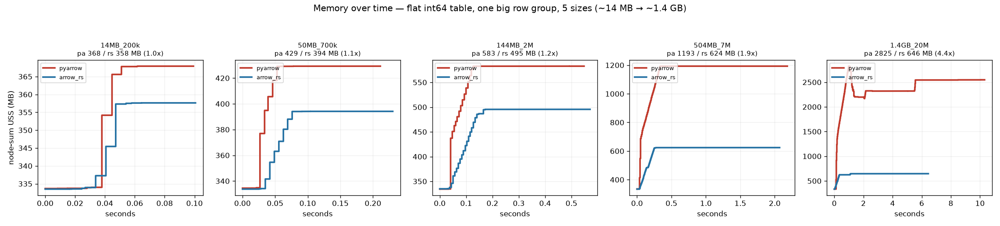

Parity at 14 MB (368 / 358 MB, 1.0×), widening monotonically to **4.4× at 1.4 GB (2825 →
646 MB)**. arrow-rs's peak is nearly flat (~360 → 646 MB) while PyArrow's scales linearly with
the group it must fully materialize. The whole thesis in one row.

**Sweep 2 — where the gap lives (row-group layout).** *Same 400 MB of data* every panel;
only the row-group chunking changes, from many tiny groups to one whole-file group.

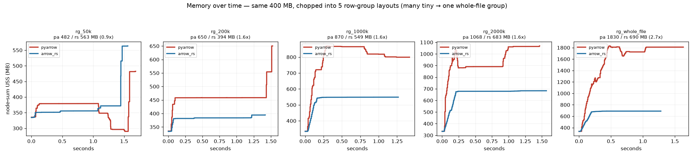

Many tiny groups → the one regime arrow-rs is **slightly behind** (0.9×: Ray's read pool
already splits the file into small independent units, so there's nothing left for arrow-rs
to bound). As the groups grow the gap opens — 1.6× → 1.6× → 1.6× → **2.7× at one whole-file
group**. This is the mechanism proof: the win is a function of *row-group size*, not file
size, and it appears exactly where PyArrow is forced to decode a large indivisible unit.

**On that first panel (the 0.9× loss) — the observation stands; our first diagnosis of it
did not.** Per-worker, arrow-rs's high-water in the many-tiny-groups regime is actually
*lower* than PyArrow's (163 vs 171 MB); the node-sum gap lives in the tail — PyArrow workers
gave ~30–40 MB back before exiting (`[...171 148 140]`) while arrow-rs workers held their
peak to exit (`[...163 163]`), and ~80 churning workers overlap near their held peaks. We
initially generalized this into an **allocator-retention theory** (glibc holding freed pages
vs PyArrow's jemalloc decaying them) and wired two Linux levers to fix it. The Linux
Ray-free probe then **disproved the allocator theory** (§5.10): on the many-small-groups
file, per-group calls retain nothing beyond one-call decode, `LD_PRELOAD` jemalloc changes
nothing, and arrow-rs standalone uses **2.3× less** than PyArrow (38 vs 89 MB). The mac
tail-release behavior was real as observed but is not an arrow-rs memory problem, and the
"loss" it produced lives entirely in the no-pressure regime (~500–600 MB either way) under
a since-retired node-sum metric. The allocator levers stay wired in the harness
(`MALLOC_ARENA_MAX`, `--features jemalloc` — see §7.8) but are demoted from "fix" to
"available A/B knobs."

**Sweep 3 — column dtype.** 2 M rows, one big row group, five schemas from int to
heavy-string.

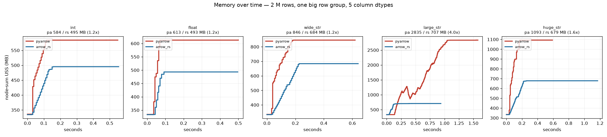

int / float / wide-string cluster at 1.2×; `large_str` hits **4.0× (2835 → 707 MB)**. arrow-rs
stays flat (~490–707 MB) across all five while PyArrow's peak tracks the per-value heap cost
of the dtype. The gap widens with decode heap pressure, never inverts.

**Sweep 4 — file count (the single-node overcommit).** One big row group per file, 1 → 8
files read across 4 workers. This is the concurrency axis: node-sum peak = sum of whatever
the ≤`num_cpus` concurrent decodes hold at once.

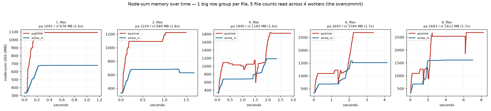

Both rise with concurrency (more big groups in flight), but arrow-rs holds a steady **~1.6–1.8×**
edge at every file count — the per-task footprint advantage composes across workers rather
than washing out. At 8 files: 2683 → 1611 MB.

**Sweeps 5–6 — the decode-budget knob (and its honest limit).** *Same 400 MB group* every
panel; only arrow-rs's `decode_budget_bytes` changes (1 → 64 MB). Left: `iter_batches`
(blocks retained). Right: `decode_drop` (output dropped).

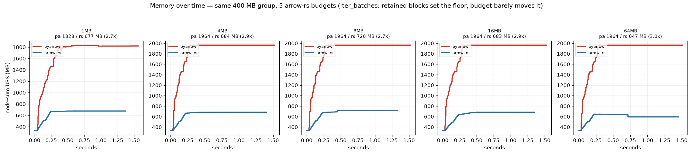

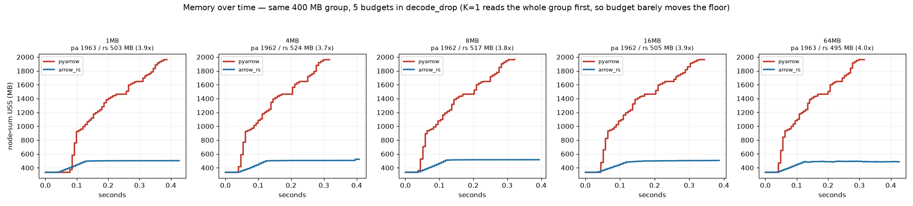

The honest finding: locally the budget knob **barely moves** arrow-rs's peak (flat ~680 MB
retained / ~500 MB dropped across every budget). With K=1 the sync reader reads the *whole*
row group before decoding, so the working-set floor is dominated by the group buffer, not the
decode batch the budget caps. The real lever here is **decode-and-release vs. retain-whole-
table** — the ~180 MB gap between the two modes — not the budget. (The budget matters where
the reader can stream a fraction of the group: the K-split and S3 async paths, §5.8 / §7.)
Against all of it, PyArrow sits at ~1960 MB — **~3–4×** higher regardless of the knob.

### 5.1 Huge single row group (8 M rows, 1 file, 1 row group, 3 string cols ×48, ~800 MB decoded)

This is the target case at scale. `iter_batches` (realistic — full output materialized):

| reader | peak single-worker | total | wall | vs PyArrow |
|---|---|---|---|---|
| PyArrow | **2332 MB** | 2327 MB | 8.15 s | — |
| arrow-rs K=1, budget 8 MB | **519 MB** | 520 MB | **5.14 s** | **4.5× less mem, 1.6× faster** |
| arrow-rs K=4 | 660 MB | 661 MB | 5.11 s | more mem, ~same speed |
| arrow-rs K=8 | 663 MB | 665 MB | 4.88 s | more mem, ~same speed |

**K costs memory (+140 MB K=1→4) for essentially no local speed.** K=1 is the clear
local default.

Same fixture, `decode_drop` (touch every column, drop output — isolates raw decode CPU):

| reader | total retained | wall (two runs) |
|---|---|---|
| PyArrow | **~1.4–1.5 GB** | **0.86–0.94 s** |
| arrow-rs K=1 | ~0–1 MB | 1.22–1.25 s |
| arrow-rs K=8 | ~29 MB | 1.15 s |

Two things here: (a) even decoding-and-dropping, **PyArrow holds the whole ~1.4–1.5 GB
row group resident** while arrow-rs retains ~nothing — the memory thesis holds at the
decode layer independent of output retention; (b) arrow-rs raw decode is **~25–40%
slower** here (PyArrow ~0.9 s vs arrow-rs ~1.15–1.25 s) — but note the caveat proven in
**§5.7**: this is the *wide-string* schema (3 cols × 48), the worst case for the crate's
string kernel, and PyArrow here is benefiting from threads a Ray worker wouldn't have. At
matched 1 thread the gap is ~1.5× on this schema and ~parity on moderate strings; local
K-split barely closes it (1.25→1.15 s) because of the ordered-drain design (§6.3). The
single-worker RSS for arrow-rs in this mode is a macOS measurement artifact (transient lone
worker) — read the `total` column, not `single`, for the decode-drop rows.

> **Reconciling (a) vs §5.1's first table:** decode-drop PyArrow is *fast* (~0.9 s) but
> *heavy* (~1.4 GB); `iter_batches` PyArrow is *slow* (8.15 s) and *heavier* (2.3 GB). The
> difference is that `iter_batches` moves the full 800 MB through the object store and
> materialization path, where PyArrow's giant peak pays a memory-pressure tax that
> arrow-rs's streaming avoids. So arrow-rs's raw-decode CPU deficit is real but is
> **more than repaid** the moment output is actually consumed.

### 5.2 Medium single row group (2 M rows, 1 file, 1 row group, ~200 MB), `iter_batches`

| reader | peak single-worker | wall |
|---|---|---|
| PyArrow | 682 MB | 0.95 s |
| arrow-rs (any budget 1–16 MB, K=1) | **~500–518 MB** | 0.90–1.05 s |

**1.3× less memory, speed within noise.** Note the memory win shrinks as the row group
shrinks (2.3 GB→519 MB was 4.5×; 682→500 MB is 1.3×) — because PyArrow's peak scales with
the row group and arrow-rs's is flat, so the *ratio* grows with file size. Budget knob is
flat across 1–16 MB here (retention-dominated at this size).

`decode_drop` on the same fixture (isolates decode): arrow-rs **~184 MB vs PyArrow
465 MB (2.5×)**, near speed parity — the clean decode-layer memory win before retention
compresses it.

### 5.3 Multi-fragment layouts (Ray's pool already parallelizes these)

Multi-row-group single file and 8-file fixtures: peak single-worker at **parity** with
PyArrow (122 vs 118; 106/132 vs 102/129 — all macOS noise). Expected: when Ray splits the
work across workers, each worker sees a small piece and neither reader has a big row group
to blow up on. **arrow-rs neither helps nor hurts here** — which is why the gate could
even route these to PyArrow with no loss (we don't bother; K=1 sequential is fine).

### 5.4 Knob summary

- **decode budget:** flat above ~1 MB in `iter_batches` (128 MB coalesce + retention
  dominate); visible in `decode_drop`. 8 MB is a safe default.
- **K (local):** scales memory **up** ~linearly (~15–35 MB/level), negligible local
  speed benefit → **K=1 local default**.

### 5.5 Expanded suite (the macOS-decisive axes)

Beyond the four headline fixtures, we now sweep the axes whose verdict does *not* depend
on absolute memory magnitude (which is only directional on macOS). Harness:
`release/nightly_tests/dataset/arrow_rs_memtrace/bench_suite.py` (`layout`, `schema`,
`tuning`, `leak`, `mixed`). All wall times `iter_batches`, K=1, 4 CPUs, warm.

**Layout (5 file/row-group shapes, wide-string schema).** arrow-rs is at parity on every
shape; the only >1.0 is the lone big row group (the K=1 decode-CPU gap, §5.1):

| layout | PyArrow | arrow-rs | rs/pa |
|---|---|---|---|
| small, 1 row group | 0.118 s | 0.123 s | 1.04 |
| small, many row groups | 0.202 s | 0.202 s | 1.00 |
| one large row group | 0.608 s | 0.675 s | 1.11 |
| many large row groups | 1.044 s | 1.032 s | 0.99 |
| **mixed large+small groups** | 1.133 s | 1.147 s | **1.01** |

The last row matters: a file with alternating 500 K/20 K row groups is the exact shape
that exposed an **O(n²) reader-rebuild trap** in a *different* (standalone-Linux) codebase
— rebuilding the reader per batch with a growing `RowSelection` skip. **Our crate is at
1.01× there**, because `RowGroupSeqReader` builds **one** reader per row group at a
footer-computed byte-budget batch size and streams it (`lib.rs` `build_group_reader`); the
only skip we emit is the K-split's, computed once per range and guarded by the page index.
So the trap is structurally absent, and the mixed-group data confirms it locally.

**Tuning (`decode_budget_bytes` sweep on the one-large-row-group file).** Too small a
budget adds per-batch/reader overhead; the 8 MB default sits at parity; a larger budget
slightly *beats* PyArrow on this pure-decode-bound case:

| budget | wall | vs PyArrow |
|---|---|---|
| 1 MB | 0.795 s | 1.26× |
| 2 MB | 0.732 s | 1.16× |
| 4 MB | 0.665 s | 1.05× |
| **8 MB (default)** | 0.638 s | **1.01×** |
| 16 MB | 0.646 s | 1.02× |
| 32 MB | 0.616 s | 0.97× |

8 MB is a safe default; on decode-bound single-group scans a larger budget closes and then
erases the CPU gap, at a proportional (still-flat-per-batch) memory cost.

**Mixed-schema, multi-file (6 files: int, float, wide_str, large_str, huge_str, + a
struct file — read as one dataset).** This is the case the per-group byte budget is *for* —
each file has a different bytes/row, so a fixed row count would over- or under-shoot — and
it also exercises the gate on a heterogeneous dataset: the 5 flat files route **native**,
the struct file routes to **PyArrow fallback**, in a single read, with no breakage. arrow-rs
wins on **both** wall time (25% faster) **and** memory (1.42×):

| reader | wall | node-sum peak | path |
|---|---|---|---|
| PyArrow | 1.350 s | 996 MB | — |
| arrow-rs | **1.010 s** (0.75×) | **700 MB** (1.42×) | 5 native / 1 fallback (struct) |

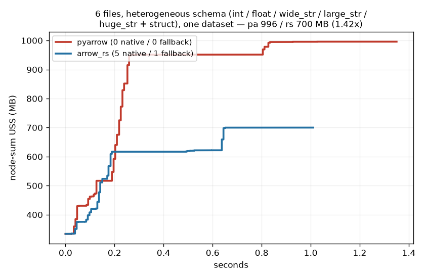

arrow-rs plateaus at 700 MB while PyArrow climbs to ~1 GB, and the legend's `5 native /
1 fallback` confirms the struct file transparently took the PyArrow path inside the same
read — mixed datasets stay correct, and the byte-budget tuning pays off on the flat majority.
The `ds.sum()` aggregation from §3.3 has a dedicated parity test (§6.4).

**Leak (8 repeated reads of the same file in one session).** Both readers hold a **flat
USS floor across all 8 reads — no ratchet**. arrow-rs's steady state sits ~80 MB lower
(~527 MB vs PyArrow ~610 MB). Per-iter wall is flat-to-declining for both (no slowdown
creep).

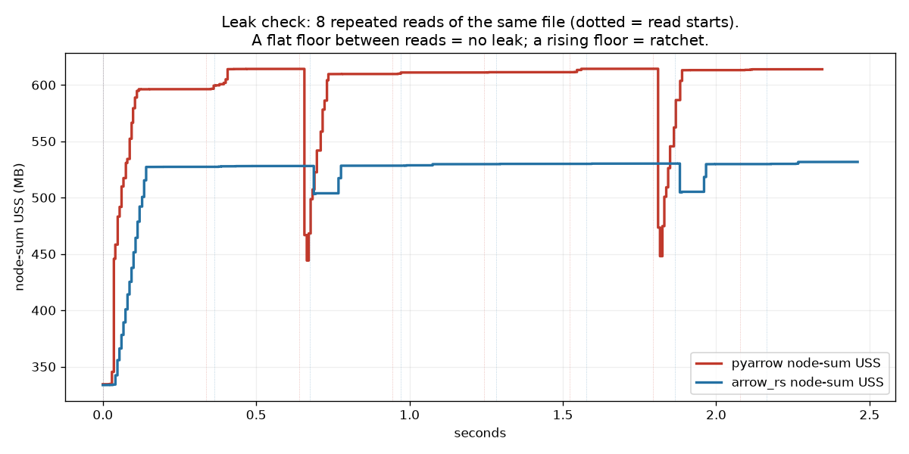

**Schema coverage / path parity (8 dtypes, per-column hash parity vs PyArrow).** Every
dtype is **byte-identical** between readers, and the support gate now routes **8/8**
correctly: flat int/float/string → native; struct, list, and Ray's own `ArrowTensorType`
→ PyArrow fallback. Getting to 8/8 required a fix — the 8th (**pyarrow *canonical*
`fixed_shape_tensor`**) originally slipped the gate into the native path; see §7.5.

### 5.6 Scaling (O(n) proof) and single-node concurrency (the real overcommit)

**Two distinct "regressions" — don't conflate them.** There are two different slowdowns in
this project, and only one is a bug:
1. An **O(n²) reader-rebuild trap** (rebuild the reader per batch with a growing
   `RowSelection` skip on one big row group). This was a *different, standalone-Linux*
   codebase. Our crate never had it (§5.5).
2. A **single-thread decode-CPU gap** — real, known, and schema-dependent (§5.7): ~parity
   on moderate strings, ~1.5× on wide strings, at the 1 thread a Ray worker gets. On the
   *small* 2 M `one_large_grp` layout row it surfaces as a 1.11× that a fixed per-read
   overhead dominates — and the scaling curve below shows it **reversing to a 35% win** as
   the file grows. Neither of these is the O(n²) trap.

The scaling axis settles both. Single row group, wide-string, `iter_batches`, sweeping row
count at a fixed 8 MB budget:

| rows | PyArrow µs/row | arrow-rs µs/row | rs/pa wall |
|---|---|---|---|
| 1 M | 0.322 | 0.355 | 1.10 |
| 2 M | 0.317 | 0.327 | 1.03 |
| 4 M | 0.404 | **0.313** | **0.77** |
| 8 M | 0.450 | **0.290** | **0.65** |

And the same sweep in the axis that actually decides this project — **peak memory**:

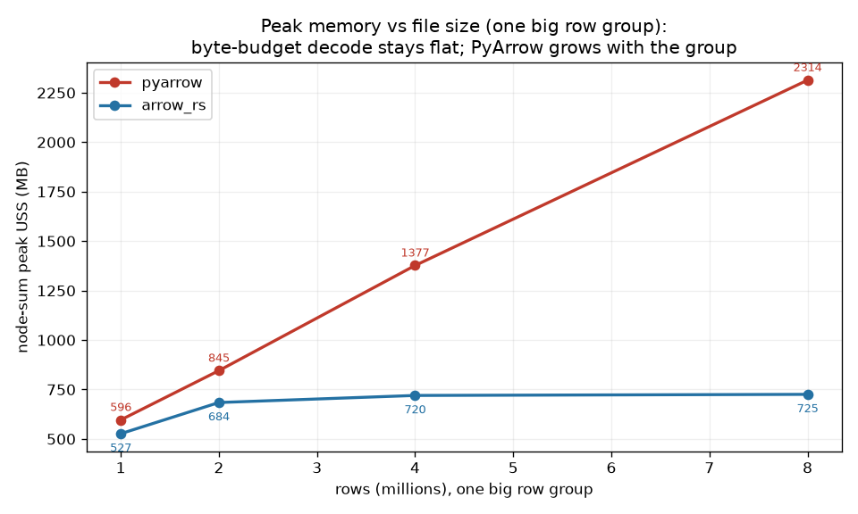

PyArrow's peak climbs linearly with the row group (596 → **2314 MB**) because it
materializes the whole group; arrow-rs's byte budget holds it **flat** (527 → 725 MB), so
the memory ratio *widens* with size to **3.2× at 8 M rows**. This is the headline: the
bigger the file, the bigger the memory win, and it never inverts.

arrow-rs's **µs/row falls** as the file grows (0.355 → 0.290) — it's **O(n)**, amortizing a
fixed per-read overhead. An O(n²) reader-rebuild would make µs/row *rise*. So regression #1
is provably absent. Meanwhile PyArrow's µs/row *rises* (0.322 → 0.450, the row-group
materialization cost), so the two curves **cross near ~3 M rows** and arrow-rs ends **35%
faster at 8 M**. The 1.11× you see at 2 M is the small-file tail of this curve (regression
#2's fixed overhead), not a scaling defect — it reverses with size. (The tuning sweep §5.5
is the same story from the other direction: smaller budget = more batches = slower, which is
fixed-per-batch overhead, the *opposite* of an O(n²) skip that would worsen with more
batches.)

**Single-node concurrency — the actual overcommit (§3.6).** N files, each one big row
group, read across K worker processes; node-sum peak USS across all workers:

| fixture (per-file group) | CPUs | PyArrow node-sum | arrow-rs node-sum | pa/rs | walls (pa / rs) |
|---|---|---|---|---|---|
| medium, 8×1 M (~100 MB) | 4 | 792 MB | 709 MB | 1.12× | 2.46 / 2.15 s |
| **big, 4×4 M (~400 MB)** | 2 | 2496 MB | 1235 MB | **2.02×** | 6.68 / 5.19 s |
| **big, 4×4 M (~400 MB)** | 4 | **3066 MB** | **1727 MB** | **1.78×** | 5.98 / 5.07 s |

This is the OOM mechanism reproduced on one laptop with real Ray parallelism: with 4
concurrent big decodes, PyArrow's node-sum private heap reaches **3.07 GB** while arrow-rs
holds **1.73 GB** — and arrow-rs is *also* faster.

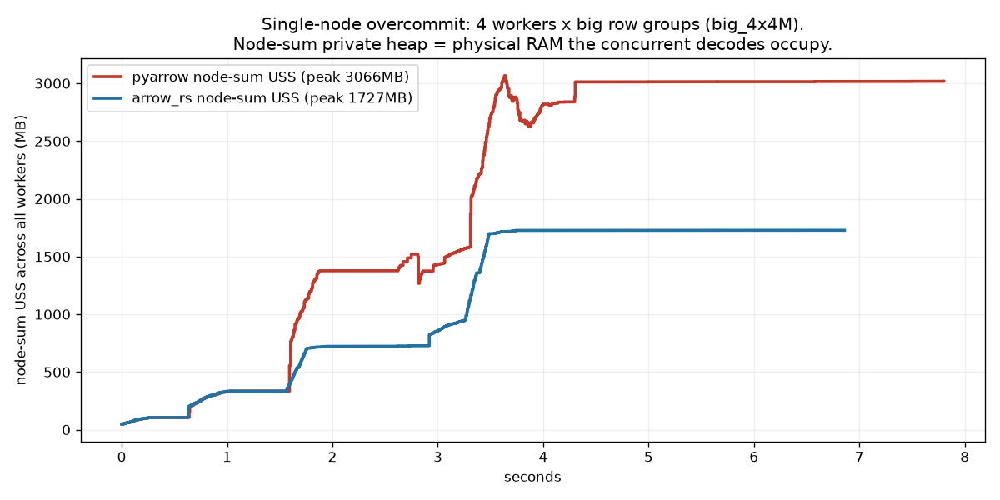

Each staircase step is another concurrent worker's big decode landing on the node total.
PyArrow climbs to ~3 GB and *stays* there (retained working set); arrow-rs plateaus at
~1.7 GB. This is §3.2's "K workers × hidden working set" made concrete — and it's the
number Ray's scheduler never sees. The gap **tracks per-file row-group
size** (medium 1.12× → big 1.78×) and **grows with worker count** (on the big fixture
PyArrow's node-sum climbs 2.50 GB at 2 CPUs → 3.07 GB at 4 — more workers = more concurrent
big decodes = more overcommit, the packing-toward-OOM behavior §3.2 predicts). Absolute
magnitudes are macOS-directional
(USS excludes shared pages); the *ratios and shapes* are the finding, and they'll only
sharpen on Linux where authoritative per-task USS is available.

### 5.7 Raw decode CPU, isolated (Ray-free) — a single-thread, schema-dependent gap

To pin down the decode-CPU story without any Ray overhead, `standalone_decode_bench.py`
drives the crate's decode loop and PyArrow's `iter_batches` **directly** (no `ray.init`,
no workers, no object store), decoding every batch and dropping it. Two things fall out,
and they **correct the earlier "~25–40% raw-decode regression" framing**:

1. **PyArrow's decode speed is mostly multi-threading, which Ray disables per worker.**
   Standalone PyArrow uses all cores; pinned to one thread it is 3–4× slower. A Ray read
   worker runs `pa.cpu_count()==1` (`OMP_NUM_THREADS=1`) — Ray gets parallelism from
   *processes*, not threads — so the **fair, Ray-representative comparison is 1-thread**:

   | 8 M rows, decode+drop | wall | vs pyarrow-1thread |
   |---|---|---|
   | pyarrow, 18 threads (standalone only) | 0.14–0.19 s | 0.26–0.44× |
   | pyarrow, **1 thread** (what a Ray worker gets) | 0.43–0.53 s | 1.00× |
   | arrow-rs k=1 | 0.52–0.68 s | **0.98× (16-char) … 1.56× (48-char)** |
   | arrow-rs k=4 | 0.48–0.62 s | 0.72× … 1.43× |

2. **The 1-thread gap scales with string width, not with n.** On moderate strings
   (6 cols × 16 chars) arrow-rs k=1 is at **parity** with 1-thread PyArrow (0.98×); on wide
   strings (3 cols × 48, the §5.1 headline schema) it is **~1.56× slower**. So there *is* a
   genuine single-thread decode deficit and it lives in arrow-rs's **wide-string decode
   kernel** — the concrete thing to optimize in the crate. arrow-rs's own K-split partially
   closes it (1.56→1.43×) and can *beat* 1-thread PyArrow on moderate schemas (0.72×),
   because in the lone-big-fragment case Ray gives PyArrow only one thread while the crate
   can split.

Net correction: the decode gap is **not** the "3.5× slower" a naive standalone run shows
(that's PyArrow's 18 threads), nor is it nothing. At matched threads it's **parity for
moderate strings, ~1.5× for wide strings**, biggest where cells are widest — and it is
recovered by materialization (§5.1) and by process-level parallelism (§5.6). Iterate on the
crate with `standalone_decode_bench.py --budgets … --ks …` before confirming in the Ray suite.

### 5.8 Is the gap missing pipelining? (No, locally — yes on S3) and the best-tuned number

A natural hypothesis: PyArrow overlaps I/O with decode (`pre_buffer=True` issues coalesced
column-chunk reads on an async I/O pool, and `OMP_NUM_THREADS=1` only disables *decode*
threads, not that prefetch), while our local path
([`RowGroupSeqReader`](_internal/datasource_v2/native/ray_data_arrow_rs/src/lib.rs)) is a
**synchronous** reader — it blocking-reads a whole row group, then decodes it, then reads
the next, with no prefetch. Could that missing pipelining be the gap?

**Empirically, no — not locally.** `standalone_decode_bench.py` now reports `cpu/wall`
(CPU seconds / wall seconds). On every warm-cache `k=1` run it is **1.00** — the process
spends all its wall time on CPU, so there is *no I/O stall to hide*. On a warm page cache
the "read" is a memcpy; prefetch buys nothing. The residual gap is the string-decode
kernel, full stop. (`cpu/wall` climbs above 1 only when `k>1` puts multiple decode threads
to work — 2.75 at 2 M / k=4 — which is CPU parallelism, not I/O overlap.)

**On S3 / cold cache it is the opposite** — per-request latency is tens of ms, PyArrow's
prefetch hides it under decode, and a *synchronous* per-group path would stall serially
(read group → wait → decode → read next → wait …). That is exactly why the S3 path is
**async and windowed** (`read_row_groups_s3` builds `ParquetRecordBatchStream`s over
`object_store`, drained on the shared tokio runtime into bounded per-unit channels), sized
memory-first: a small compressed **fetch window** bounds in-flight bytes, and Ray's
4-thread fragment pool overlaps fetch/decode across files (with K-split reserved for the
lone big row group Ray can't split). Peak stays `≈ window + decode_budget`. Whether that
bounded window still reaches PyArrow's throughput — or needs a larger window / intra-unit
prefetch — is what the Linux/S3 sweep decides; memory-parity-or-better is the bar, speed
parity the constraint.

**Best-tuned, not single-thread-crippled.** The right comparison (per the memory-first bar)
is PyArrow-in-Ray as-is vs arrow-rs with its knobs *tuned* (byte budget + K), not `k=1`:

| 2 M rows, huge_str, decode+drop | wall | vs pyarrow-1thread |
|---|---|---|
| pyarrow, 1 thread (Ray-representative) | 0.107 s | 1.00× |
| arrow-rs k=1, 8 MB | 0.161 s | 1.50× |
| **arrow-rs k=4, 32 MB (best)** | **0.074 s** | **0.69× (faster)** |

So on a moderate single big group, tuned arrow-rs already *beats* the PyArrow a Ray worker
gets. The tuning does **not** hold at 8 M (best 1.44×): with large rows-per-range the
depth-2, strictly-ordered range channels serialize the K threads (`cpu/wall` falls
2.75 → 1.22). That depth-2 is what *bounds memory* to ≤ k×2 batches — the memory↔speed knob
§6.3/§7 is about. Since the bar is memory-first and timing-not-worse, this is a known,
bounded speed cost with a clear optimization path, not a blocker.

### 5.9 S3: correctness un-gated and tested (speed/memory deferred)

Local-only would be a niche PR — real Ray Data reads are overwhelmingly from object
storage — so S3 is now a first-class, tested path. What landed in this phase:

- **Config fidelity.** The reader recovers the *full* S3 connection config from the
  pyarrow `S3FileSystem` — `fs.__reduce__()[1][0]` round-trips `endpoint_override`,
  `access_key`/`secret_key`/`session_token`, `region`, and `force_virtual_addressing`
  (verified) — and passes it to the crate (`_s3_config` →
  `ray_data_arrow_rs.read_row_groups_s3(...)`), which now takes those params on
  `AmazonS3Builder`. Previously the crate rebuilt a default client from the ambient env,
  silently ignoring an explicit endpoint or static creds — so MinIO / moto / credentialed
  buckets would have broken. One subtlety handled: pyarrow's `scheme` field stays
  `"https"` even for an `http://` endpoint override, so `allow_http` is derived from the
  endpoint URL, not `scheme` (object_store refuses plain-HTTP endpoints otherwise).
- **Gate un-gated.** `_arrow_rs_supported` now admits `S3FileSystem` as well as
  `LocalFileSystem`; the same flat-schema/no-nested/no-int96 rules apply, so a struct
  column over S3 falls back to PyArrow exactly as it does locally.
- **Tested on a moto server.** Ray Data's `s3_server` fixture (a real HTTP S3 mock — which
  the crate's `object_store` client needs, since it speaks raw S3 HTTP) backs a suite:
  full-scan parity, projection parity, `ds.sum()` over S3, struct-fallback over S3, a
  `_s3_config` recovery unit test, and a native-path assertion (the read really goes
  through `read_row_groups_s3`, not a silent fallback). All green.
- **One real bug found + fixed by these tests.** The S3 path reported the *full* file
  schema while streaming *projected* batches → `ArrowArray struct has 1 children, expected
  4` at the FFI boundary. Fixed by building the projected stream once and reporting
  `stream.schema()` (the projected schema), mirroring the local path's `probe_schema`.

- **Windowed, byte-budgeted, memory-first S3 path (now ported).** `read_row_groups_s3`
  no longer streams the whole file through one default reader. It ports `main.rs`'s
  `read_all_async`/`read_unit_windowed` but tuned **memory-first**, not speed-first: each
  row group's rows are sliced into fetch **windows** sized so only ~`fetch_window_mb` of
  *compressed* bytes are in flight per stream, and the decode batch is byte-budgeted — so
  S3 peak RSS is `≈ window + decode_budget`, a knob we set, **flat regardless of
  row-group size**, instead of PyArrow's whole-row-group pre-buffer. Crucially it does
  **not** copy `main.rs`'s unconditional K-way fan-out (which multiplies in-flight memory
  by K to buy latency-hiding): it fans out to K concurrent GET streams **only** for a lone
  row group above `split_threshold_bytes` (the case Ray's fragment pool can't split) —
  exactly the local K-split rule — so crate-K and Ray's 4-thread pool never multiply into
  16 concurrent GETs. Every other layout is a single windowed stream (K=1); Ray's pool
  parallelizes files. Output is **order-preserving** (per-unit tokio channels drained in
  order, depth-2 backpressure), covered by a moto K-split test that asserts exact `0..n-1`
  order for K∈{2,4,8}. Also: one **shared process-wide tokio runtime** (was: a fresh
  runtime built+destroyed per fragment).

**Still deferred to Linux + real S3 (§7.1):** *measuring* the memory/speed. The mechanism
is in place and correct, but the win **cannot** be measured here — moto is in-process (no
network latency, no page-cache pressure) and macOS USS is directional. The harness is
ready: `bench_suite.py s3` reads `RAY_DATA_ARROW_RS_S3_BENCH_PATH` and **sweeps the two
memory knobs** — `fetch_window_mb` ∈ {4,16,64,0} and `MALLOC_ARENA_MAX` (uncapped vs
capped) — against a PyArrow baseline, recording wall + node-sum USS. So S3 is **correct,
memory-first by construction, and tested now; the number is measured on Linux**.

### 5.10 Linux (Anyscale workspace) — what's established so far

The first Linux phase produced one measurement-methodology postmortem (§3.5.1) and,
from its salvage instruments, a set of findings that all point the same way. Caveat up
front: the in-Ray numbers below were taken under the since-retired windowed-incremental
metric — on **big** fixtures the decode signal (hundreds of MB to GB) swamps that
metric's ~100 MB bias, so those stand as directional; on **small** fixtures only the
bias-free instruments (Ray-free probe, per-worker absolute deltas) are quoted.

**Big fixtures (bias-negligible, the thesis regime) — the mac shapes reproduce.**
The budget sweep on the ~400 MB single group: PyArrow **1660 → arrow-rs 670 MB
(0.40×)** in `iter_batches`, 0.21× in decode-drop; the selective-filter workload
**0.26×**; `sum` near parity (0.86×). The memory-over-time shape is the finding again:
PyArrow a tall right-triangle — a fast climb to the whole decoded group, then a cliff —
arrow-rs a low flat line. On the fresh layout run, one_large_grp came in at **0.70×**
with arrow-rs also ~15% faster; walls were parity-to-faster across every layout.

**Small/many-group fixtures (where the retired metric lied) — parity-to-better,
triple-confirmed.** The Ray-free probe on the many-small-groups file: PyArrow ~89 MB,
arrow-rs ~38 MB (one call or per-group call alike; jemalloc `LD_PRELOAD` inert; extension
import+init = 0 MB). Per-worker absolute traces of the same read in Ray: arrow-rs
Δ89.1 MB vs PyArrow Δ98.7 MB, one worker each, matching the mac §5.5 parity row. The
lone contrary datapoint (153 vs 22 MB) is unreproducible, its traces destroyed by its
own rerun, and both its halves are individually impossible against the standalone
numbers — classified a metric artifact (§3.5.1).

**Also established on Linux:** one small-file subtlety confirmed in the base reader —
files below the chunker's `target_chunk_size` go **whole-file** (chunk metadata `None` →
`row_groups=None` → ONE crate call per task, `parquet_file_reader.py:300`), so the
one-subfragment-per-row-group fan-out only applies to files big enough to chunk. And Ray's
prestarted-worker pool on a many-core node is why naive node-sum absolute USS needs care:
idle workers each hold an import floor; the per-task metric sidesteps this entirely.

**Pending (the deciding run):** the full suite — layout, mixed, sweeps, workloads,
concurrency, S3 — rerun on the metric of record, producing `figs/task_mem/` (per-task
lines vs the E line) for every config. Also planned: an `oom` axis — a memory-ceilinged
node where PyArrow's hidden decode heap OOM-kills the read and arrow-rs finishes — the
end-to-end demonstration of §3.2's failure mode and its removal.

---

## 6. Optimizations and fixes, by phase

### Phase 1 (macOS integration)

**6.1 Removed reader-side block accumulation (§4.3).** The headline fix. −25 lines,
eliminated a full second block-sized buffer per worker, brought multi-fragment
peak-single-worker RSS from ~1.4× PyArrow down to parity.

**6.2 Fixed benchmark memory attribution.** The harness now tracks **per-PID min→max**
RSS and reports incremental single-worker growth self-baselined against that same PID's
minimum — instead of subtracting a global baseline sampled from a different process
(which produced a spurious ~0 MB single-worker reading and hid PyArrow's real
single-worker spike). Added a `decode_drop` consume mode to isolate the decode working
set from output retention — this is what made the true 2.5× decode-layer memory win (and
the ~25–40% decode-CPU gap) visible instead of being masked by the shared 128 MB coalesce
buffer.

**6.3 Tuned K and found its local ceiling (the important negative result).** Swept
K∈{1,2,4,8} × budget∈{1,2,4,8,16 MB} on single-row-group fixtures up to 800 MB.
**Finding: K-split does not pay off locally.** It costs memory (§5.1) for ~no speed, and
even the speed it *does* give (1.25→1.15 s at K=8) is far short of the ~K× you'd hope for.
Root cause is a design tension we deliberately accepted for correctness (§4.8): the
consumer drains range channels **in order** with **depth-2** bounded channels, so ranges
`1..K-1` stall after 2 batches until range 0 is fully drained. Ordered output + bounded
memory + parallel decode of contiguous ranges = pick two. `main.rs` "won" only because it
summed a commutative checksum and needed no order. Locally there is also **no network
latency to hide**, which is the entire reason K-split helps on S3. Conclusion: **K=1
local; K-split stays gated and reserved for the S3 phase.** (See §7 for the redesign that
could make it win locally too.)

**6.4 Added a K-split parity+order test.** `test_kspilt_parity_and_order` forces the
split path (`split_threshold_bytes=0`) on a single big row group and asserts the result
is byte-identical to the sequential path, to PyArrow, **and** that `id` is exactly
`0..n-1` (catches a merge/reorder bug that a set-equality check would miss). **22/22 tests
pass**, covering local parity/projection, K-split order, gate fallbacks
(nested/struct/canonical-extension), `ds.sum()` aggregation parity (§3.3), and the S3 suite
(§5.9: parity, projection, sum, struct-fallback, `_s3_config` recovery, native-path
assertion, **and the windowed S3 K-split order test** — forces the split + a tiny window
and asserts exact `0..n-1` order for K∈{2,4,8}, so any range/window mis-ordering in the new
async path is a hard failure — all on a moto server). Lint clean (ruff 0.8.4 + black
22.10.0). Running the S3 tests needs `moto[server]` (`shutil.which("moto_server")` on
PATH), else they skip.

### Phase 2 (Linux workspace — measurement hardening)

**6.5 Diagnosed and retired a biased memory metric (§3.5.1).** The windowed-incremental
node-sum USS metric produced one impossible result; three implementation hypotheses
(per-group call overhead, allocator retention, lazy-import multiplication) were each
killed by direct measurement, leaving the metric itself as the cause: baseline
subtraction hides warmup-retained heap in proportion to the reader's own working set,
flattering PyArrow. All incremental/windowed metrics, peak bars, and summary scalars
removed from the harness outputs.

**6.6 Built the metric-of-record instrumentation.** The worker hook now patches
`FileReader.read` to log epoch task windows (both readers, one shared patch point);
each run records `meta.json` (reader, `expected_task_mb` from the live `DataContext`,
warmup boundary); `task_mem.py` renders per-task absolute USS lines vs the E line for
every config pair, bracketing sub-sampling-interval task windows so no task is dropped.
Support instruments: `micro_alloc_probe.py` (Ray-free A/B of the crate vs PyArrow on one
file, with allocator `LD_PRELOAD` and import-cost modes) and `inspect_run.py`
(per-worker baseline/peak/delta breakdown + per-worker USS-over-time plots of any run
dir). The hook's `ray.data` import at worker startup equalizes import floors across
readers; node-sum absolute peak kept only as a sanity column, now alive-gated (an
exited worker's last sample no longer forward-fills across the window).

---

## 7. Open holes — what we want critiqued

Ranked by how much they'd change the decision:

1. **S3 is correct, tested, and now memory-first by construction — the *number* is not yet
   measured.** S3 is un-gated, config-faithful, covered by a moto suite (§5.9), and the
   windowed/byte-budgeted/order-preserving fetch path **is now ported** (no longer the naive
   single stream): peak RSS is `≈ fetch_window + decode_budget`, flat in row-group size, and
   the K-way fan-out is bounded to the lone-big-row-group case so it never multiplies Ray's
   pool. What remains is purely *measurement*: it can't be done locally (moto has no network
   latency or cache pressure; macOS USS is directional), so the memory/speed comparison must
   run on **real S3 on Linux**. Harness ready and it **sweeps the memory knobs**
   (`fetch_window_mb` ∈ {4,16,64,0}, `MALLOC_ARENA_MAX` on/off) vs PyArrow: `bench_suite.py
   s3` — now judged on the metric of record (per-task USS vs E, §3.5.1) like every other
   axis. This is the single most important remaining item and the natural next PR.

2. **The single-thread wide-string decode gap (§5.7).** Isolated from Ray, at the
   1-thread count a Ray worker gets, arrow-rs decode is parity on moderate strings and
   **~1.5× slower on wide strings** — a real deficit in the crate's wide-string decode
   kernel (PyArrow's bigger standalone lead is just multi-threading, which Ray disables per
   worker). It reverses under materialization (§5.1) and process parallelism (§5.6).
   Resolutions, want a steer:
   - **(a) Accept it, memory-first.** Honest, simple. At matched threads it's parity-to-1.5×,
     recovered end-to-end; only pure-decode-bound wide-string scans stay behind.
   - **(b) Optimize the crate's wide-string decode** and/or **redesign the K-split** with a
     **bounded-reorder buffer** (a small out-of-order window instead of strict ordered-drain
     + depth-2 channels) so ranges make real concurrent progress while still emitting in
     order — the crate can then use K threads in the lone-fragment case where Ray gives
     PyArrow one. Rust work; risk is the resident reorder window.

3. **No projection/predicate pushdown into Rust (§4.7).** Filters are applied
   post-decode, so we decode rows we then throw away. Now measured (§3.3): a selective
   filter still wins on *memory* (2.37×, arrow-rs decode transient never accumulates) but
   does the same wasted decode *work* as PyArrow — no CPU advantage on filtered scans.
   Pushing predicates into the crate is a concrete future win and would turn filtered reads
   from "memory-advantaged but same work" into "advantaged on both." **Full design,
   Parquet-statistics background, and the tie-in to Ray's planned page-index chunker: §7.9.**

4. **Linux/USS accounting — instrument built, deciding run pending.** Per-task absolute
   USS over time is now first-class (§3.5.1): task windows from the `FileReader.read`
   hook, one line per task vs the E line, absolute (no baseline games). Still open:
   (a) running the *full* suite on it (only spot-checks so far, §5.10); (b) validating
   each line's max against Ray's own `TaskExecWorkerStats.max_uss_bytes` — agreement
   makes the number indisputable; (c) upstream, `max_uss_bytes` is still advisory-only
   (§3.5) — surfacing it in the operator summary is a small, independently useful PR.

5. **Schema coverage — now measured, and one gate hole found + fixed (§5.5).** The
   `schema` axis reads 8 dtypes both ways and asserts per-column hash parity **and** which
   path the support gate chose. Result: all 8 are byte-identical, and the gate routes 7/8
   correctly (flat int/float/string → native; struct/list/Ray `ArrowTensorType` →
   fallback). The 8th caught a real bug: pyarrow's **canonical `fixed_shape_tensor`** is
   *not* `isinstance(pa.ExtensionType)` in pyarrow 24 (and there's no `pa.types.is_extension`),
   so it slipped the gate into the native crate. It happened to decode correctly, but that
   violated the gate's contract (only flat non-extension types go native). **Fixed** by
   also rejecting any type with an `extension_name` in `_arrow_rs_supported`; re-verified
   the tensor now falls back with parity intact. Still open: nulls, dictionaries,
   timestamps, decimals aren't yet in the matrix, and nested paths are correct-by-fallback,
   not optimized.

6. **Retained-block scenario under `materialize`.** We measured `iter_batches` and
   `decode_drop`. The `materialize` path (blocks retained in the object store) is the
   third profile and isn't in the tables above.

7. **Is targeting only the lone-big-group case worth the complexity?** The gate is
   narrow. If real workloads rarely hit "one giant row group, flat schema, local," the
   whole prototype is a niche win. Worth validating against actual customer file layouts.

8. **Allocator levers — demoted from "fix" to "available knobs" after the theory they
   were built for was disproven (§5.0 panel 1, §5.10).** The mac many-tiny-groups 0.9×
   was first diagnosed as glibc holding freed pages vs PyArrow's jemalloc decaying them.
   The Linux Ray-free probe killed that: `LD_PRELOAD` jemalloc changed nothing, per-group
   calls retain nothing, and arrow-rs standalone uses 2.3× *less* than PyArrow on the
   exact file — the "loss" was the retired metric, not the allocator. Two levers remain
   wired in the harness for A/B use if an allocator question ever resurfaces:
   `MALLOC_ARENA_MAX=2` via worker `runtime_env` (no-code, zero-risk), and the crate's
   `--features jemalloc` build (compiles clean; untested under Ray workers). Historical
   warning that still stands: **do not use `--features mimalloc`** — a
   `#[global_allocator]` in the Python-extension cdylib segfaulted Ray workers the moment
   the native path ran across the Arrow-C-stream FFI boundary (fine outside Ray).

### 7.9 Statistics-driven predicate pushdown (the full design + page-index tie-in)

This is the fleshed-out version of open hole #3, and the single biggest *CPU* win still on
the table. It's written up in detail because it lands right on top of a change the Ray Data
team has signalled — moving the V2 chunker from **row-group ranges** to **page ranges backed
by a page index** — and the arrow-rs reader is the natural engine for it. The current
row-group-atomic chunker is described in `chunkers/file_chunker.py`
(`ParquetFileChunker.generate_chunk_metadatas`): at listing time it reads each footer and
**bundles consecutive row groups up** to `target_chunk_size`, but it can never split a row
group **down** — which is exactly the lone-big-row-group limitation §1 targets. A page-index
chunker removes that floor, and everything below reuses machinery the crate already has.

**Where Parquet statistics actually live (the part that's easy to get wrong).** The physical
layout is `file → row group → column chunk → page`, but statistics do **not** exist at four
independent levels. They exist at **two**:

- **Per-(row group, column) — column-chunk statistics.** Stored in the file footer on each
  `ColumnChunkMetaData.statistics`: `min`, `max`, `null_count`, optional `distinct_count`.
  Cheap (footer-only) and almost always written. Note a row group is **not** a separate stats
  object: within a row group each column has exactly **one** column chunk, so "row-group stats
  for column X" *are* the column-chunk stats for X in that row group — same numbers, not a
  distinct granularity.
- **Per-(page, column) — the ColumnIndex.** Part of the optional **PageIndex** written just
  before the footer: per-page `min`/`max`/`null_count`, paired with the **OffsetIndex**
  (per-page byte offset + compressed size + first-row-index, so you can skip *and* seek). A
  legacy form also exists — inline `Statistics` in each `DataPageHeader` — but those require
  scanning the pages to read, so they're useless for skipping; the ColumnIndex is the modern,
  seekable version, and it's the structure Ray's planned "page index" refers to.

There is **no** standard column-statistics object in `FileMetaData` (file level) — any
file-wide bound is derived by aggregating row-group stats. So the honest model is a
**two-stage cascade**: coarse (row-group/column-chunk, always available) → fine (page, only
if the page index was written) → then per-row late materialization. This maps one-to-one onto
a page-indexed chunker.

**What Ray does today (code-verified, and it confirms "predicates aren't pushed as far as
possible").** The ceiling today is row-group skipping, and it isn't even everywhere:

- **PyArrow base path** does `fragment.subset(filter=filter_expr)`
  (`readers/parquet_file_reader.py:401-402`), which uses column-chunk stats to **skip whole
  row groups** — but then `iter_batches` can't take a filter, so the row-level predicate is
  applied **post-decode per batch** (`parquet_file_reader.py:473-474`). No page skipping.
- **arrow-rs path** does *neither*: no `subset(filter=...)`, filter applied post-decode in
  Python (`readers/arrow_rs_parquet_file_reader.py:376-383`). The crate has **zero** pushdown
  — grepping `src/lib.rs` for `RowFilter`/`ArrowPredicate`/`column_index` returns nothing.

So across the whole stack: **row-group skip = PyArrow only; page skip = nowhere; late
materialization = nowhere.** Everything below a row group decodes-then-discards.

**The cascade to build, and the exact arrow-rs primitive for each stage.**

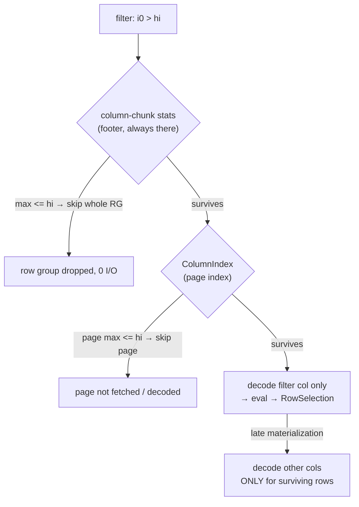

| Stage | Granularity | arrow-rs primitive | Status in the crate |
|---|---|---|---|
| Skip row groups | column-chunk stats | build the surviving-RG `Vec<usize>` from `row_group(i).column(c).statistics()` | not done |
| Skip pages | ColumnIndex | `RowSelection` from `column_index()` + `offset_index()` | index is *loaded* (`lib.rs:365`), not *used* to filter |
| Late materialization | per-row | `RowFilter` + `ArrowPredicate` on the builder (`with_row_filter`) | not done |

The leverage: the crate's K-split path **already builds `RowSelection` objects**
(`build_range_reader`, `lib.rs:281`) and **already loads the page index**
(`PageIndexPolicy::Optional`, `lib.rs:365`). Pushdown reuses exactly that machinery — feed a
*filter-derived* `RowSelection` into the same builder instead of a *range-derived* one. And
`RowFilter` unlocks the biggest win, **late materialization**: decode only the filter column,
evaluate the predicate, then decode the wide/expensive columns *only* for surviving rows.

**Concrete example (the §3.3 filter workload).** `ds.filter("i0 > hi")` over the 4 M-row
single-row-group file, keeping 6 rows. Today both readers decode all 4 M rows × all columns
and drop all but 6 (arrow-rs still wins 2.37× on *memory* because its decode transient never
accumulates — but does the same wasted *work* as PyArrow). With the cascade: (1) row-group
stats don't prune the lone group; (2) the ColumnIndex keeps only the pages whose per-page
`max(i0) > hi` — a few thousand rows instead of 4 M; (3) `RowFilter` decodes just `i0` on
those pages, finds the 6 matches, and decodes the other columns for **6 rows**. "Decode
everything, keep 6" becomes "touch a few pages, decode ~6 wide rows" — the wasted-decode-CPU
cost §4.7 flags, gone.

**Honest caveat — the I/O win depends on data layout.** Page/row-group skipping only prunes
when the data is **sorted or clustered on the predicate column**, so per-page min/max ranges
are narrow. On a randomly-ordered column every page's range overlaps the filter and skipping
prunes nothing — you still get late materialization (decode fewer *columns*), but not the I/O
saving. This is why real systems push users toward sorting / Z-ordering on filter columns;
the 4 M→6 example above assumes `i0` is clustered.

**Two layers of "pushdown" — Ray already does one of them, and it's not this one.** It's easy
to confuse two separate wins. Keep them apart:

- **Layer 1 — *where* the filter runs in the plan.** Moving the filter below a join, shuffle,
  sort, or projection so those expensive operators process fewer rows. This is a big win
  because joins/shuffles/sorts are super-linear (network, serialization, spill), while a filter
  is linear with a tiny constant. **Ray already does this** — the `PredicatePushdown` rule
  (`_internal/logical/rules/predicate_pushdown.py`) relocates an expression filter down through
  Sort/Shuffle/Repartition (pass-through), Project (with column renaming), Union (into both
  branches), and **Join** (side-aware and join-type-safe: INNER → either side, LEFT_OUTER →
  left only, FULL_OUTER → neither, since nulls would be dropped —
  `logical/operators/join_operator.py:203-212`), and finally into the Read op. So by the time a
  read happens, the join/shuffle above it already sees the filtered row count. This layer is
  **done**; the crate doesn't touch it.
- **Layer 2 — *how* the filter runs once it reaches the Read.** Even after Layer 1 pushes the
  filter *into* the Read op, execution today still **decodes every row, then filters** (PyArrow
  filters post-decode per batch; the arrow-rs path filters in Python after decode). "Pushed into
  the read" does **not** mean "skips the decode." Making the decode itself cheap — skip pages
  via stats, decode only the predicate column first, then decode the wide columns only for
  surviving rows (late materialization) — is Layer 2, and **no reader does it today.** This is
  the crate's job and the whole subject of this section.

Two practical notes on Layer 1, because they decide whether Layer 2 ever gets a filter to work
with: (1) **only expression filters are pushed** — `ds.filter(expr="i0 > 1000")` gets pushed
through the join and into the read, but `ds.filter(lambda row: ...)` is an opaque UDF and is
pushed *nowhere*. (2) Only PyArrow-convertible parts of a predicate reach the datasource; a
mixed `a > 5 AND my_udf(b)` pushes `a > 5` into the read and leaves `my_udf(b)` as a filter
above it. So the two layers **compound**: Layer 1 delivers fewer rows to the read and a filter
the read can see; Layer 2 makes producing those rows cheap.

**When the stats even exist (a capability ladder, degrade gracefully).** Two things are
independent and both optional, so the reader must fall down a ladder:

- **Column-chunk stats** (per row group, in the footer): min/max/null_count. *Usually present*
  — most writers write them by default; can be disabled or truncated.
- **The page index** (ColumnIndex per-page min/max + OffsetIndex per-page location): *often
  absent*. **pyarrow does not write it by default** (needs `write_page_index=True`), while
  parquet-mr/Spark writes the column index by default since Parquet 1.11 — so many real files,
  especially pandas/pyarrow-written ones, have none.

The ladder: **page index present** → skip pages (ColumnIndex) + skip page I/O (OffsetIndex);
**else column-chunk stats present** → skip whole row groups only; **else** → no skipping. Late
materialization (below) still works at *every* rung, including the bottom — it needs no stats.
The crate already probes the top rung: `offset_index().is_some()` (`lib.rs:381`) is exactly the
"do we have a page index?" check, today gating K-split.

**Bloom filters for set-containment predicates.** Min/max only prunes *range* predicates
(`>`, `<`, `BETWEEN`) and only on clustered data. For **equality / `IN`** on an *unclustered
high-cardinality* column, min/max is useless (the value sits inside almost every page's range).
A Parquet **bloom filter** answers "is `x` *definitely not* in this chunk?" regardless of sort
order (no false negatives). Caveats: **column-chunk granularity** (skips row groups, not pages),
**optional** (both pyarrow and Spark need explicit config — often absent), and probabilistic
("maybe present" → still read it). arrow-rs reads them (`parquet::bloom_filter::Sbbf`, the same
path DataFusion uses). So it's a third pruning input: bloom skips row groups for `=`/`IN`,
min/max skips pages for ranges, late materialization handles the residue.

**What Ray already knows about clustering (and it's already in hand).** Ray stores nothing of
its own — but at *listing time* the chunker already reads every footer
(`ParquetFileChunker.generate_chunk_metadatas` → `pq.read_metadata`), so the row-group min/max
stats are **already loaded during planning** (don't add a second footer read). From those you
can infer clustering (disjoint/monotonic per-row-group ranges ⇒ sorted on that column).
Also available: Hive **partition columns** (known and already pruned — guaranteed clustering),
`sorting_columns` in row-group metadata (authoritative but rarely written), and page-level
min/max if the index exists. You never *need* clustering info for correctness — the stats check
is cheap, so the safe design is **attempt-and-fall-through**: try the skip, and if nothing
prunes you just decode normally. Knowing selectivity in advance only lets you *skip the
strategy* when it wouldn't pay.

**How late materialization actually plugs into Ray (the part that looks harder than it is).**
It needs **no executor / operator / DAG changes** — because Ray's Layer-1 pushdown already
delivers the predicate to the reader. In `arrow_rs_parquet_file_reader.py` the reader receives
`filter_expr = scanner_kwargs.get("filter")` (line ~311) and today applies it *after* decode via
`table.filter(filter_expr)` (line ~378). Late materialization only changes *how the reader
executes a predicate it already has* — Python-post-decode → Rust two-phase decode. The work is
almost entirely in the crate:

1. **Pass the predicate into the crate**, not just the column list — a small serialized IR of
   conjuncts `{column, op, literal(s)}` (the same `col OP literal` + `AND`/`OR`/`IN` subset
   Ray's own pushdown already restricts to).
2. **In Rust**, split the projection into a *predicate* `ProjectionMask` and an *output*
   `ProjectionMask`; build an `ArrowPredicateFn` over the predicate mask whose closure runs
   arrow compute kernels (`gt`/`eq`/`is_in`/…) → `BooleanArray`; wrap in `RowFilter`; hand to the
   builder via `.with_row_filter(...)`. arrow-rs decodes predicate columns → builds a
   `RowSelection` → decodes output columns under it (skipping whole pages when the OffsetIndex is
   present). This reuses the exact `RowSelection` machinery the K-split path already builds.
3. **Return already-filtered batches** and delete the Python `table.filter(...)`.
4. **Gate it**: `_arrow_rs_supported` also checks the predicate is expressible in the IR; if not,
   fall back to today's post-decode filter (still correct).

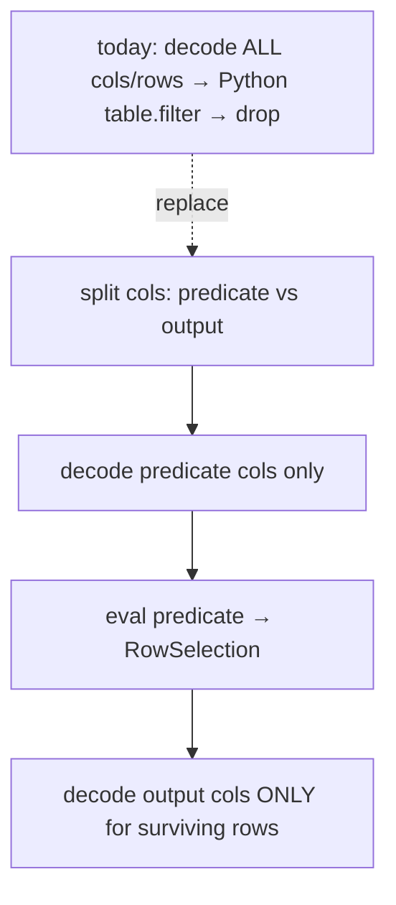

**Do it database-query-optimizer style — or borrow one.** The whole scheme *is* what a columnar
query optimizer does (prune partitions → row groups → pages → late-materialize). There's a
shortcut: **DataFusion** (a query engine on arrow-rs) already implements min/max + bloom-filter
Parquet pruning, `RowFilter` late materialization, and expression evaluation. A heavier prototype
could evaluate predicates through DataFusion physical exprs instead of hand-rolling kernels —
trade-off is a large dependency vs. a bounded self-written evaluator. Flag as an option, not the
default.

**When late materialization pays (and when it hurts).** Do it when the filter is *selective*
**and** there are extra, ideally wide, output columns to defer. Skip it when the filter keeps
most rows (you decode the predicate column, then decode almost everything anyway, plus overhead),
or when the only columns read are predicate columns (nothing to defer). Stats give a cheap
selectivity *estimate* to make this call before committing — a use of stats that helps even when
nothing can be skipped.

**Why this is the moment.** Page-level chunks and page-level pushdown are the *same*
`RowSelection` + page-index mechanism. If the chunker starts handing the reader page ranges,
the reader is already consuming a page-index-guided `RowSelection`; adding a filter-derived
`RowSelection` on top composes for free rather than fighting. PyArrow, by contrast, can't
cheaply read a sub-row-group page range (`iter_batches` materializes the whole group), so it
would fight a page-index chunker — which is the strongest strategic argument for the arrow-rs
reader as the engine underneath that planned change.

---

## 8. How to build / run

```bash
# Build the native crate (macOS dev; needed for the flag to work at all):
cd python/ray/data/_internal/datasource_v2/native/ray_data_arrow_rs
maturin develop --release
# On a uv-managed venv (PEP 668 blocks `develop`'s pip step), build + install instead:
#   maturin build --release && uv pip install --force-reinstall --no-deps target/wheels/*.whl
# Allocator A/B on the Linux run (§7.8): `--features jemalloc` swaps in jemalloc
# (PyArrow's allocator) — set `_RJEM_MALLOC_CONF=background_thread:true,dirty_decay_ms:1000,
# muzzy_decay_ms:1000`. Or leave the default build and cap arenas with `MALLOC_ARENA_MAX=2`
# in the worker env (the harness sets this). Do NOT use `--features mimalloc` — it segfaults
# Ray workers across the FFI boundary (§7.8); jemalloc replaces it.

# Correctness + order parity (skips if the native module isn't importable).
# The S3 tests also need `moto[server]` on PATH (else they skip):
uv pip install "moto[server]"   # once, for the S3 tests
pytest python/ray/data/tests/datasource/test_arrow_rs_parquet_reader.py -v

# Benchmark one config (flip the reader via --readers; sweep sizes here):
RAY_DATA_USE_DATASOURCE_V2=1 python \
  release/nightly_tests/dataset/arrow_rs_read_benchmark.py \
  --readers pyarrow arrow_rs --consume iter_batches \
  --rows 8000000 --num-files 1 --row-group-size 8000000 \
  --str-cols 3 --str-width 48 --num-cpus 4
```

Consume modes: `iter_batches` (realistic), `decode_drop` (isolate decode CPU/transient),
`sum`, `materialize` (retained blocks). Knobs are env-driven at worker import:
`RAY_DATA_ARROW_RS_DECODE_BUDGET_BYTES`, `RAY_DATA_ARROW_RS_K`,
`RAY_DATA_ARROW_RS_FETCH_WINDOW_MB` (S3 in-flight compressed bytes; the S3 memory knob).

**Memory-over-time + the expanded suite** live in
`release/nightly_tests/dataset/arrow_rs_memtrace/`:

```bash
cd release/nightly_tests/dataset/arrow_rs_memtrace
# Per-worker private-heap (USS) over time, both readers overlaid (§3 figures):
python mem_over_time.py && python plot_mem.py
# The axes (§5.5–5.6): layout, schema coverage+parity, budget tuning, leak check,
# mixed-schema, scaling (O(n) proof), concurrency (single-node overcommit).
# Emits runs/results_<axis>.json; USS is sampled every 5 ms on EVERY run:
# S3 memory/speed (§5.9) — Linux + real S3 only; skips locally. ONE command does
# everything: generate fixtures on S3 (N files x one big row group, page index) →
# sweep PyArrow baseline vs arrow-rs across fetch_window_mb ∈ {4,16,64,0} and
# MALLOC_ARENA_MAX on/off → write figs/s3_mem_time.png + figs/s3_speed_time.png +
# a summary table. Needs AWS creds in env + the crate built/installed:
#   RAY_DATA_ARROW_RS_S3_BENCH_PATH=s3://bucket/prefix python run_s3_benchmark.py
# Scale via RAY_DATA_ARROW_RS_S3_BENCH_{ROWS,NUM_FILES,SCHEMA}. (bench_suite.py s3
# runs just the sweep against an existing RAY_DATA_ARROW_RS_S3_BENCH_PATH.)
# or one-variable sweeps (§5.0): bench_suite.py sweep_size,sweep_rowgroup,sweep_schema,
#   sweep_files,sweep_batch,sweep_batch_dd,workloads
python bench_suite.py            # runs all axes if no arg; every axis logs per-task
                                 # windows (tasks_*.csv) + USS (uss_*.csv) + meta.json
python summarize.py              # per-axis tables + THE memory graphs: per-task USS
                                 # vs Ray's E line, one per config (figs/task_mem/) +
                                 # the §5.0 sweep gallery (figs/sweep_*_mem_time.png)
python task_mem.py [substr]      # just the per-task graphs (optionally filtered)

# Postmortem / drill-down instruments (§3.5.1, §5.10):
python inspect_run.py runs/<dir> --plot   # per-worker base/peak/delta + USS-over-time
python micro_alloc_probe.py data/<fixture> [budget_mb]   # Ray-free crate-vs-pyarrow A/B
                                 # (modes incl. LD_PRELOAD allocator + import-cost)

# Ray-FREE raw-decode bench (§5.7) — iterate on the crate without Ray overhead;
# reports pyarrow at 1 thread (Ray-representative) AND full threads:
python standalone_decode_bench.py --rows 8000000 --schema huge_str --budgets 8,32 --ks 1,4
```

`bench_suite.py` sets `RAY_DATA_ARROW_RS_PATH_TRACE=<dir>`, which makes the reader append
`native`/`fallback` per fragment to `path_<pid>.log` in that dir — the harness reads it to
assert which path the support gate chose. The knob is inert unless the env var is set.

---

## 9. Key files

- `context.py` — the `use_arrow_rs_parquet_reader` flag (3 edits, mirrors `use_datasource_v2`).
- `_internal/datasource_v2/scanners/parquet_scanner.py` — `create_reader()` branch.
- `_internal/datasource_v2/readers/arrow_rs_parquet_file_reader.py` — the reader.
- `_internal/datasource_v2/native/ray_data_arrow_rs/src/lib.rs` — the Rust crate
  (`read_row_groups` local + byte-budget + K-split; `read_row_groups_s3` windowed +
  byte-budget + order-preserving K-split-for-lone-big-RG; shared tokio runtime; jemalloc
  feature).
- `tests/datasource/test_arrow_rs_parquet_reader.py` — parity + order + gate tests.
- `release/nightly_tests/dataset/arrow_rs_read_benchmark.py` — RSS-over-time harness
  (macOS-era, §5.1–5.4).
- `release/nightly_tests/dataset/arrow_rs_memtrace/` — the suite (§5.0, §5.5+, §5.10):
  `bench_suite.py` (axes; per-run meta.json + task/USS traces),
  `hookdir/worker_mem_sampler.py` (USS sampler + `FileReader.read` task-window patch),
  `task_mem.py` (THE memory graphs: per-task USS vs E), `inspect_run.py` (per-worker
  drill-down), `micro_alloc_probe.py` (Ray-free crate A/B), `summarize.py`,
  `standalone_decode_bench.py` (§5.7), `run_s3_benchmark.py` (§5.9).

---

## 10. One-paragraph verdict

Integrated into Ray Data V2 and measured locally, an arrow-rs Parquet reader gives a
**flat, file-size-independent decode working set** where PyArrow's scales with the row
group. On the layout Ray can't parallelize — one big row group — this is **4.5× less
peak RSS and 1.6× faster end-to-end** in the realistic `iter_batches` path at 800 MB,
shrinking to a 1.3× memory win at 200 MB and to parity on multi-fragment files (where
Ray's own pool already parallelizes). Under real single-node concurrency (K workers × big
row groups) the node-sum memory gap is **1.78× at 4 workers** (§5.6). The one regression is
a **single-thread, schema-dependent decode deficit** — parity on moderate strings, ~1.5× on
wide strings at the 1 thread a Ray worker gets (§5.7; PyArrow's larger standalone lead is
multi-threading Ray disables per worker) — and it reverses whenever output is materialized.
The memory win is robust and needs no exotic tuning (byte-budget decode, K=1). S3 is now a
first-class path — un-gated, config-faithful, correctness-tested on a moto server, and its
fetch path is **windowed and byte-budgeted so S3 peak RSS is a knob (`window + budget`),
flat in row-group size, not PyArrow's whole-row-group pre-buffer** (§5.9). The first Linux
phase hardened the *measurement* itself: an incremental-USS metric produced one false
regression, was dissected (three implementation hypotheses killed by direct measurement),
and was replaced by the metric of record — **every task's absolute USS over time against
E = 2 × target_max_block_size, Ray's own provisioning assumption** (§3.5.1) — under which
everything reproducible shows arrow-rs parity-to-better on small layouts and multiples
better where row groups are big (§5.10). What's left: the full Linux suite + real S3 on
that one metric, and the `oom` axis (PyArrow OOM-killed, arrow-rs finishes) as the
end-to-end demonstration. Bar: memory-parity-or-better at speed-parity — restated on the
new metric as *tasks that stay near the line Ray schedules by*.
