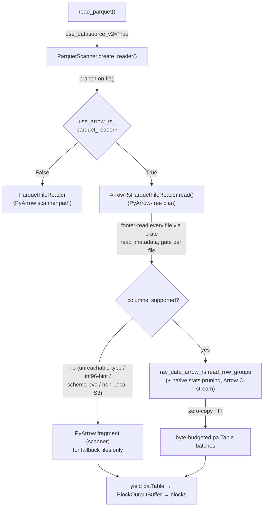
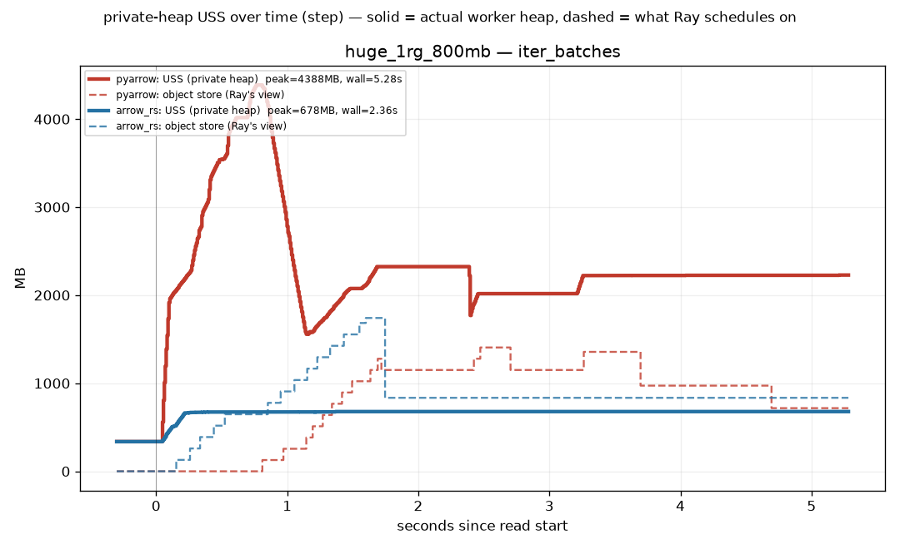
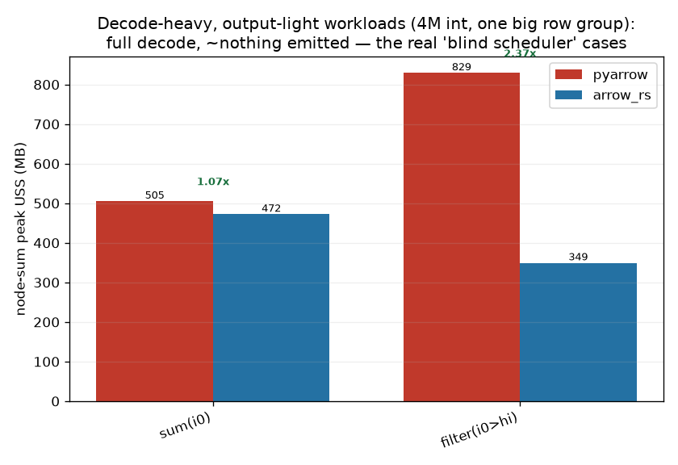
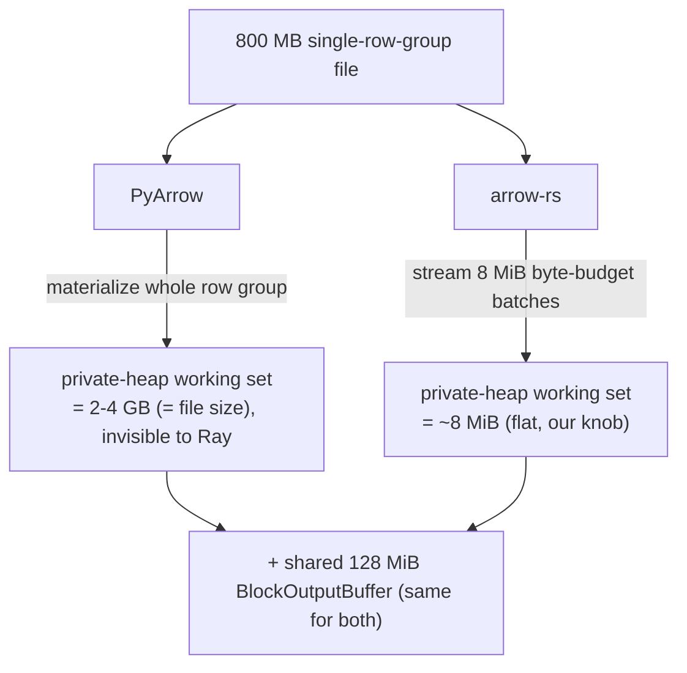
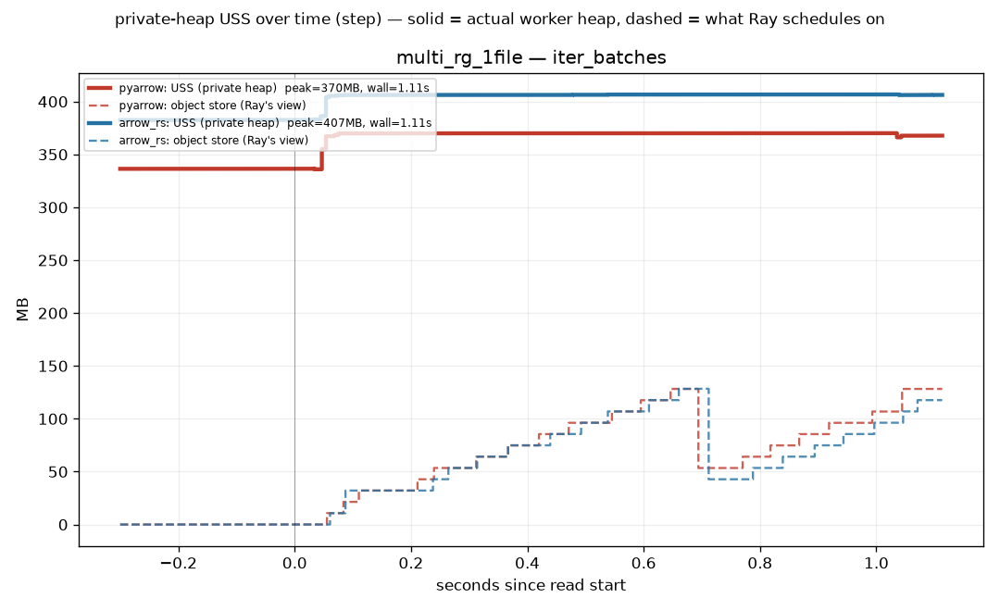
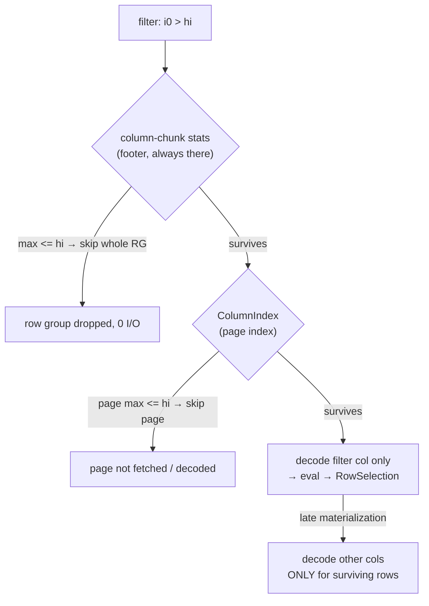
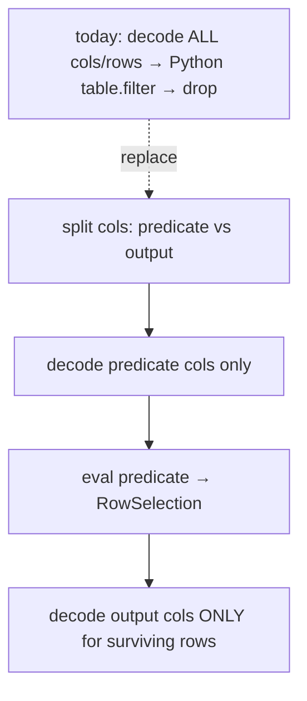

# arrow-rs Parquet reader for Ray Data V2 — case, design, findings

**Status (2026-07-28):** flag-gated (`DataContext.use_arrow_rs_parquet_reader`, active
only under `use_datasource_v2`), **functionally complete for local + S3**: a supported
file is read PyArrow-free end to end (footer, statistics pruning, decode), and every
remaining PyArrow fallback is a *documented decision* (§7.11), not a gap. The
**deciding Linux + real-S3 runs are in** (§5.10): arrow-rs's peak memory is at-or-below
PyArrow's in every paired config at wall parity-to-faster, with **2.6–2.8× less memory
on the target layout** (a lone big row group as one S3 object). Committed on branch
`arrow-rs-parquet-reader`, not merged upstream. Superseded measurement detail (the
macOS-era numbers, the metric postmortem, the phase-by-phase fix log) is archived in
[agents_archive.md](agents_archive.md) under the same section numbers.

**Purpose of this doc:** hand this to a reviewer cold. It states *exactly* the case we
target, *exactly* what we built, every design choice and its rejected alternative, the
real (Ray-integrated) benchmark numbers, the optimizations and fixes by phase, and —
most importantly — the open holes we want critiqued. It is self-contained: it assumes
you know Ray Data and Parquet at a high level but nothing about this work.

**Open work items live in [TODO.md](TODO.md)** (agreed next steps, decisions-needed with
their blockers, and deferred items with revive-triggers). This doc records what's done
and why; that file records what isn't.

---

## 0. The 60-second version

- **What we target:** the single painful Parquet layout Ray's own reader can't
  parallelize — **one big row group in a lone fragment** — on **local or S3**. The
  **column-type gate is now complete** (2026-07-24): every type Parquet can actually
  store — flat, dictionary, map, extension (Ray tensor / variable-shaped / canonical
  `fixed_shape_tensor`), and struct/list/map nesting of them to any depth — decodes
  natively byte-identically to PyArrow (§6.8). The only types still on the PyArrow
  fallback have **no Parquet encoding at all** (union, list_view, run_end_encoded,
  interval — PyArrow itself refuses to write them), so that rejection is an unreachable
  fail-safe, not a limitation. What still routes to PyArrow is **filesystem** (non-Local/S3)
  and a few reader-level kwargs (§1) — *types are no longer the axis.*
- **Why arrow-rs helps:** Ray's **normal** V2 path decodes a row group through PyArrow's
  **dataset scanner** (`fragment.scanner().scan_batches()`, `pre_buffer=True`), which holds
  the selected columns of the whole row group resident *plus* prefetched compressed bytes —
  so peak RSS grows with row-group size, which the file dictates. (`pq.ParquetFile.iter_batches`,
  often *assumed* to stream, is only the ARROW-5030 nested fallback and *also* materializes
  the whole decoded row group — §3.2.) arrow-rs instead sizes each decode batch **by bytes**
  (~8 MiB), turning the dominant O(row group) term into O(decode budget). Its peak is **not**
  literally flat — it's `budget + S3 fetch window + read-ahead + page/dict buffers + allocator
  retention` (§3.4) — but the row-group-scaled term is gone.
- **Headline finding (real integrated reader, macOS, 800 MB single-row-group file,
  `iter_batches`):** arrow-rs peaks at **519 MB vs PyArrow's 2332 MB (4.5× less)** and
  finishes in **5.14 s vs 8.15 s (1.6× faster)**. The memory win is the robust result;
  the speed win is a *consequence* of it (less memory pressure on the materialization
  path). Note this pins PyArrow to `iter_batches`; the **production** path is the scanner,
  which is *worse* still (§3.2 measured it ~2.3× above `iter_batches`), so 4.5× is a
  conservative floor vs what Ray actually runs.
- **The one honest speed regression:** on a *pure-decode-bound* scan (touch every column,
  throw the output away) arrow-rs's raw decode is slower — but this is **single-thread and
  schema-dependent**: at the thread count a Ray worker actually gets (`pa.cpu_count()==1`)
  it's **parity on moderate strings and ~1.5× slower on wide strings** (§5.7). PyArrow's
  bigger apparent lead is multi-threaded column decode, which **Ray disables per worker**
  (parallelism comes from processes). Wherever output is materialized (§5.1) or spread
  across processes (§5.6), it reverses.
- **Chosen local default: K = 1.** Intra-fragment K-split costs memory (+140 MB going
  K=1→4 on the huge case) for negligible local speed. K-split's value is an S3
  phenomenon (concurrent GETs hide network latency); there is no latency to hide
  locally. K-split stays in the crate, gated to the lone-big-fragment case, reserved for
  the S3 phase.
- **How we judge memory (the metric of record, §3.5.1):** one graph per config — every
  read task's **absolute worker USS over time** against a single, decoder-independent
  **ideal streaming reader** line (measured warm floor + one output block,
  `target_max_block_size`). A perfect reader reads compressed bytes off disk (file-backed,
  not USS), decodes in small bounded batches, and streams output; its one irreducible
  private cost is the output block assembled before handoff to plasma — a Ray property,
  identical for both readers, and flat in row-group size. A task's rise above the line IS
  the private memory it holds beyond that ideal (PyArrow ~the whole row group; arrow-rs its
  over-buffering). No baseline subtraction, no summary scalars. This replaced an incremental
  metric that produced a false regression on Linux (§3.5.1), an earlier E = 2×block_size
  heuristic, and an over-budgeted floor+compressed-group line (which let arrow-rs appear
  impossibly *below* "expected").
- **Predicate pushdown:** pushed filters (`ds.filter(expr=...)` via Ray's
  `PredicatePushdown` rule) now prune row groups by footer statistics on the arrow-rs
  path exactly as the PyArrow path does (`fragment.subset`), before any fetch/decode;
  a fully-pruned fragment never calls the crate. Row-*level* in-decode filtering
  (arrow-rs `RowFilter`) remains open (§7).
- **What's proven at node level (§5.10):** the full Linux suite + real-S3 run came back
  uniform — arrow-rs's absolute node-sum peak USS is at-or-below PyArrow's in every
  paired config (~45 cells), at wall parity-to-faster; headline cells: 0.50× at 4-CPU
  concurrency, 0.43× at 1.4 GB, 0.37× on large_str. On the **S3 geometry sweep** the
  target case — a lone big row group as one S3 object, the layout that OOMs today — is
  **2.6–2.8× less memory at speed parity** (`large_1rg` 2.63×, `large_str_1rg` 2.83×), and
  the per-task graphs now carry the ideal-streaming-reader line: PyArrow towers ~+2.4 GB
  above it, arrow-rs ~+0.6 GB (§5.10).
- **What's unproven:** column-type *correctness* is now settled — map/dictionary/extension
  decode byte-identically (§6.8) — but the *memory-win magnitude* for those richer schemas at
  node level (beyond the flat/string/struct cells in §5.10) isn't separately measured; also
  open: the `oom` end-to-end demo, whether the K-split concurrency can be redesigned to win
  locally too, and **filesystem breadth (GCS/Azure)**, which needs new crate connectors (§7).

---

## 1. The exact case we target

Ray Data's V2 Parquet reader chunks work **row-group-aligned** and fans row-group
sub-fragments across a small thread pool (`RAY_DATA_READ_FILES_NUM_THREADS`, default 4).
That pool is Ray's only intra-file parallelism, and it **cannot split a single row
group** — the chunker treats a row group as atomic. So when a file is written as *one
big row group* (common: Spark/pandas defaults, `row_group_size` = row count), that whole
group is a lone fragment handed to a single worker, and PyArrow decodes it essentially
single-threaded while holding the entire decoded group resident.

That is the case we route to arrow-rs. The routing gate is now applied **per file** at
plan time (`_columns_supported`, inside the PyArrow-free `read()` — §2/§7.10), with a
conservative per-fragment re-gate (`_arrow_rs_supported`) on the fallback path. A file is
read natively **only** if all of these hold:

- **local or S3 filesystem** (`LocalFileSystem` / `S3FileSystem`) — every other
  filesystem (GCS, ABFS, HTTP, …) falls back. This is the crate's only real remaining
  boundary: `object_store` is compiled with the `aws` feature only, so the crate has no
  connector to fetch bytes from other backends — an implementation gap, not a property of
  the data (§7). The S3 path recovers the full connection config (endpoint, credentials,
  region, addressing style) from the pyarrow `S3FileSystem` via `fs.__reduce__()`, so
  credentialed / MinIO / moto / custom-endpoint buckets decode identically to PyArrow (§5.9);
- **any column type Parquet can store** — flat, dictionary, map, extension (Ray tensor /
  variable-shaped / canonical `fixed_shape_tensor`), and struct/list/map nesting to any
  depth, all verified byte-identical (§6.8). The recursive `_arrow_rs_type_supported`
  rejects only the `is_nested` exotics (union, list_view, run_end_encoded, interval), and
  those are **unreachable from Parquet**: they have no Parquet encoding, so a column read
  from a Parquet file can never carry one (PyArrow's writer throws "Unhandled type for
  Arrow to Parquet schema conversion"). The rejection is a fail-safe, not a real limit;
- **no `int96` timestamp coercion** (`coerce_int96_timestamp_unit`), no forced
  `dictionary_columns` read — the crate doesn't mirror those read-time coercions. A file
  *written* with legacy int96 timestamps still goes native (parquet-rs defaults int96 →
  `timestamp[ns]`, matching PyArrow) unless it embeds a non-ns Arrow hint, which the gate
  detects via the crate's `int96_columns` and falls back (§6.10);
- **non-empty, non-dotted projection** — empty projection (count-style scans) and nested
  projections fall back;
- **no per-fragment schema evolution** — a column whose per-fragment type differs from
  the unified schema, or is absent from the fragment, falls back (PyArrow does the
  null-fill / cast).

Any file failing the gate is read by PyArrow (fallback fragments built only for those
files). **Correctness is therefore never at risk** — the gate only narrows *where the
arrow-rs path runs*, never what the output is. The cost of the gate is that benchmarks
must confirm the arrow-rs path actually ran (it does — see the `test_native_read_is_pyarrow_free`
test and the parity tests).



---

## 2. Where we plug in (the integration seam)

Three edits, all mirroring the existing `use_datasource_v2` flag pattern:

1. **`context.py`** — new `DataContext.use_arrow_rs_parquet_reader` field, env
   `RAY_DATA_USE_ARROW_RS_PARQUET_READER`, default `False`. Only takes effect under
   `use_datasource_v2=True`.
2. **`scanners/parquet_scanner.py`** `create_reader()` — branch on the flag; return
   `ArrowRsParquetFileReader` (same constructor args) or `ParquetFileReader`. The
   arrow-rs import is lazy (inside the reader), so a missing native module never breaks
   the default path — but if the flag is on and the module import fails, we **raise with
   a build hint** rather than silently falling back (silent fallback would corrupt
   benchmark attribution).
3. **`readers/arrow_rs_parquet_file_reader.py`** — the reader (below).

The reader began as a narrow seam (override `_iter_fragment_tables` only), but the memory
win is now banked through a **PyArrow-free `read()`** (§7.10): for a supported file the
reader footer-reads via the crate's `read_metadata`, prunes row groups from footer
statistics natively (`predicate.rs`, replacing `fragment.subset`), and decodes via
`read_row_groups` — PyArrow never opens the file. It decides native-vs-PyArrow **per file**
(`_columns_supported`), building PyArrow `ParquetFileFragment`s only for the fallback files.
The listing-stage footer read was migrated too (§6.11): with the flag on, `ParquetFileChunker`
reads row-group sizes via the crate, so a supported Local/S3 file is PyArrow-free *end to
end* — footer and data. The format-agnostic finishing (limit, `path`/`row_hash` synthesis,
projection, block sizing, per-fragment retry) is still inherited from the base `FileReader`,
which was refactored to share `_split_columns` / `_postprocess` / `_dispatch_fragment_reads`
between the two paths.

A Ray "block" *is* a `pyarrow.Table`, and the reader contract is just
`Iterator[pa.Table]`, so no block-layer or executor changes are needed. The native crate
returns an Arrow **C-stream** consumed zero-copy via `pa.RecordBatchReader.from_stream`.

---

## 3. Memory: how Ray schedules on it, why PyArrow OOMs, and how we measured it

This is the crux of the whole project, so it gets its own section. The short version:
**Ray decides how many read tasks to run based on a memory number that does not include
PyArrow's decode explosion.** So Ray keeps admitting tasks while each worker quietly eats
gigabytes of heap Ray never counted — until the node OOM-kills. arrow-rs makes that
hidden number small and flat, so Ray's estimate and reality reconverge.

### 3.1 How Ray decides how many tasks to run (the scheduling memory model)

Ray Data's streaming executor admits a new task only when the operator's resource request
fits the remaining budget. The gate is `ReservationOpResourceAllocator.can_submit_new_task`
(`_internal/execution/resource_manager.py:776`):

```python
return (
    op.incremental_resource_usage().satisfies_limit(budget)
    and budget.object_store_memory
        >= (op.metrics.obj_store_mem_max_pending_output_per_task or 0)
)
```

So a task is admitted iff **(CPU/GPU slots fit) AND (object-store budget ≥ estimated
pending output bytes)**. That's the entire memory model. And note *which* bytes:

- The per-task object-store **max** requirement is hardcoded to infinity —
  `_internal/execution/operators/task_pool_map_operator.py:261`:
  ```python
  # we don't know how much data each task can output.
  object_store_memory=float("inf"),
  ```
- The estimate it *does* use, `obj_store_mem_max_pending_output_per_task`, is derived from
  `average_bytes_per_output` — a **lagging average of logical output bytes**
  (`_internal/execution/interfaces/op_runtime_metrics.py:755`), where each block's size is
  `table.nbytes` (`_internal/arrow_block.py:355`: `return self._table.nbytes`).

`table.nbytes` is the **logical Arrow-buffer size of the finished block** — the thing that
gets placed in the shared plasma object store. There is **no term anywhere in the
admission predicate for the worker's process heap / RSS**. Ray schedules purely on
CPU slots + the size of the *output blocks* it expects to land in the object store.

Ray does, however, state what it *assumes* a task's footprint is. The comment justifying
the 128 MiB default block size (`context.py:44`) does the provisioning arithmetic
explicitly: *"With streaming execution and num_cpus many concurrent tasks, the memory
footprint will be about 2 \* num_cpus \* target_max_block_size ≈ RAM \*
object_store_fraction \* 0.3."* That is a **design-time sizing assumption, not an
enforced bound** — by default no `memory` resource is attached to read tasks at all
(`MapOperator` only sets one under the opt-in
`DataContext.default_map_logical_memory_enabled`, default False, which reserves
~2.57 GiB/CPU logical memory — `map_operator.py:103`). Ray Data's own stated aspiration
there: *"if you set each UDF's logical memory to at least the heap memory that UDF
needs, the system won't oversubscribe."* That guarantee is only meaningful for a reader
whose heap need is *knowable* — which is exactly what arrow-rs's knob-bounded working
set provides and PyArrow's layout-dependent one cannot.

The benchmark's per-task graphs therefore draw a **measured expected-without-decode
line** per reader (§3.5.1) rather than an abstract constant: floor (worker USS entering
the task) + compressed-bytes-in-flight (largest row group's compressed size; capped at
the fetch window on the arrow-rs S3 path) + one output block (`target_max_block_size`).
Everything a well-behaved streaming task holds *except* the decode working set — so how
far a task's line rises above it IS that reader's decode working set, read directly off
the graph.

### 3.2 Why PyArrow OOMs the node

The output block is not where the memory goes. A read task is a Ray generator that builds
each block in the **worker's private heap**, then `yield`s it into shared plasma
(`_internal/execution/operators/map_operator.py:887`). Ray only ever accounts for the
*post-yield* object-store size. The **decode working set** — everything the worker
allocates to produce that block — lives in private heap and is invisible to the gate.

For PyArrow that working set is the whole row group. Ray's **normal** V2 path decodes via
the dataset scanner (`fragment.scanner().scan_batches()`, `file_reader.py:555`) with
`pre_buffer=True`, which holds the selected columns of the whole row group resident *and*
prefetches coalesced compressed bytes on top. (The `pq.ParquetFile.iter_batches` path —
`parquet_file_reader.py:457`, reached **only** under the ARROW-5030 nested fallback, not
in the normal path — is no better: it too materializes the entire decoded row group before
handing out `batch_size`-row slices; the batch size controls only the *output* chunk, not
peak. The common belief that `iter_batches` streams within a row group is **false** for a
wide read.) Measured, one 320 MB single-row-group file, 8 float64 cols, `batch_size=4096`
rows (0.26 MB/batch), isolated-subprocess peak RSS above a warm floor:

```
scanner (pre_buffer) — the normal V2 path   +805 MB   decoded row group + prefetched compressed
read_row_group(0) (whole)                   +740 MB
iter_batches, all 8 cols (fallback path)    +346 MB   ≈ the whole decoded row group
iter_batches, 1 of 8 cols                   + 46 MB   ≈ one 40 MB column chunk (scales w/ cols)
arrow-rs crate (8 MB budget, K=1)           + 14 MB   ≈ the byte budget
```

The 1-column vs 8-column `iter_batches` rows (46 vs 346 MB, ~8×) are the proof that peak
scales with *(projected columns × row-group size)*, never with `batch_size`. So the real
picture is:

```
what Ray budgets   = table.nbytes of the output block   (logical, ~128 MiB coalesced)
what the worker uses = whole decoded row group + scratch (can be GBs, invisible)
```

When those diverge, here is the precise failure — and it is worth stating carefully,
because the admission gate ANDs a CPU check with the object-store check
(`resource_manager.py:783-790`), so the memory term can only make admission *stricter*, never
looser. The object-store gate exists to **throttle read concurrency down** when output
blocks are large. Because the decode heap is absent from the estimate, that throttle
**never engages** — so concurrency stays pinned at the CPU cap (`num_cpus`, since a
task-pool read op sets no max-concurrency by default), while each of those `num_cpus`
workers balloons to a multi-GB decode working set in private heap. `num_cpus` × a multi-GB
hidden working set overruns physical RAM, and because it's process heap (not object-store,
which *can* spill) the result is a hard kernel **OOM-kill, not a spill**. The failure is
**bounded and knowable** — exactly `num_cpus` concurrent big decodes — not unbounded
admission; which also means the size of the win **scales directly with core count** (more
cores → more simultaneous big decodes → more overcommit).

The plot below is one 800 MB single-row-group file read with `iter_batches`. Red/blue solid
= actual worker private heap (USS) over time; **black dashed = plasma object-store occupancy
(`object_store_bytes_used`, measured).** PyArrow's heap **spikes to 4.4 GB** while plasma
occupancy tops out near 1.4 GB — a ~3× gap of memory that never enters the admission
estimate — and it sawtooths, never settling. arrow-rs holds a flat ~680 MB.



> **Careful about the dashed line.** It is *measured plasma occupancy*, which is a good
> proxy for "what Ray sees" but is **not literally the scheduled quantity**. The number the
> gate actually uses is `obj_store_mem_max_pending_output_per_task` (a lagging average of
> `table.nbytes`, `op_runtime_metrics.py:755`), which we do not yet log. Directly tracing
> that estimate — to prove the gate is blind rather than infer it from plasma — is a planned
> instrumentation fix (§7). The claim is correct; this plot supports it by proxy, not by
> direct measurement.

Both readers on one axis (solid = actual private heap, dashed = plasma occupancy).
PyArrow's heap (4388 MB) towers over plasma (~1400 MB); arrow-rs's heap (678 MB) is small.
Side-by-side per-worker versions of every plot are in `agents_assets/`
(`*__iter_batches.png`, `*__decode_drop.png`).

**This decode floor is not tunable from PyArrow's Python API — verified by sweeping every
knob that plausibly bounds it** (§5.12). On the scanner path, `batch_readahead` (1→32),
`pre_buffer` (on/off), and `buffer_size` (1→64 MiB) leave the per-task working set
**completely flat** (144 MB across all of them, on a 30-group / one-read-task fixture).
`iter_batches` is a fixed ~85 MB floor (≈ one row group), unmoved by `pre_buffer` or
`use_threads`. The reason: the scanner decodes whole row groups with PyArrow's own internal
concurrency, and none of these knobs bound that; `batch_readahead` shapes only the
batch-level look-ahead *within* an already-decoded group. arrow-rs is the **only** reader
whose working set is a settable number — its byte budget moves it directly (26 MB @ 2 MiB
budget, well under the scanner's 144 MB). So "just configure PyArrow to use less" is not an
option the API offers; a different decoder is.

### 3.3 The decode-heavy, output-light case (real workloads)

The gap is starkest when the consumer decodes a lot but retains almost nothing — so the
decode working set is the whole story and there's no output block to equalize the two
readers. The honest versions of this are real workloads, not a synthetic probe: an
**aggregation** (`ds.sum("i0")`) and a **selective filter** (`ds.filter(expr="i0 > hi")`,
keeping a sliver). Both force a full decode; both emit ~nothing. 4 M int rows, one big row
group:



- **`sum(i0)` → 1.07× (505 → 472 MB).** Near parity. The aggregation streams and the output is
  one scalar, so neither reader carries a big working set past the decode — arrow-rs's flat
  decode transient gives it only a slight edge. Honest: no dramatic win when the decode unit
  is small relative to nothing-retained.
- **`filter(i0 > hi)` → 2.37× (829 → 349 MB).** The filter is a downstream operator, so the
  read decodes *all* 4 M rows and the filter drops all but 6. PyArrow materializes the whole
  decoded group plus the filter pipeline; arrow-rs decodes byte-budgeted batches and releases
  each as the filter consumes it. This also **honestly exercises the no-predicate-pushdown
  limitation** (§4.7): arrow-rs decodes rows it immediately throws away — and *still* wins on
  peak memory, because the decode transient never accumulates.

Two framing notes so this isn't over-read:

- **This is not a *distinct* mechanism from §3.2** — it's the same "decode heap is invisible to
  the object-store gate" point on a realistic consumer. Concurrency stays pinned at `num_cpus`
  and each of those workers decodes off-budget; a retain-nothing consumer just makes the
  decode transient the *only* thing on the heap, so the readers' floors show through cleanly.
- **The earlier synthetic `decode_drop` probe** (a `map_batches` returning a row count) is kept
  only as a decode-CPU isolator in §5.1/§5.5, not as a memory claim — its "plasma ≈ 0" was
  partly a Read↔map fusion artifact (`plan_read_op.py:127`), and a real `count()`
  short-circuits to footer metadata without decoding at all.

### 3.4 Why arrow-rs is flat (the mechanism)

A Parquet file is `file → row groups → column chunks → pages`; a row group is the natural
decode unit. PyArrow decodes a whole one at a time. arrow-rs instead sizes each decode
batch **by bytes, not rows**: it reads the row group's uncompressed size / row count from
the footer and picks a row count so `rows × bytes_per_row ≈ decode_budget_bytes` (~8 MiB).
A wide-string group gets few rows/batch, a numeric group many — both land near the budget.
Each batch is dropped as Python pulls the next, so the decode transient is **flat across
schemas and file sizes**, and is a knob we set rather than a property of the file.



The retained-output-block term (the coalesced ~128 MiB block that Ray *does* see) is
identical for both readers — it's the downstream `BlockOutputBuffer`. arrow-rs's entire win
is on the invisible decode-transient term. And critically, arrow-rs's private heap ends up
**smaller than the object store Ray already tracks** — so it converts an unbounded,
invisible explosion into mostly-visible, spillable, object-store-accounted memory. That is
the structural win, beyond the raw ratio.

**"Flat" is an idealization, stated honestly.** The decode-transient term is bounded by the
byte budget, but arrow-rs's *total* peak is a sum of several terms: `decode budget + S3
compressed fetch window (the fetch_window_mb knob; absent on local reads) + a few read-ahead
batches buffered in the order-preserving channel + current page/dictionary buffers per active
column + memory the Rust system allocator keeps mapped after free (RSS does not drop on a
logical free — the MALLOC_ARENA_MAX / allocator discussion in §7.8)`. The clean ~8–14 MB
local numbers above are a **best case** — local read (no fetch window), incompressible floats,
K=1. The defensible claim is therefore **O(decoded row group) → O(budget + window + constants)**:
a large reduction on big-row-group files, not a literally flat line. The real S3 peak (window
+ budget + allocator retention) is exactly what the Linux/S3 run in §5.10 measures.

**Where arrow-rs neither helps nor hurts:** when a file has many small row groups, Ray's
own thread pool spreads them across workers so no single worker ever holds a big group.
Both readers stay flat and near-identical there (370 vs 407 MB below — the gap is just
import floor), which is the correct "not worse" outcome:



### 3.5 How we measured this, and why

**The quantity: per-worker private heap (USS).** Node OOM is driven by resident physical
memory, and the piece Ray *doesn't* model is each worker's **private** heap — the decode
working set — not shared pages. So we measure **USS** (unique set size: pages resident only
in that process), which excludes shared libraries and the shared plasma object-store
segment. This is exactly the quantity that (a) causes the OOM and (b) is absent from the
admission gate. It is also literally the field Ray's own `MemoryProfiler` samples
(`_internal/util.py:1792` uses `memory_full_info().uss`) and attaches to block metadata as
`max_uss_bytes` (`map_operator.py:878`) — but that value is **advisory only**: its sole
consumers are the reported metric and a *warning* in `high_memory_detector.py:84`. It is
referenced nowhere in `resource_manager.py`. Ray measures the right number and then does not
schedule on it.

**Why not RSS (what our first harness used):** RSS includes shared pages, so it (a)
double-counts the object store and shared libs across K workers and (b) is partly the very
thing Ray *does* track. It conflates the visible and invisible memory. Worse, a per-PID
`max − min` RSS metric we tried was contaminated by worker **import ramp** on short reads
(whether the poller caught a worker before it finished importing PyArrow was luck), which
produced swings of 133→211 MB across identical runs — pure measurement noise, not real
behavior. USS + the method below removes both problems.

**How we sample it:** externally polling another process's USS is `AccessDenied` on macOS,
and external RSS polling misses sub-100 ms transients. So each worker samples **its own**
USS from inside the process: a `worker_process_setup_hook` starts a daemon thread at worker
boot that records `memory_full_info().uss` every 5 ms to a per-worker CSV, epoch-timestamped
so all workers align on one wall clock. In parallel the driver samples Ray's object-store
usage (`object_store_bytes_used`) — "what Ray sees" — on the same clock.

**Why step functions, not connected lines:** USS is a piecewise-constant gauge sampled at
discrete instants; drawing sloped lines between samples invents values we never observed.
We render `where='post'` steps (hold-last) so the plot claims only what was measured. We
plot **absolute** USS (not baseline-subtracted) because the worker's whole private heap is
what's invisible to Ray; a dotted "import floor" line marks the interpreter+libs baseline so
the decode explosion above it is legible. The goal is **consistency over time**, not a
single peak — which is why PyArrow's *sawtooth that never settles* and arrow-rs's *flat
plateau* are the real finding, visible only in the time series.

The instrument lives in `release/nightly_tests/dataset/arrow_rs_memtrace/` (sampler
`hookdir/worker_mem_sampler.py`, driver `mem_over_time.py`, plotter `plot_mem.py`);
the figures in this section are under `python/ray/data/agents_assets/`.

### 3.5.1 The Linux relapse, and the metric of record (per-task absolute USS vs E)

**The relapse, in brief.** On Linux the harness switched to a *windowed incremental
node-sum USS* metric (peak minus each worker's first-in-window sample) to cancel a
shared node's idle pre-started workers — and produced one impossible result (arrow-rs
“6.8× worse” on a many-small-groups file) that every other measurement contradicted.
The postmortem killed three implementation hypotheses by direct measurement (per-group
crate-call overhead; allocator retention — `LD_PRELOAD` jemalloc inert, arrow-rs
standalone 38 vs 89 MB on that very file; lazy-import multiplication), leaving the
metric itself: baseline subtraction hides warmup-retained heap in proportion to the
reader's own retention, systematically flattering PyArrow. All incremental/windowed
metrics, peak bars, and summary scalars were retired. Full postmortem:
[agents_archive.md](agents_archive.md) §3.5.1.

**The metric of record, applied uniformly since.** One graph per benchmark config
(`task_mem.py` → `figs/task_mem/`): the executing worker's **absolute USS over time for
every read task** (red = PyArrow, blue = arrow-rs, each aligned at its own start)
against a **per-reader dashed expected-without-decode line** = measured floor (median
USS entering a task) + compressed-bytes-in-flight (the fixture's largest row group's
compressed size; capped at `fetch_window_mb` on the arrow-rs S3 path) + one output
block (`target_max_block_size`). The line is everything a well-behaved task holds
*except* the decode working set, so a task's rise above it IS its decode working set
(§3.1). Task windows come from the worker hook patching `FileReader.read`
(`readers/file_reader.py:192` — the one per-task entrypoint both readers inherit); a
Ray worker runs one task at a time, so clipping its USS samples to the window *is*
that task's memory. Absolute, because the kernel OOM killer and Ray's memory monitor
act on absolute process memory; USS, because it excludes exactly the shared plasma
pages Ray's gate *does* account (§3.1). Cross-check on Linux: Ray's own per-task
`TaskExecWorkerStats.max_uss_bytes` should match each line's max.

### 3.6 One laptop — is this actually distributed? (single-node, multi-process)

Yes, in the sense that drives this whole thesis. `ray.init(num_cpus=K)` starts a **local,
single-node Ray cluster with K worker *processes***, and read tasks fan out across them.
The OOM mechanism (§3.1–3.2) is **per-node**: K concurrent workers, each with a private
heap the scheduler doesn't count, sharing one machine's RAM. That is exactly what a local
multi-process run reproduces. Going multi-*node* changes only *where the bytes come from*
(local disk → S3, which is the separate deferred phase), not the per-node memory model. So
"one laptop" is the right place to test the memory mechanism; only the S3/network *speed*
story genuinely needs a cluster.

**But there's a subtlety this exposes, and it matters:** our headline case — *one big row
group in a lone fragment* — is inherently a **single-worker decode** (one fragment → one
task). It shows the per-worker win, but it never exercises the *concurrent overcommit*
(many big decodes racing for one node's RAM), which is the actual OOM. To exercise that
locally you need **N files each with one big row group, read across K workers**. We do that
in the `concurrency` axis (§5.6): node-sum USS across all workers, matched CPU counts. The
rule of thumb it confirms: the concurrent memory gap tracks the per-file row-group size —
medium groups stay ~parity (§5.2), big groups multiply the per-worker gap by K.

---

## 4. Design choices (each with its rejected alternative)

**4.1 Subclass, override only the decode step.** *Chosen:* subclass `ParquetFileReader`,
override `_iter_fragment_tables`. *Rejected:* a standalone reader reimplementing
projection / limit / path synthesis / retry. *Why:* those are load-bearing and easy to
get subtly wrong; reusing them means the arrow-rs path differs from PyArrow *only* in the
decode kernel, which is exactly what we want to A/B.

**4.2 Byte-budgeted decode, sized in Rust from the footer.** *Chosen:* pick rows/batch so
`rows × bytes_per_row ≈ 8 MiB`, clamped to `[2048, requested]`. *Rejected:* a fixed row
count (PyArrow's default 131072). *Why:* a fixed row count makes a wide-string file
explode (each row is big) and starves a narrow numeric file. Byte budget is *the*
mechanism that keeps memory flat across schemas (§3). Env: `RAY_DATA_ARROW_RS_DECODE_BUDGET_BYTES`.

**4.3 No reader-side block accumulation — yield each batch straight through.**
*Chosen:* yield each 8 MiB batch as its own `pa.Table`, exactly like the PyArrow base
path yields one table per scanner batch. *Rejected (an earlier prototype did this):*
accumulate batches into a full `target_block_size` block inside the reader before
yielding. *Why:* the downstream read-op `BlockOutputBuffer` **already** coalesces reader
output to `target_max_block_size`. Accumulating a block in the reader *too* just stacks a
second block-sized buffer on top of the output buffer's — roughly **doubling per-worker
peak RSS** relative to PyArrow. This was the actual cause of a multi-fragment
peak-single-worker regression we saw earlier (272 MB vs PyArrow's 194 MB); removing the
accumulation (net −25 lines) brought it to parity (122 vs 118 — macOS noise). **This is
the single most important fix of the iteration** and the reason the memory profile now
matches PyArrow's shape everywhere except the decode transient, where we win.

**4.4 Conservative support gate, fail-safe to PyArrow.** *Chosen:* narrow allowlist
(§1), everything else falls back. *Rejected:* try to handle nested/dictionary/S3 now.
*Why:* correctness first; the prototype's job is to prove the win on the case it
targets, not to be complete. The gate makes "wrong output" impossible — the worst case
is "we ran PyArrow when we could have run arrow-rs."

**4.5 K-split gated to the lone-big-fragment case only.** *Chosen:* the crate splits a
single row group into K parallel row-range readers **only** when `k > 1` AND the call
covers exactly one row group AND it's ≥ `split_threshold_bytes` AND the offset/page index
is present. Every other layout uses the sequential (K=1) path. *Rejected:* always split
K ways. *Why:* Ray's fragment thread pool already parallelizes multi-row-group files;
splitting there too would over-subscribe cores (crate-K × Ray-pool). Gating to the lone
big fragment means the two parallelism layers **never multiply**. (And per §6.3, K=1 is
the local default anyway.)

**4.6 Fail loud on missing native module.** *Chosen:* if the flag is on but
`ray_data_arrow_rs` won't import, raise `ImportError` with a `maturin develop` hint.
*Rejected:* silently fall back to PyArrow. *Why:* a silent fallback would make a
benchmark that *thinks* it's measuring arrow-rs actually measure PyArrow — the most
dangerous possible failure for this project.

**4.7 Predicate applied post-decode in Python.** *Chosen:* the crate has no filter
pushdown; we apply the scanner `filter` on the decoded `pa.Table`. *Rejected:* port
predicate pushdown into Rust now. *Why:* out of scope for the prototype; makes filtered
reads *conservative* for arrow-rs (we decode rows we then drop), which is the safe
direction for a "not worse" claim. Flagged as a real future optimization (§7).

**4.8 Order-preserving K-split merge.** *Chosen:* one bounded channel (depth 2) per
range, consumer drains channels **in range order**, so output row order matches a
sequential read. *Rejected:* commutative merge (what `main.rs` did — it only summed a
checksum, so order didn't matter). *Why:* we return real data to Ray; row order must be
identical to PyArrow. The `test_kspilt_parity_and_order` test asserts `id` comes back
exactly `0..n-1`. **This correctness requirement is also the source of the local-speed
limitation in §6.3** — ordered drain + depth-2 channels means later ranges stall behind
range 0, so parallelism is throttled.

---

## 5. The numbers

> **How to read this section.** §5.10 holds the **deciding results** — the Linux +
> real-S3 runs on the metric of record (§3.5.1). §5.0–§5.9 and §5.11–§5.12 are the
> earlier macOS-era evidence, reduced here to their load-bearing conclusions; the full
> tables, graphs and narrative live in [agents_archive.md](agents_archive.md) under the
> same section numbers. The macOS shapes and ratios all reproduced on Linux; their
> absolute magnitudes were always directional (macOS RSS/USS-era metrics). Per-column
> parity with PyArrow was confirmed on every fixture throughout.

### 5.0 One-variable macOS sweeps (findings only — galleries archived)

Six sweeps, one variable each, both readers overlaid. **File size:** parity at 14 MB
widening monotonically to **4.4× at 1.4 GB** (arrow-rs flat, PyArrow linear in
row-group size — the whole thesis in one row). **Row-group layout** (same 400 MB,
chunked five ways): the win tracks *row-group size*, not file size — 0.9× at
many-tiny-groups → **2.7× at one whole-file group** (the mac 0.9× later proved a
metric/allocator-timing artifact; on Linux that cell is a 0.87× *win* — §5.10).
**Schema:** 1.2× on ints/floats → **4.0× on `large_str`**. **File count**
(concurrency): steady 1.6–1.8× at every count. **Decode budget** (retained + dropped):
locally near-flat — with K=1 the sync reader holds the whole group buffer, so the
budget is a wall lever, not a local memory lever; PyArrow sits ~3–4× higher regardless
of any knob.

### 5.1 Huge single row group — the macOS headline (archived)

800 MB single-row-group file, `iter_batches`: **arrow-rs 519 MB vs PyArrow 2332 MB
(4.5×), 5.14 s vs 8.15 s (1.6× faster)**. K=4/8 add ~140 MB for no local speed → K=1
default. `decode_drop` isolation: PyArrow holds the whole ~1.4–1.5 GB group resident
even with output dropped; arrow-rs retains ~nothing. arrow-rs's raw-decode CPU deficit
on this wide-string schema is the §5.7 worst case and is repaid wherever output is
materialized.

### 5.2 Medium single row group (archived)

200 MB group: **1.3× less memory at speed parity** — the ratio scales with row-group
size (§5.6). Decode layer isolated (`decode_drop`): 184 vs 465 MB (2.5×).

### 5.3 Multi-fragment layouts (archived)

**Parity everywhere** (within macOS noise): when Ray's pool spreads small fragments
across workers, neither reader holds a big group — the correct “not worse” outcome.

### 5.4 Knob summary (archived)

Budget flat above ~1 MB locally in `iter_batches` (downstream coalesce dominates); K
scales memory up ~linearly for negligible local speed → **K=1 local default**.

### 5.5 Expanded macOS axes (archived)

**Wall parity on every layout shape** (worst 1.11× — the lone big group's K=1 decode
gap); the alternating-group shape that exposed an O(n²) reader-rebuild trap in a
different codebase is 1.01× here (structurally absent: one reader per row group,
streamed). **Mixed 6-file dataset** (5 flat files native + 1 struct fallback inside a
single read): 25% faster and 1.42× less memory. **Leak axis** (8 repeated reads): flat
floor, no ratchet, arrow-rs ~80 MB lower. **Schema axis:** 8/8 dtypes byte-identical
per-column-hash — and it caught a real gate hole (pyarrow's canonical
`fixed_shape_tensor` slipping past the extension check; fixed, later superseded by full
native extension support, §6.8).

### 5.6 Scaling and single-node concurrency (archived)

**Scaling:** arrow-rs is O(n) — µs/row *falls* with size (no rebuild trap), crossing
PyArrow near ~3 M rows and ending **35% faster at 8 M**; the memory ratio widens to
**3.2×** and never inverts. **Concurrency** (N big-group files × K workers — the
actual OOM mechanism): at 4 CPUs PyArrow's node-sum hits 3.07 GB vs arrow-rs 1.73 GB
(**1.78×**), arrow-rs also faster; the gap grows with worker count — §3.2's
packing-toward-OOM, observed.

### 5.7 Raw decode CPU, isolated — the one real deficit (conclusion; data archived)

Ray-free, at the **1 thread a Ray worker actually gets** (`pa.cpu_count()==1`; Ray
parallelizes with processes, not threads): arrow-rs decode is **parity on moderate
strings (0.98×) and ~1.5× slower on wide strings**. The deficit lives in the crate's
wide-string decode kernel — the concrete thing to optimize. PyArrow's larger
standalone lead is multi-threaded decode that Ray disables per worker. The gap
reverses wherever output is materialized (§5.1) or work spreads across processes
(§5.6). Iterate with `standalone_decode_bench.py` before confirming in the Ray suite.

### 5.8 Pipelining: not the local gap; the S3 overlap design (conclusion; archived)

Locally there is **no I/O stall to hide** (`cpu/wall = 1.00` on every warm k=1 run —
the residual gap is the string kernel, not missing prefetch). On S3 the async windowed
path + **`prefetch_windows`** (default 2) overlaps window N+1's GET with window N's
decode, drained strictly in row order — the memory-first analog of `pre_buffer`,
bounded at ≈ `k × prefetch_windows × fetch_window` compressed in flight. Best-tuned
(k=4, 32 MB) beats 1-thread PyArrow at 2 M rows (0.69×) but not at 8 M — the ordered
depth-2 channels serialize K (the deliberate memory-bounding trade, §4.8/§6.3).

### 5.9 S3 correctness (design facts; phase log archived)

Still-current design: the reader recovers the **full S3 connection config** from the
pyarrow `S3FileSystem` via `fs.__reduce__()` (endpoint override, static/session creds,
region, addressing style; `allow_http` derived from the endpoint URL, not the always-
`https` `scheme` field) and hands it to the crate's `AmazonS3Builder` — so MinIO /
moto / credentialed buckets decode identically to PyArrow. The fetch path is
**windowed, byte-budgeted, order-preserving async** (peak ≈ `fetch_window +
decode_budget`, flat in row-group size), with K-fan-out **only** for a lone big row
group (never multiplies Ray's 4-thread pool) and one shared tokio runtime. The moto
suite covers parity / projection / sum / struct-fallback / config recovery / K-split
order / prefetch order, and caught + fixed a projected-schema FFI bug. Measurement was
deferred to Linux + real S3 — since run: §5.10.

### 5.10 Linux + real S3 — the deciding results (metric of record)

The first Linux phase produced one measurement-methodology postmortem (§3.5.1) and,
from its salvage instruments, a set of findings that all point the same way. Caveat up
front: the in-Ray numbers below were taken under the since-retired windowed-incremental
metric — on **big** fixtures the decode signal (hundreds of MB to GB) swamps that
metric's ~100 MB bias, so those stand as directional; on **small** fixtures only the
bias-free instruments (Ray-free probe, per-worker absolute deltas) are quoted.

**Big fixtures (bias-negligible, the thesis regime) — the mac shapes reproduce.**
The budget sweep on the ~400 MB single group: PyArrow **1660 → arrow-rs 670 MB
(0.40×)** in `iter_batches`, 0.21× in decode-drop; the selective-filter workload
**0.26×**; `sum` near parity (0.86×). The memory-over-time shape is the finding again:
PyArrow a tall right-triangle — a fast climb to the whole decoded group, then a cliff —
arrow-rs a low flat line. On the fresh layout run, one_large_grp came in at **0.70×**
with arrow-rs also ~15% faster; walls were parity-to-faster across every layout.

**Small/many-group fixtures (where the retired metric lied) — parity-to-better,
triple-confirmed.** The Ray-free probe on the many-small-groups file: PyArrow ~89 MB,
arrow-rs ~38 MB (one call or per-group call alike; jemalloc `LD_PRELOAD` inert; extension
import+init = 0 MB). Per-worker absolute traces of the same read in Ray: arrow-rs
Δ89.1 MB vs PyArrow Δ98.7 MB, one worker each, matching the mac §5.5 parity row. The
lone contrary datapoint (153 vs 22 MB) is unreproducible, its traces destroyed by its
own rerun, and both its halves are individually impossible against the standalone
numbers — classified a metric artifact (§3.5.1).

**Also established on Linux:** one small-file subtlety confirmed in the base reader —
files below the chunker's `target_chunk_size` go **whole-file** (chunk metadata `None` →
`row_groups=None` → ONE crate call per task, `parquet_file_reader.py:300`), so the
one-subfragment-per-row-group fan-out only applies to files big enough to chunk. And Ray's
prestarted-worker pool on a many-core node is why naive node-sum absolute USS needs care:
idle workers each hold an import floor; the per-task metric sidesteps this entirely.

**The full-suite rerun (2026-07-21, single fat node, private 4-CPU sessions, real S3).**
Every axis, on the new instrumentation; memory below is **absolute node-sum peak USS**
(no subtraction — the retired metric's bias cannot produce these numbers). The result is
uniform: **arrow-rs's peak is at-or-below PyArrow's in every paired config in the suite**
(~45 cells; the only exception is the S3 `w0` config, which deliberately disables the
fetch window to prove it is the lever). Ratios are arrow-rs ÷ PyArrow:

| axis | memory (rs/pa) | wall (rs/pa) |
|---|---|---|
| layout (5 shapes) | 0.81–0.93× | 0.90–0.99× (small_many_grp 1.16×) |
| mixed 6-file (incl. struct fallback) | **0.65×** (636 vs 975 MB) | **0.55×** |
| concurrency @4cpu | **0.53× / 0.50×** (1727 vs 3237; 2474 vs 4997 MB) | 0.86× / 0.82× |
| sweep_size 14 MB → 1.4 GB | 0.98× → **0.43×** (1613 vs 3733 MB) | 0.83–0.98× |
| sweep_rowgroup tiny → whole-file | 0.87× → **0.51×** | 0.77–1.03× |
| sweep_schema (large_str peak) | **0.37×** (1037 vs 2828 MB) | 0.63× (float 1.12×) |
| sweep_files 1→8 | 0.64–0.84× | 0.87–0.96× |
| sweep_batch retained / decode-drop | ~0.50× / **~0.24×** | ~0.85× / ~0.48× |
| workloads sum / filter | 0.91× / **0.34×** | 0.82× / 0.54× |
| s3 real bucket, w16 | 0.81–0.89× (best 2267 vs 2814 MB) | 0.99× |

Readings that matter beyond the ratios:

- **The concurrency direction, not just the level:** going 2→4 CPUs, PyArrow's node peak
  *rises* (3142→3237, 4827→4997 MB) while arrow-rs's *falls* (1919→1727, 2953→2474 MB —
  more workers finish sooner, each holding less). Per-task overshoot × concurrency
  compounding is precisely §3.2's OOM mechanism, observed at node level.
- **The mac many-tiny-groups loss (§5.0 sweep-2 panel 1, 0.9×) does not exist on Linux:**
  rg_50k is a 0.87× *win* at wall parity (1.03×) — consistent with the probe's finding
  that per-worker high-water was always lower and the mac node-sum gap was an
  allocator-release timing effect on macOS.
- **Memory scaling in file size:** 14 MB → 1.4 GB moves PyArrow 252→3733 MB (~15×) but
  arrow-rs 248→1613 MB (~6.5×); the ratio widens monotonically (0.98→0.43×). Same shape
  as the mac sweep, now at authoritative USS.
- **The budget knob is a wall lever, not a local memory lever (mac null reproduced):**
  arrow-rs retained peak is flat ~890–990 MB across budgets 1→64 MB; the tuning wall
  sweep shows 1 MB=1.22×, 2 MB (default) =1.05×, ≥4 MB=0.91–0.94×.
- **S3: the fetch window is the memory lever, confirmed by ablation.** w4 saves memory
  but costs wall (1.32×); w64 gives back the memory (2860 MB); **w0 (no window) is worse
  than PyArrow** (3284 vs 2814 MB); w16 = speed parity (0.99×) at 0.81–0.89×.
  Default `fetch_window_mb=16` validated. `MALLOC_ARENA_MAX=2` was inert (2424≈2494 MB),
  consistent with the dead allocator hypotheses.
- **Speed cells ≥1.1× slower, all small/fast fixtures:** layout small_many_grp 1.16×
  (0.43→0.50 s), schema float 1.15× and sweep_schema float 1.12× (the one *consistent*
  slow cell — plain-float decode, ~parity band), schema wide_str 1.27× — contradicted by
  sweep_schema wide_str 0.88× and tuning b2 1.05× on bigger fixtures, so treated as noise
  pending a repeat.

**The task_mem-with-ideal-line rerun + S3 geometry sweep (2026-07-22, Linux + real S3).**
This run carries the metric of record — per-task absolute USS over time vs the **ideal
streaming reader** line (`floor + one output block`, decoder-independent; §3.5.1). Both
halves of the thesis now show on one run.

*Per-task overshoot above the ideal line* (MB the reader holds beyond a perfect streaming
reader; pyarrow / arrow-rs):

| config | pyarrow | arrow-rs |
|---|---|---|
| S3 `large_1rg` (8 M, 1 rg) | **+2431** | **+645** |
| S3 `large_str_1rg` (2 M) | +2381 | +549 |
| S3 `many_files_1rg` (4 files) | +443 | +257 |
| S3 `small_many_rg` (100k-rg) | −57 | −40 (both *below* ideal) |
| local `scale__8M` / `sweep_size 1.4 GB` | +2477 / +3295 | +877 / +1200 |
| `decode_drop` (blocks dropped — mechanism isolated) | +1196 | **+24 to +77** |
| `leak` (8 repeats) | +166 | −119 (below ideal, no ratchet) |

`decode_drop` is the cleanest single picture: with retained blocks removed, arrow-rs sits
essentially *on* the ideal line (+24 MB) while PyArrow towers +1.2 GB — the whole-row-group
decode heap, made visible.

*S3 geometry sweep (option B — the differentiating geometries on real S3, where the windowed
async fetch finally engages).* Memory = absolute node-sum peak USS; `mem` = pyarrow ÷ arrow-rs
(>1 ⇒ arrow-rs uses less):

| geometry | pyarrow | arrow-rs | mem | wall rs/pa |
|---|---|---|---|---|
| `large_1rg` (lone big rg, the OOM case) | 2882 MB | 1096 MB | **2.63×** | 1.08× |
| `large_str_1rg` | 2833 MB | 1001 MB | **2.83×** | 0.88× |
| `many_files_1rg` (4 objects) | 1815 MB | 1808 MB | 1.00× | 1.09× |
| `small_many_rg` (many tiny rg) | 1450 MB | 1614 MB | 0.90× | 0.94× |
| `list_1rg` | 741 MB | 656 MB | 1.13× | 0.91× |

Reading it: the two `large_*_1rg` rows are the target — a lone big row group arriving as one
S3 object, the layout that OOMs today — and arrow-rs is **2.6–2.8× less private memory at
speed parity**, because the fetch window caps compressed-in-flight (~16 MB) while PyArrow
pulls the whole object and decodes the whole group. `many_files_1rg` parity is expected (4
separate objects ⇒ working set is already one-file-at-a-time for both; no lone object for the
window to cap). The one regression, `small_many_rg` at 0.90×, is real but immaterial: the
overshoot table shows **both readers below the ideal line** there (−57 / −40 MB), i.e. both
peak under a single output block — the 10% "loss" lives entirely in sub-block noise, not an
OOM regime. This run also reproduced the on-node overcommit win (concurrency 1.42–1.59× less
at 4 CPUs, faster wall) and the filter workload (3.0× less memory, 1.56× faster).

The honest speed framing: parity-to-modestly-faster everywhere, **not** the standalone 4–5×
(that was the S3 K-split, dormant except on a lone big row group, and K=1 by default). The
pitch is *removing the OOMs at no speed cost*, which the deciding run confirms.

**The `leak_rgsize` axis on the metric of record (2026-07-27, first run on the current
Anyscale Python workspace).** Booting a from-source master cluster on the managed workspace
image cost a day of environment debugging, none of it arrow-rs-related; the three pitfalls
(private local cluster, missing `aiohttp`, a task-events SIGSEGV workaround) are recorded in
[arrow_rs_runbook.md](arrow_rs_runbook.md) §2 so the next run skips it. This axis decomposes the #49158 surge by **row-group size** using
the #49158 shape itself (3200 rows of ~256 KiB binary cells, ~800 MB, written two ways):
`many_tiny` (`row_group_size=16` ⇒ ~200 tiny groups, the churn case) and `few_large`
(4 × ~200 MB groups, the decode-floor case). Four readers, `num_cpus=4`, `decode_drop` with
`target_max_block_size=8 MiB`; `max_task` = the busiest worker's windowed USS growth = the
reader's working set (the metric of record), with node-sum incr/peak kept only as a sanity
overlay:

| geom | reader | max_task | incr_USS | peak_USS | nat/fb | wall |
|---|---|---|---|---|---|---|
| many_tiny | pyarrow_v1 (legacy scanner) | **1866** | 2129 | 2572 | 0/0 | 5.71 |
| many_tiny | pyarrow (V2 scanner) | 82 | 263 | 663 | 0/0 | 5.18 |
| many_tiny | pyarrow_iter | 79 | 325 | 733 | 0/0 | 5.07 |
| many_tiny | arrow-rs | **64** | 208 | 573 | **200/0** | 4.62 |
| few_large | pyarrow_v1 (legacy scanner) | **2477** | 2659 | 3020 | 0/0 | 5.39 |
| few_large | pyarrow (V2 scanner) | 958 | 1891 | 2094 | 0/0 | 1.61 |
| few_large | pyarrow_iter | 616 | 616 | 820 | 0/0 | 1.14 |
| few_large | arrow-rs | **403** | 801 | 1001 | **4/0** | 2.74 |

1. **V2 kills the v1 surge in both geometries.** The legacy whole-file scanner (the actual
   #49158 path) holds 1866 / 2477 MB per task; every V2 reader cuts that 3–30×. Orthogonal to
   arrow-rs (it's the per-group fan-out) but it frames the axis.
2. **arrow-rs has the smallest per-task working set of any reader in both geometries** —
   64 vs 79–82 (many_tiny) and 403 vs 616–958 (few_large) — the byte-budget/streaming-decode
   mechanism, on authoritative Linux USS, on the exact leak shape. `nat/fb = 200/0` and `4/0`
   confirm the native path ran on every fragment: zero silent PyArrow fallback, so these rows
   really measure arrow-rs.
3. **The one caveat — few_large's node-sum — is concurrency, not a reader loss.** arrow-rs's
   node-sum incr/peak (801/1001) reads *above* pyarrow_iter's (616/820) despite a *lower*
   per-task working set (403 vs 616). The gap is instantaneous overlap: node-sum ÷ per-task
   ≈ **2 for arrow-rs** (801/403) vs **≈ 1 for iter** (616/616) — arrow-rs had ~2 heavy decodes
   live at the peak, iter ~1. The Rust decode path **releases the GIL** and genuinely
   parallelizes the 4 groups across the V2 read-thread pool where `pq.iter_batches`
   (pure-Python batch loop) serializes on it; more overlap ⇒ higher *instantaneous* node-sum
   for the same total work. A secondary contributor is glibc `ptmalloc` retaining freed pages
   where PyArrow's jemalloc returns them (§7.8). Per worker — the metric that drives OOM —
   arrow-rs holds the least.
4. **This axis is K=1**, so it never exercises the K-split byte-range mechanism (the S3
   flat-peak lever): with K=1 arrow-rs still resident-holds the whole ~200 MB compressed
   column chunk per big group (the budget caps *decoded output*, not compressed input).
   few_large tests streaming-decode-only, and arrow-rs still wins per-task.

A `num_cpus=1` variant was run to serialize the decodes and cross-check reading (3); it is
**rejected as a test**. arrow-rs came back `nat/fb = 0/0` (its native instrumentation didn't
register) and all four readers collapsed to identical numbers — because forcing every group
through one long-lived worker swaps the concurrency variable for single-process
allocator-retention accumulation (a *different* confound) and broke the per-task tracing. The
concurrency reading stands on the arithmetic above and the per-task overlap graph
(`figs/task_mem/leakrg__few_large.png`), not on serialization. Lesson for the harness: isolate
concurrency by reading the per-task overlap graph, never by dropping to one core.

**Pending:** the planned `oom` axis — a memory-ceilinged node where PyArrow's hidden decode
heap OOM-kills the read and arrow-rs finishes — the end-to-end demonstration of §3.2's failure
mode and its removal.

### 5.11 arrow#39808 leak geometry inside Ray (archived)

30-group file read as **one task**: scanner 144 MB > `iter_batches` 85 MB > arrow-rs
39 MB — the issue's tiering reproduced through real Ray tasks. V2's chunker +
`fragment_readahead=1` bound the classic whole-file accumulation (no catastrophic leak
even in the worst geometry); the residual chunk-size-dependent scanner growth
(110→144 MB) is real but bounded; `iter` and arrow-rs are flat across both modes.

### 5.12 “Just tune PyArrow”? — a measured no (conclusion; data archived)

Sweeping every plausibly-bounding PyArrow knob (`batch_readahead` 1→32, `buffer_size`
1→64 MiB, `pre_buffer`, `use_threads`) leaves the scanner's ~144 MB decode floor and
`iter_batches`' ~85 MB floor **completely flat** — the scanner decodes whole row groups
with internal concurrency none of those knobs bound (and the knobs were verified to
reach the workers, so the flatness is real). **arrow-rs's byte budget is the only
working memory knob** (26 MB @ 2 MiB budget). One caveat: `pre_buffer` is an S3
I/O-coalescing knob, not a local memory lever. The macOS `budget=32 MiB → 431 MB`
"cliff" was a **macOS-allocator artifact, disproven on Linux** (2026-07-29): a Ray-free
`micro_alloc_probe` on the same 30-group fixture holds ~100 MB @ 8 MiB and ~137 MB @
32 MiB — mild and monotonic, no explosion. macOS retained the crate's freed >4 MiB
decode buffers across row groups; glibc `munmap`s them immediately. So the budget sweep
**is** quotable on Linux (the measurement box), and macOS numbers above ~16 MiB budget
should be read as allocator noise, not a reader property.

---

## 6. Optimizations and fixes, by phase

### Phase 1 (macOS integration) — compressed; full text archived

**6.1** Removed reader-side block accumulation (§4.3) — the headline fix: −25 lines,
killed a second block-sized buffer per worker, parity everywhere except the decode
transient. **6.2** Fixed benchmark memory attribution (per-PID self-baselined; added
the `decode_drop` consume mode that made the decode-layer win visible). **6.3** Found
K-split's local ceiling: ordered drain + depth-2 channels throttle it by design
(§4.8) → K=1 local default; K-split reserved for S3. **6.4** The K-split
parity+order test + the correctness suite (local parity/projection, gate fallbacks,
`ds.sum()` parity, moto-S3 incl. windowed K-split order).

### Phase 2 (Linux workspace — measurement hardening) — compressed; archived

**6.5** Diagnosed and retired the biased windowed-incremental metric (§3.5.1).
**6.6** Built the metric-of-record instrumentation: task windows via the
`FileReader.read` hook, `task_mem.py` per-task graphs, `micro_alloc_probe.py`
(Ray-free crate A/B), `inspect_run.py` (per-worker drill-down); equalized import
floors; alive-gated node-sum sanity column.

### Phase 3 (capability expansion, post-suite)

**6.7 Row-group predicate pushdown on the native path.** Ray's V2 planner already
pushes `ds.filter(expr=...)` into the read (`PredicatePushdown` rule →
`ArrowFileScanner.push_filters` → a PyArrow expression in the reader's scanner kwargs),
and the PyArrow reader was already pruning row groups with it. The arrow-rs reader now
does the identical `fragment.subset(filter=...)` stats-prune before calling the crate —
zero Rust changes, pruned groups are never fetched or decoded, and a fully-pruned
fragment skips the crate call entirely. Tests assert the crate receives exactly the
surviving row-group ids (`row_groups=[3]` on a sorted 4-group file) and end-to-end
parity through the planner rule.

**6.8 Column-type gate completed — every Parquet-representable type is native.** The
blanket `is_nested` rejection was first replaced (2026-07-21) by a recursive
`_arrow_rs_type_supported` admitting flat + struct/list nesting; then extended (2026-07-24)
to **dictionary, map, and all extension types** — Ray `ArrowTensorTypeV2`,
`ArrowVariableShapedTensorType`, pyarrow canonical `fixed_shape_tensor`, and even
*unregistered* custom extensions. The crate needed **no changes**: `ProjectionMask::roots`
projects whole root columns, and the FFI C-stream carries the embedded arrow-schema field
metadata (`ARROW:extension:name`/`:metadata`), so pyarrow reconstructs a registered
extension identically and surfaces an unknown one as storage-type + metadata — exactly its
own read behavior. Verified byte-identical via direct crate-vs-PyArrow probes (map incl.
null/empty entries; multi-row-group per-group dictionaries + nulls, the index-divergence
trap; tensors with projection; a 4-level `list<struct<map<string,list<int>>>>`) plus
end-to-end parity tests. The earlier blanket `extension_name` rejection (once logged as a
"gate bug fix") was over-conservative — the crate simply didn't pass embedded schema through
at that time. **What remains rejected cannot occur in Parquet:** union, list_view,
run_end_encoded, and interval have no Parquet encoding (PyArrow's writer throws), so the
`is_nested` fail-safe is *unreachable* rather than a limitation. Net: column type is no
longer a routing axis to PyArrow. The mixed benchmark fixture (`mixed7_tensor`, 6 native +
a tensor member) predates this and now routes fully native.

**6.9 Dependency minimization.** The optional `mimalloc`/`jemalloc` allocator features
and the unused `anyhow` dependency were removed from the crate (the allocator-retention
theory they existed for was disproven — §3.5.1/§7.8 — and mimalloc segfaulted as a
cdylib global allocator anyway). The tree is now: `parquet`, `arrow` (ffi only),
`object_store` (aws), `pyo3`, `tokio`, `futures`. Allocator A/B stays possible via
`LD_PRELOAD`, which needs no crate support.

**6.10 int96 timestamps on the native path (+ a latent correctness bug fixed).** parquet-rs
defaults int96 → `timestamp[ns]` (matching PyArrow's default), so a Spark/Hive/Impala int96
file — no embedded Arrow hint — now decodes natively byte-identically. A *pyarrow-written*
int96 file, however, embeds a `timestamp[us]` Arrow hint that parquet-rs **honors** (→us)
but PyArrow **ignores** (always ns); with no user `schema=` the per-file type check was being
skipped, so such a file went native and silently produced `us` ≠ PyArrow's `ns`. Fixed by
exposing `int96_columns` from the crate footer and gating both entry points: the plan-time
gate (`_columns_supported`) admits an int96 column only when the crate lands on ns/no-tz; the
conservative pyarrow-fragment re-gate falls back any int96-physical read column (it can't see
the crate's output). Verified: no-hint → native/ns, us-hint → fallback/ns, both parity.

**6.11 Listing-stage footer read migrated to the crate (PyArrow-free end to end).** With the
flag on and a Local/S3 filesystem, `ParquetFileChunker` reads row-group sizes via the crate's
`read_metadata` (shared `native_metadata.py`) instead of `pq.read_metadata`, so a supported
file's footer is never touched by PyArrow either. The crate now exposes
`row_group_compressed_sizes` (= `rg.compressed_size()`), which equals PyArrow's
`sum(col.total_compressed_size)` **exactly**, so greedy row-group bundling yields byte-for-byte
identical chunk boundaries flag on/off (verified across target sizes; flag-on makes zero
`pq.read_metadata` calls). Result: the two footer reads a supported file used to incur
(PyArrow in the listing task + arrow-rs in the read task) are now both arrow-rs.

---

## 7. Open holes — what we want critiqued

Ranked by how much they'd change the decision:

1. **S3 memory/speed — MEASURED (2026-07-22, §5.10).** The windowed path delivered on
   real S3: **2.6–2.8× less memory at speed parity** on the lone-big-row-group geometry,
   with the fetch-window ablation confirming the knob (w16 the validated knee; w0 worse
   than PyArrow; `MALLOC_ARENA_MAX` inert). Still open from this item: the **`oom` axis**
   — a memory-ceilinged node where PyArrow's hidden decode heap OOM-kills the read and
   arrow-rs finishes — the end-to-end demonstration of §3.2's failure mode; and whether
   a lone big group wants `prefetch_windows` deeper than 2 (swept, not decisive).

2. **The single-thread wide-string decode gap (§5.7).** Isolated from Ray, at the
   1-thread count a Ray worker gets, arrow-rs decode is parity on moderate strings and
   **~1.5× slower on wide strings** — a real deficit in the crate's wide-string decode
   kernel (PyArrow's bigger standalone lead is just multi-threading, which Ray disables per
   worker). It reverses under materialization (§5.1) and process parallelism (§5.6).
   Resolutions, want a steer:
   - **(a) Accept it, memory-first.** Honest, simple. At matched threads it's parity-to-1.5×,
     recovered end-to-end; only pure-decode-bound wide-string scans stay behind.
   - **(b) Optimize the crate's wide-string decode** and/or **redesign the K-split** with a
     **bounded-reorder buffer** (a small out-of-order window instead of strict ordered-drain
     + depth-2 channels) so ranges make real concurrent progress while still emitting in
     order — the crate can then use K threads in the lone-fragment case where Ray gives
     PyArrow one. Rust work; risk is the resident reorder window.

3. **Predicate pushdown — row-group pruning DONE (6.7); in-decode row filtering open.**
   Pushed filters now prune row groups by footer statistics on the native path exactly
   like the PyArrow path (`fragment.subset`), so on sorted/clustered data the crate
   never touches non-matching groups. What remains is *row-level* in-decode filtering
   (arrow-rs `RowFilter`/`ArrowPredicate`): inside a surviving row group we still decode
   rows we then drop — same wasted decode work as PyArrow (measured §3.3: filter still
   wins 2.37× on memory, no CPU advantage). That needs an expression translation layer
   into Rust. **Full design, Parquet-statistics background, and the tie-in to Ray's
   planned page-index chunker: §7.9.**

4. **Linux/USS accounting — instrument built, deciding runs done (§5.10); two
   follow-ups.** (a) validating each per-task line's max against Ray's own
   `TaskExecWorkerStats.max_uss_bytes` — agreement makes the number indisputable;
   (b) upstream, `max_uss_bytes` is still advisory-only (§3.5) — surfacing it in the
   operator summary is a small, independently useful PR.

5. **Schema coverage — now measured, one gate hole found + fixed (§5.5), and
   struct/list since ungated (6.8).** The `schema` axis reads 9 dtypes both ways and
   asserts per-column hash parity **and** which path the support gate chose. All are
   byte-identical; since the 6.8 ungate the expected routing is flat + struct + list →
   native, both tensor flavors → fallback. The original run also caught a real bug:
   pyarrow's **canonical `fixed_shape_tensor`** is *not* `isinstance(pa.ExtensionType)`
   in pyarrow 24 (and there's no `pa.types.is_extension`), so it slipped the gate into
   the native crate. It happened to decode correctly, but that violated the gate's
   contract. **Fixed** by also rejecting any type with an `extension_name` — a check the
   recursive `_arrow_rs_type_supported` now applies at every level of the type tree, so
   a tensor *inside* a struct can't slip through either. Still open: nulls, dictionaries,
   timestamps, decimals aren't yet in the matrix, and nested paths are correct-by-fallback,
   not optimized.

6. **Retained-block scenario under `materialize`.** We measured `iter_batches` and
   `decode_drop`. The `materialize` path (blocks retained in the object store) is the
   third profile and isn't in the tables above.

7. **Is targeting only the lone-big-group case worth the complexity?** The gate is
   narrow. If real workloads rarely hit "one giant row group, flat schema, local," the
   whole prototype is a niche win. Worth validating against actual customer file layouts.

8. **Allocator levers — demoted from "fix" to "available knobs" after the theory they
   were built for was disproven (§5.0 panel 1, §5.10).** The mac many-tiny-groups 0.9×
   was first diagnosed as glibc holding freed pages vs PyArrow's jemalloc decaying them.
   The Linux Ray-free probe killed that: `LD_PRELOAD` jemalloc changed nothing, per-group
   calls retain nothing, and arrow-rs standalone uses 2.3× *less* than PyArrow on the
   exact file — the "loss" was the retired metric, not the allocator. The full-suite
   S3 sweep then confirmed it in-Ray: `MALLOC_ARENA_MAX=2` was inert (2424≈2494 MB).
   Consequently the crate's optional `mimalloc`/`jemalloc` allocator features were
   **removed entirely** (dependency minimization, §6.9); A/B experiments use
   `LD_PRELOAD` (no recompile) and the harness's `MALLOC_ARENA_MAX` env lever.
   Historical warning that still stands: a `#[global_allocator]` (mimalloc) in the
   Python-extension cdylib segfaulted Ray workers the moment the native path ran across
   the Arrow-C-stream FFI boundary (fine outside Ray) — don't reintroduce one.

### 7.9 Statistics-driven predicate pushdown (the full design + page-index tie-in)

This is the fleshed-out version of open hole #3, and the single biggest *CPU* win still on
the table. It's written up in detail because it lands right on top of a change the Ray Data
team has signalled — moving the V2 chunker from **row-group ranges** to **page ranges backed
by a page index** — and the arrow-rs reader is the natural engine for it. The current
row-group-atomic chunker is described in `chunkers/file_chunker.py`
(`ParquetFileChunker.generate_chunk_metadatas`): at listing time it reads each footer and
**bundles consecutive row groups up** to `target_chunk_size`, but it can never split a row
group **down** — which is exactly the lone-big-row-group limitation §1 targets. A page-index
chunker removes that floor, and everything below reuses machinery the crate already has.

**Where Parquet statistics actually live (the part that's easy to get wrong).** The physical
layout is `file → row group → column chunk → page`, but statistics do **not** exist at four
independent levels. They exist at **two**:

- **Per-(row group, column) — column-chunk statistics.** Stored in the file footer on each
  `ColumnChunkMetaData.statistics`: `min`, `max`, `null_count`, optional `distinct_count`.
  Cheap (footer-only) and almost always written. Note a row group is **not** a separate stats
  object: within a row group each column has exactly **one** column chunk, so "row-group stats
  for column X" *are* the column-chunk stats for X in that row group — same numbers, not a
  distinct granularity.
- **Per-(page, column) — the ColumnIndex.** Part of the optional **PageIndex** written just
  before the footer: per-page `min`/`max`/`null_count`, paired with the **OffsetIndex**
  (per-page byte offset + compressed size + first-row-index, so you can skip *and* seek). A
  legacy form also exists — inline `Statistics` in each `DataPageHeader` — but those require
  scanning the pages to read, so they're useless for skipping; the ColumnIndex is the modern,
  seekable version, and it's the structure Ray's planned "page index" refers to.

There is **no** standard column-statistics object in `FileMetaData` (file level) — any
file-wide bound is derived by aggregating row-group stats. So the honest model is a
**two-stage cascade**: coarse (row-group/column-chunk, always available) → fine (page, only
if the page index was written) → then per-row late materialization. This maps one-to-one onto
a page-indexed chunker.

**What Ray does today (code-verified 2026-07-22).** The ceiling today is row-group skipping,
and **both** readers now hit it — an earlier version of this section wrongly claimed the
arrow-rs path pruned nothing; it does, at parity:

- **PyArrow base path** does `fragment.subset(filter=filter_expr)`
  (`readers/parquet_file_reader.py:401`), which uses column-chunk stats to **skip whole
  row groups** — but then `iter_batches` can't take a filter, so the row-level predicate is
  applied **post-decode per batch**. No page skipping.
- **arrow-rs path does the same row-group skip**, mirroring the base path line-for-line:
  `fragment.subset(filter=filter_expr)` (`readers/arrow_rs_parquet_file_reader.py:388`) →
  surviving ids (`:390`) → crate `read_row_groups(_s3)(row_groups=…)` (`:428`) →
  `lib.rs:419` (`selected`) → `:262` (`.with_row_groups(vec![rg])`), so Rust opens only the
  survivors (on S3, never fetches the rest). The row-level filter is then applied post-decode
  in Python (`:465`). The **crate itself** carries no pushdown logic — grepping `src/lib.rs`
  for `RowFilter`/`ArrowPredicate` returns nothing; the pruning is pyarrow's, done in Python
  before the FFI call, so no Rust reimplementation is needed to reach parity.

So across the whole stack: **row-group skip = both readers (via pyarrow footer stats); page
skip = nowhere; late materialization = nowhere.** Everything below a row group
decodes-then-discards.

**The cascade to build, and the exact arrow-rs primitive for each stage.**



| Stage | Granularity | arrow-rs primitive | Status in the crate |
|---|---|---|---|
| Skip row groups | column-chunk stats | **done in Python** via `fragment.subset(filter=…)` → `row_groups=` (both readers, at parity); a Rust build buys nothing since pyarrow is always present | **done** |
| Skip pages | ColumnIndex | `RowSelection` from `column_index()` + `offset_index()` | index is *loaded* (k>1 only), not *used* to filter |
| Late materialization | per-row | `RowFilter` + `ArrowPredicate` on the builder (`with_row_filter`) | not done — deferred; belongs as a planner pushdown hint (see plan doc) |

The leverage: the crate's K-split path **already builds `RowSelection` objects**
(`build_range_reader`, `lib.rs:281`) and **already loads the page index**
(`PageIndexPolicy::Optional`, `lib.rs:365`). Pushdown reuses exactly that machinery — feed a
*filter-derived* `RowSelection` into the same builder instead of a *range-derived* one. And
`RowFilter` unlocks the biggest win, **late materialization**: decode only the filter column,
evaluate the predicate, then decode the wide/expensive columns *only* for surviving rows.

**Concrete example (the §3.3 filter workload).** `ds.filter("i0 > hi")` over the 4 M-row
single-row-group file, keeping 6 rows. Today both readers decode all 4 M rows × all columns
and drop all but 6 (arrow-rs still wins 2.37× on *memory* because its decode transient never
accumulates — but does the same wasted *work* as PyArrow). With the cascade: (1) row-group
stats don't prune the lone group; (2) the ColumnIndex keeps only the pages whose per-page
`max(i0) > hi` — a few thousand rows instead of 4 M; (3) `RowFilter` decodes just `i0` on
those pages, finds the 6 matches, and decodes the other columns for **6 rows**. "Decode
everything, keep 6" becomes "touch a few pages, decode ~6 wide rows" — the wasted-decode-CPU
cost §4.7 flags, gone.

**Honest caveat — the I/O win depends on data layout.** Page/row-group skipping only prunes
when the data is **sorted or clustered on the predicate column**, so per-page min/max ranges
are narrow. On a randomly-ordered column every page's range overlaps the filter and skipping
prunes nothing — you still get late materialization (decode fewer *columns*), but not the I/O
saving. This is why real systems push users toward sorting / Z-ordering on filter columns;
the 4 M→6 example above assumes `i0` is clustered.

**Two layers of "pushdown" — Ray already does one of them, and it's not this one.** It's easy
to confuse two separate wins. Keep them apart:

- **Layer 1 — *where* the filter runs in the plan.** Moving the filter below a join, shuffle,
  sort, or projection so those expensive operators process fewer rows. This is a big win
  because joins/shuffles/sorts are super-linear (network, serialization, spill), while a filter
  is linear with a tiny constant. **Ray already does this** — the `PredicatePushdown` rule
  (`_internal/logical/rules/predicate_pushdown.py`) relocates an expression filter down through
  Sort/Shuffle/Repartition (pass-through), Project (with column renaming), Union (into both
  branches), and **Join** (side-aware and join-type-safe: INNER → either side, LEFT_OUTER →
  left only, FULL_OUTER → neither, since nulls would be dropped —
  `logical/operators/join_operator.py:203-212`), and finally into the Read op. So by the time a
  read happens, the join/shuffle above it already sees the filtered row count. This layer is
  **done**; the crate doesn't touch it.
- **Layer 2 — *how* the filter runs once it reaches the Read.** Even after Layer 1 pushes the
  filter *into* the Read op, execution today still **decodes every row, then filters** (PyArrow
  filters post-decode per batch; the arrow-rs path filters in Python after decode). "Pushed into
  the read" does **not** mean "skips the decode." Making the decode itself cheap — skip pages
  via stats, decode only the predicate column first, then decode the wide columns only for
  surviving rows (late materialization) — is Layer 2, and **no reader does it today.** This is
  the crate's job and the whole subject of this section.

Two practical notes on Layer 1, because they decide whether Layer 2 ever gets a filter to work
with: (1) **only expression filters are pushed** — `ds.filter(expr="i0 > 1000")` gets pushed
through the join and into the read, but `ds.filter(lambda row: ...)` is an opaque UDF and is
pushed *nowhere*. (2) Only PyArrow-convertible parts of a predicate reach the datasource; a
mixed `a > 5 AND my_udf(b)` pushes `a > 5` into the read and leaves `my_udf(b)` as a filter
above it. So the two layers **compound**: Layer 1 delivers fewer rows to the read and a filter
the read can see; Layer 2 makes producing those rows cheap.

**When the stats even exist (a capability ladder, degrade gracefully).** Two things are
independent and both optional, so the reader must fall down a ladder:

- **Column-chunk stats** (per row group, in the footer): min/max/null_count. *Usually present*
  — most writers write them by default; can be disabled or truncated.
- **The page index** (ColumnIndex per-page min/max + OffsetIndex per-page location): *often
  absent*. **pyarrow does not write it by default** (needs `write_page_index=True`), while
  parquet-mr/Spark writes the column index by default since Parquet 1.11 — so many real files,
  especially pandas/pyarrow-written ones, have none.

The ladder: **page index present** → skip pages (ColumnIndex) + skip page I/O (OffsetIndex);
**else column-chunk stats present** → skip whole row groups only; **else** → no skipping. Late
materialization (below) still works at *every* rung, including the bottom — it needs no stats.
The crate already probes the top rung: `offset_index().is_some()` (`lib.rs:381`) is exactly the
"do we have a page index?" check, today gating K-split.

**Bloom filters for set-containment predicates.** Min/max only prunes *range* predicates
(`>`, `<`, `BETWEEN`) and only on clustered data. For **equality / `IN`** on an *unclustered
high-cardinality* column, min/max is useless (the value sits inside almost every page's range).
A Parquet **bloom filter** answers "is `x` *definitely not* in this chunk?" regardless of sort
order (no false negatives). Caveats: **column-chunk granularity** (skips row groups, not pages),
**optional** (both pyarrow and Spark need explicit config — often absent), and probabilistic
("maybe present" → still read it). arrow-rs reads them (`parquet::bloom_filter::Sbbf`, the same
path DataFusion uses). So it's a third pruning input: bloom skips row groups for `=`/`IN`,
min/max skips pages for ranges, late materialization handles the residue.

**What Ray already knows about clustering (and it's already in hand).** Ray stores nothing of
its own — but at *listing time* the chunker already reads every footer
(`ParquetFileChunker.generate_chunk_metadatas` → `pq.read_metadata`), so the row-group min/max
stats are **already loaded during planning** (don't add a second footer read). From those you
can infer clustering (disjoint/monotonic per-row-group ranges ⇒ sorted on that column).
Also available: Hive **partition columns** (known and already pruned — guaranteed clustering),
`sorting_columns` in row-group metadata (authoritative but rarely written), and page-level
min/max if the index exists. You never *need* clustering info for correctness — the stats check
is cheap, so the safe design is **attempt-and-fall-through**: try the skip, and if nothing
prunes you just decode normally. Knowing selectivity in advance only lets you *skip the
strategy* when it wouldn't pay.

**How late materialization actually plugs into Ray (the part that looks harder than it is).**
It needs **no executor / operator / DAG changes** — because Ray's Layer-1 pushdown already
delivers the predicate to the reader. In `arrow_rs_parquet_file_reader.py` the reader receives
`filter_expr = scanner_kwargs.get("filter")` (line ~311) and today applies it *after* decode via
`table.filter(filter_expr)` (line ~378). Late materialization only changes *how the reader
executes a predicate it already has* — Python-post-decode → Rust two-phase decode. The work is
almost entirely in the crate:

1. **Pass the predicate into the crate**, not just the column list — a small serialized IR of
   conjuncts `{column, op, literal(s)}` (the same `col OP literal` + `AND`/`OR`/`IN` subset
   Ray's own pushdown already restricts to).
2. **In Rust**, split the projection into a *predicate* `ProjectionMask` and an *output*
   `ProjectionMask`; build an `ArrowPredicateFn` over the predicate mask whose closure runs
   arrow compute kernels (`gt`/`eq`/`is_in`/…) → `BooleanArray`; wrap in `RowFilter`; hand to the
   builder via `.with_row_filter(...)`. arrow-rs decodes predicate columns → builds a
   `RowSelection` → decodes output columns under it (skipping whole pages when the OffsetIndex is
   present). This reuses the exact `RowSelection` machinery the K-split path already builds.
3. **Return already-filtered batches** and delete the Python `table.filter(...)`.
4. **Gate it**: `_arrow_rs_supported` also checks the predicate is expressible in the IR; if not,
   fall back to today's post-decode filter (still correct).



**Do it database-query-optimizer style — or borrow one.** The whole scheme *is* what a columnar
query optimizer does (prune partitions → row groups → pages → late-materialize). There's a
shortcut: **DataFusion** (a query engine on arrow-rs) already implements min/max + bloom-filter
Parquet pruning, `RowFilter` late materialization, and expression evaluation. A heavier prototype
could evaluate predicates through DataFusion physical exprs instead of hand-rolling kernels —
trade-off is a large dependency vs. a bounded self-written evaluator. Flag as an option, not the
default.

**When late materialization pays (and when it hurts).** Do it when the filter is *selective*
**and** there are extra, ideally wide, output columns to defer. Skip it when the filter keeps
most rows (you decode the predicate column, then decode almost everything anyway, plus overhead),
or when the only columns read are predicate columns (nothing to defer). Stats give a cheap
selectivity *estimate* to make this call before committing — a use of stats that helps even when
nothing can be skipped.

**Why this is the moment.** Page-level chunks and page-level pushdown are the *same*
`RowSelection` + page-index mechanism. If the chunker starts handing the reader page ranges,
the reader is already consuming a page-index-guided `RowSelection`; adding a filter-derived
`RowSelection` on top composes for free rather than fighting. PyArrow, by contrast, can't
cheaply read a sub-row-group page range (`iter_batches` materializes the whole group), so it
would fight a page-index chunker — which is the strongest strategic argument for the arrow-rs
reader as the engine underneath that planned change.

### 7.10 Full migration: making arrow-rs the default reader (scope + plan)

The gate today is an **allowlist** — arrow-rs runs only for a narrow supported set, PyArrow
is the default. The goal recorded here is to **invert that**: arrow-rs becomes the default,
PyArrow shrinks to a *denylist fallback* for cases we choose not to port. Motivation: the
memory win holds across the whole gated subset at speed parity (§5.10), so there is no reason
to keep it niche.

**Scoping conclusion: nothing here is fundamentally impossible.** Every current gate exclusion
is "not ported yet," not "arrow-rs can't." Two things that looked like hard walls are not:

- **Extension / user-defined types** (Ray's `ArrowTensorType`, `ArrowVariableShapedTensorType`,
  `ArrowPythonObjectType`, and *any* user-registered `pa.ExtensionType`). An extension type is
  a storage type + field metadata (`ARROW:extension:name` + params). Parquet stores the storage
  type; the Arrow C Data Interface carries field metadata across FFI; pyarrow auto-reconstructs
  a *registered* extension on import. So: decode the storage array in Rust, preserve field
  metadata, let pyarrow rebuild the extension in the worker. Generalizes to all UDTs — no
  per-type special-casing. Effort: mostly metadata plumbing (verify metadata survives our
  C-stream).
- **Arbitrary Python / fsspec / HDFS filesystems.** Not a wall: because the crate is a pyo3
  extension, Rust can hold the Python filesystem object and implement `object_store::ObjectStore`
  by calling back into it (open / read-range) via pyo3 inside `spawn_blocking`. This **keeps the
  memory win** (streaming decode is independent of how bytes arrive) but **loses async fetch
  concurrency** (GIL-bound, serialized range GETs → slower on high-latency opaque stores).
  Trade-off vs PyArrow fallback: bridge = memory win + slower fetch; fallback = native fetch +
  no memory win. For the memory bar the bridge is strictly better. HDFS/fsspec reach us through
  their Python fs via the same bridge.

Capability classification (✅ done · 🔧 port, effort · ❓ niche/uncertain · ⭐ arrow-rs *better*):

| Area | Item | Verdict |
|---|---|---|
| filesystem | local, S3 | ✅ |
| | HTTP(S) | 🔧 easy (`object_store` HTTP) |
| | GCS | 🔧 med (config recovery like `_s3_config`) |
| | Azure/ABFS | 🔧 med (`object_store` Azure) |
| | HDFS / fsspec / opaque Python fs | 🔧 via pyo3 fs-bridge (memory-yes, async-no) |
| types | flat; struct/list/large_list/fixed_size_list | ✅ (§6.8) |
| | dictionary; map; extension (tensor / variable / canonical / unregistered) | ✅ (§6.8 — metadata round-trips through FFI, byte-identical) |
| | union / list_view / run_end_encoded / interval | ✅ n/a — **no Parquet encoding**, unreachable (§6.8) |
| | int96 (default ns) | ✅ (§6.10) |
| | int96 *coerce* to a non-default unit | 🔧 easy (per-column `with_schema` unit override) |
| | dotted nested projection (`a.b`) | 🔧 med (`ProjectionMask` leaf) |
| | forced `dictionary_columns` read output | ❓ niche — crate has no read-time dict-coerce knob |
| pipeline | empty projection / `count()` | 🔧 easy + ⭐ (metadata-only, no decode) |
| | schema evolution null-fill | 🔧 med — **the correctness centerpiece** |
| | per-fragment → unified cast | 🔧 med (Arrow compute cast) |
| | row-group pruning by stats | 🔧 med (Rust, or Python from footer stats) |
| | in-decode row filtering | 🔧 large (§7.9, `RowFilter`) |
| | limit pushdown | ✅ (post-decode slice) |
| | ARROW-5030 (nested rg > 2 GB) | ⭐ arrow-rs avoids it (64-bit offsets) |
| | pickle object columns | 🔧 easy (decode binary, keep Python check) |
| | partition / path / row_hash | ✅ unchanged (Python path-string work) |

**Two non-negotiable caveats to accept before flipping the default:**
1. **Wide-string decode gap (§5.7 / open-hole #2).** Broadening to all files means the
   single-thread ~1.5× wide-string decode deficit now applies to workloads PyArrow handles fine
   today. Recovered end-to-end by concurrency/materialization, but a pure decode-bound wide-string
   scan is measurably slower. Accept, or budget the Rust kernel work.
2. **Rust build/CI ownership.** Ray Data would own a cross-platform Rust build (Linux x86/arm,
   mac wheels) in CI — a standing maintenance cost independent of any feature.

**Plan — five tracks.** Discipline for *every* item: per-column hash parity vs PyArrow, routing
confirmed via `RAY_DATA_ARROW_RS_PATH_TRACE`, PyArrow fallback stays until that item is
parity-proven.

- **Track 1 — arrow-rs self-sufficient (foundation; do first).** Add a `read_metadata()` FFI
  (open once via `object_store`, return Arrow schema + per-row-group `(num_rows, byte_size,
  per-column min/max/null_count)`). Rewire the worker `read()` so PyArrow stops opening supported
  files (schema/names from `read_metadata`; drop the PyArrow batch-size estimate — the byte budget
  is the real lever; chunker emits `(path, [row_group_ids])`). Move row-group pruning off PyArrow
  (Python-from-stats first). *Delivers: single footer read, PyArrow out of the hot path for the
  current supported set.* Everything else builds on Rust owning metadata.
- **Track 2 — broaden the type gate** (independent, parity-tested, by value ÷ effort):
  (1) `count()`/empty projection; (2) int96 coerce; (3) schema evolution null-fill + per-fragment
  cast — start strict (identical schemas native, evolution → fallback), then add null-fill;
  (4) dotted nested projection; (5) extension/UDTs via storage decode + metadata round-trip;
  (6) dictionary-output/map/union/list_view — niche, last or never.
- **Track 3 — broaden the filesystem gate:** (1) HTTP; (2) GCS; (3) Azure/ABFS; (4) the pyo3
  fs-bridge for HDFS/fsspec/opaque Python fs (memory-yes/async-no; the permanent long tail).
- **Track 4 — push filtering into decode (§7.9), optional.** `RowFilter` + page-index skipping.
  A CPU/IO win, not needed for the memory bar; sequence last or only if filter-heavy workloads
  justify the `Expr` → arrow-rs translation layer.
- **Track 5 — flip the default + shrink the fallback.** Invert `_arrow_rs_supported` to a
  denylist, promote arrow-rs to default (keep the flag one release), delete dead PyArrow
  metadata/scanner wiring on the main path.

**First three PRs:** (1) Track 1 (metadata FFI + rewire) — after the S3 measurement lands;
(2) Track 2.1 + 2.2 + Track 3.1 (count, int96, HTTP — cheap, all shrink the fallback);
(3) Track 2.3 (schema evolution) — the hard correctness one, on its own for full review attention.

#### 7.10.1 Status — metadata FFI + native pruning + PyArrow-free `read()` + chunker footer + full type gate + int96 done (flag-gated); default-flip, RowFilter, GCS/Azure deferred

**Landed since the rewrite (2026-07-24), all still flag-gated, nothing committed:** the
**listing-stage footer read** migrated to the crate (§6.11, PyArrow-free end to end); the
**column-type gate completed** (§6.8 — dictionary/map/all extensions native; only
non-Parquet-representable types rejected, and that fail-safe is unreachable); **int96**
brought native with a latent-bug fix (§6.10). What that leaves genuinely open: the
**default flip** (needs the crate shipped in the wheel + a field-validation pass),
in-decode **`RowFilter`** (§7 — we prune row groups but still decode surviving rows before
`table.filter` drops them), and **filesystem breadth (GCS/Azure)** — the last real routing
axis, gated only because `object_store` is compiled `aws`-only, so it needs new crate
connectors + config bridging in both the listing and reader gates, not because storage
location matters to the data. ~~The remaining non-filesystem fallbacks (schema-evolution
cast/null-fill, empty/dotted projection) are small Python-side reconciliation steps (§1).~~
**Done 2026-07-28 — see §7.10.2:** all four Python-closable gates are closed via the
`_ColumnAlignment` mechanism + zero-decode count path; dotted projection turned out to be
a platform non-feature, not a reader gap.

Two reorderings vs the list above, both forced by the pruning analysis:

- **`read_metadata` FFI landed** (Track 1's keystone). `read_metadata(path)` /
  `read_metadata_s3(...)` open the footer once and return the Arrow schema (via the C-schema
  PyCapsule, so extension/field metadata round-trips for the UDT track) + per-row-group
  `(num_rows, byte_size)`. Verified byte-identical to PyArrow on local + moto-S3.
- **Track 4 (part 1) pulled *before* the `read()` rewrite.** Removing PyArrow from `read()` means
  giving up `fragment.subset(filter=)` pruning. The memory win is *already* banked in the decode
  (footer reads are a fixed cost, not the scaling term), so the metadata rewrite alone buys ~zero
  memory and, done as originally scoped ("Python-from-stats"), risks a hand-rolled stats evaluator
  that could *silently drop rows* if a null/interval case is wrong. So pruning was moved into the
  crate first, where it's sound and testable, and the rewrite rides on it.

**Track 4 part 1 — native statistics row-group pruning (done):**
- `predicate.rs`: a small JSON predicate IR (`cmp`/`and`/`or`/`not`/`is_null`/`is_not_null`/`in`/
  `unknown`) + `can_match(pred, ColStats)`. **Soundness contract:** conservative — a row group is
  dropped only when the predicate is provably false for *every* row; every uncertainty (missing
  column, absent stats, cross-type/NaN compare, `NOT`, unmodeled op, malformed IR) resolves to
  *keep*. Over-pruning (the only data-loss path) is impossible by construction; 19 Rust unit tests
  pin the boundaries.
- `lib.rs`: `stat_min_max` maps parquet `Statistics` → IR `Value` (int/float/utf8/bool; Int96 &
  FixedLenByteArray → unknown → keep); `prune_row_groups`/`apply_predicate` thread an optional
  `predicate_json` into `read_row_groups` / `read_row_groups_s3` (pruned groups are never
  fetched/decoded — no S3 GET). New introspection fn `select_row_groups(path, predicate_json)`
  returns the surviving ids without decoding (tests + the future rewrite use it).
- Python: `_predicate_to_ir` lowers the *Ray `Expr`* (not the PyArrow expr — the Ray AST is
  directly introspectable) to the IR. **Total** — unrepresentable subtrees become `unknown`, so
  `a>5 AND udf(b)` still prunes on `a>5`. Op flips when the column is on the right (`5 < col` →
  `col > 5`). `_predicate_json` returns None when nothing is prunable (skip the arg).
- Cargo: `serde`/`serde_json` added; `extension-module` behind a default feature so
  `cargo test --no-default-features` runs the pure-Rust unit tests by linking libpython.

**Track 4 part 1 — now wired live + the `read()` rewrite (done):**
- **Native pruning is load-bearing.** `_iter_fragment_tables` no longer calls PyArrow
  `fragment.subset`; the lowered `predicate_json` is passed straight to the crate, which prunes
  row groups from footer statistics before fetch/decode. Python `table.filter()` remains the
  post-decode *final authority*, so the composition is sound: native pruning can only avoid
  IO/decode, never change which rows surface.
- **`read()` is PyArrow-free for supported files.** The override footer-reads every unique path
  via `read_metadata` (any footer failure → whole-split PyArrow fallback), splits columns off the
  union of on-disk names, decides native-vs-PyArrow *per file* via `_columns_supported(schema,
  read_columns)`, and builds PyArrow `ParquetFileFragment`s **only** for fallback paths. Supported
  files are read entirely through the crate — PyArrow never opens them (proven by
  `test_native_read_is_pyarrow_free`, which spies `pyarrow.dataset.dataset` and asserts zero calls
  while the crate's `read_metadata`/`read_row_groups` do run). The native work unit is
  `_NativeParquetFragment{path, row_groups|None}`; `_native_fragments_for_file` mirrors the base
  chunker's granularity (whole-file → one fragment at offset 0; chunked → one fragment *per row
  group*, seeded with its cumulative pre-filter offset) so synthesized `row_hash` is byte-identical
  (pinned by `test_native_chunked_read_row_hash_parity`).
- The format-agnostic finishing (limit / partition / `path` / `row_hash` / projection) is shared
  with the base reader via extracted `FileReader._split_columns` / `_postprocess` /
  `_dispatch_fragment_reads` (behavior-preserving for the CSV/JSON/PyArrow readers).
- **`count` / empty-projection resolved (not a gap).** `ds.count()` is answered entirely from
  listing metadata — it never invokes the reader (verified: `reader.read` call count 0), so it is
  correct under the flag by construction and there is nothing to decode natively (a count scan reads
  no data columns → no working set to shrink → zero memory to win). A *genuinely* column-less read
  (empty projection) was initially fallen back to PyArrow's stub-column path; **superseded 2026-07-28
  (§7.10.2)** — it now decodes *nothing at all*: footer row counts answer it via
  `_NativeCountFragment` (zero crate decodes, zero `pds.dataset` calls). Pinned by
  `test_count_is_metadata_only_under_arrow_rs` and
  `test_empty_projection_counts_natively_with_zero_decode`.
- **Transient-error retry parity proven.** Native `_NativeParquetFragment`s flow through the same
  `iterate_with_retry` wrapper as PyArrow fragments (`_read_fragments_sequential`), so a retryable
  I/O failure mid-read is re-attempted and recovered identically. Pinned by
  `test_native_fragment_read_retries_transient_error` (injects a one-shot default-retryable error
  into the crate's `read_row_groups`, asserts byte-correct data + re-invocation).
- Verified: **19 Rust unit tests + Python (arrow-rs 45 local + 13 moto-S3 skipped; v2 unit +
  parquet_v2 78; `test_parquet.py` non-S3 256) green**, ruff/black clean. (Remaining clippy
  warnings are pre-existing pyo3-macro artifacts.)

**One remaining PyArrow touch-point for supported files (documented non-goal):** the *listing*
stage still reads each Parquet footer via PyArrow — `ParquetFileChunker.generate_chunk_metadatas`
calls `pyarrow.parquet.read_metadata` to compute row-group chunk boundaries — so a supported file's
footer is read twice (once by the chunker at listing, once by the reader's `read_metadata` at read).
The *decode* is PyArrow-free (where all the memory lives); the residual is one footer-only read.
Unifying it on the crate would remove the last PyArrow file access but touches shared listing
infrastructure that also serves the PyArrow reader — disproportionate blast radius for a footer read
that costs no memory. Left as-is on purpose.

**Remaining for the full migration (deferred, with rationale):**
- *Track 4 part 2 — in-decode `RowFilter`* (skip-decode of non-matching rows via arrow compute +
  `RowSelection`). **Deferred:** the worthwhile version is a *speed/IO* win, but the filter-case
  *memory* win already exists without it (byte-budget streaming + per-batch Python filter, §5.10),
  and the project frame is memory-first / speed-parity-is-enough — so it chases speed we don't need
  while carrying an unrecoverable over-drop risk. Belongs at the query-planner level as a pushdown
  hint (§7.9), not hand-rolled in the reader.
- *Flip the default* (`use_arrow_rs_parquet_reader` → True). **Deferred:** would raise in every
  environment without the compiled crate (not shipped in the wheel). The default flip is a
  follow-up PR after field validation + packaging — exactly as `use_datasource_v2` itself still
  defaults False. The coherent PR here is "introduce the flag-gated arrow-rs reader that fully
  replaces the PyArrow read path for supported files," default off.
- *Track 2 — broaden the type gate.* **Done** (dictionary, extension/tensor, map, int96 all
  native with parity proofs — §6.8/§6.10; forced `dictionary_columns` closed via alignment casts,
  `coerce_int96_timestamp_unit` re-decided 2026-07-28 as a per-file *fallback* — a cast can't
  reproduce decode-time coercion on pre-1970 values, §7.11 — and nested-column projection
  resolved as a platform non-feature — §7.10.2).

**Filesystems beyond local + S3 — analysis (deferred, not blocked).** The gate allows only
`LocalFileSystem` / `S3FileSystem` today; everything else falls back to PyArrow (correct, just no
memory win). Whether to add more:

| Backend | Native feasible? | What it takes | Verdict |
|---|---|---|---|
| **GCS** (`GcsFileSystem`) | Yes | `object_store` feature `gcp` (already vendored in 0.13) + a `_gcs_config` bridge (config *is* recoverable via `__reduce__`: `access_token`/`anonymous`/`endpoint_override`/`project_id`/…) | **Defer** — token risk |
| **Azure** (`AzureFileSystem`) | Yes | `object_store` feature `azure` + an `_azure_config` bridge | **Defer** — token risk |
| **HDFS** (`HadoopFileSystem`) | No | `object_store` has no HDFS backend | Never native — fall back |
| **HTTP / fsspec-wrapped** (`PyFileSystem`) | No / low-value | fsspec is arbitrary Python — can't bridge to `object_store` | Fall back |

Recommendation: **stay local + S3 for now.** `object_store` 0.13 already ships `aws`/`azure`/`gcp`
backends (we enable only `aws`), and adding GCS/Azure is a one-line Cargo feature + one
`_s3_config`-style bridge each — so it is *cheap to add later, per backend*. The blocker is the same
one that deferred the whole fs-broadening: **credential bridging + real cloud validation.** S3's
static keys round-trip cleanly through `__reduce__`; GCS/Azure use short-lived tokens / ambient ADC
that `__reduce__` often does *not* carry, so a naive bridge would connect with the wrong (or no)
credentials — and unlike a type-gate miss, that fails the read rather than falling back. Since S3 is
the dominant object store for the OOM cases this project targets, local + S3 covers the vast
majority; GCS/Azure are a clean follow-up once we can test against real buckets.

#### 7.10.2 Python-side gate closures + the dotted-projection non-gap (2026-07-28, flag-gated, not committed)

Executing the functionality-first migration plan (phases 1–2 of 6: close every Python-closable
fallback before touching packaging/optimization). After this, the only remaining fallback triggers
are: non-Local/S3 filesystems, extension-typed schema *drift*, and tz-carrying/nested INT96
oddities. (The per-type gate is **gone entirely**: `_arrow_rs_type_supported`'s one remaining
rejection was `is_nested` exotics — `union`/`list_view`/`run_end_encoded` — which have no Parquet
encoding, so a footer-derived schema can never contain one; the function had become constant-True
dead code and was removed, with a test pinning that PyArrow refuses to *write* a union column.)

**Phase 1 — one mechanism closes four gates.** The per-file half of the support gate was upgraded
from a yes/no verdict to a *plan*: `_plan_column_alignment(...)` returns a `_ColumnAlignment`
(null-fills, casts, column order) describing how to make this file's native decode match what the
PyArrow scanner would produce under the pinned dataset schema; `_apply_column_alignment` applies it
per decoded batch **before** the post-decode `table.filter` (final authority). Built at plan time
from the **crate's** footer metadata (authoritative pre-coercion view). What it closes:

- **Schema evolution** — a column missing from a file is null-filled with the unified-schema type
  (+ column reorder), exactly the scanner's pinned-schema behavior.
- **Per-file type drift** — cast to the unified type. Safe casts only, so lossy data errors loudly
  — parity-of-error with the scanner's own implicit cast.
- **INT96** — an embedded hint unit is cast to `timestamp[ns]` (PyArrow's default; an exact
  upcast). With `coerce_int96_timestamp_unit` set the file **falls back** instead: PyArrow's
  decode-time coercion floors, a cast truncates toward zero — one unit apart on every pre-1970
  value (§7.11; corpus-caught 2026-07-28, replacing the earlier truncating-cast approach).
- **Forced `dictionary_columns`** — cast to `dictionary<int32, T>` (what PyArrow's forced-dict
  decode yields); non-string/binary targets stay on PyArrow.

**Empty projection went from stub-fallback to zero-decode:** no columns + no predicate is answered
from footer row counts alone (`_NativeCountFragment` — zero crate decodes *and* zero `pds.dataset`
calls, pinned by spy test). **Pruning safety argument:** alignment casts cannot corrupt native
row-group pruning because `_literal_to_ir_value` already rejects datetimes/decimals/bytes (so
timestamp predicates never reach the crate) and int/float/string drift casts are order-preserving.
**Gate split:** the planned `read()` now gates only on filesystem and admits any plannable
alignment; the *per-fragment re-gate* stays conservative (no-op alignments only) because PyArrow's
`physical_schema` is post-coercion — planning an alignment from it would produce a false no-op.

**Pre-existing live bug found & fixed:** with *no explicit projection*, the old gate derived the
expected columns from each file's own footer, so an evolved file yielded fewer columns than the
base path (concat schema mismatch downstream), and a unified-schema column absent from *every*
file was silently dropped. Names now come from the unified schema when one is pinned. Regression
tests: `test_schema_evolution_null_fill_native_parity`, `test_unified_only_column_not_dropped_natively`.

**Phase 2 — dotted (nested-column) projection is a platform non-feature, not a reader gap.**
Probed end to end: the *raw* PyArrow scanner can resolve `columns=["user.name"]` (outputs a leaf
column named `name`), but Ray V2 never passes it through — `FileReader._split_columns` classifies
any not-on-disk name as "synthesize", nothing synthesizes it, and `_postprocess` drops it, on
**both** reader paths identically (public-API verified: both flags return only the non-dotted
columns). So a Rust `ProjectionMask` would be *new functionality* Ray doesn't have on PyArrow
either — out of scope for a parity migration, deliberately skipped. Nested *types* (struct/list/map
to any depth) were already native (§6.8). The one change: the gate's blanket fall-back on dots in
column names was removed — genuinely-nested dotted projections can never reach the gate, so the
only reachable case was a **flat column literally named `"a.b"`**, which both the scanner and the
crate resolve by exact flat-name match (verified, including the ambiguous flat-`"user.name"`-plus-
struct-`user{name}` file) — now native. Pinned by `test_dotted_nested_projection_native_parity`
and `test_flat_column_named_with_dot_native_parity`.

**Verified:** arrow-rs suite 61 passed + 13 skipped (moto-S3 env), `test_read_parquet_v2.py` 15
passed, `test_parquet.py` non-S3 256 passed + 1 skipped, ruff + black clean.

**Phase 4 — format-kwarg audit (2026-07-28, same day).** Audited every kwarg that can reach the
reader. Constructor kwargs are all handled by shared base machinery; the one opaque surface is
`parquet_format_kwargs` (the deprecated `dataset_kwargs` payload, spread into
`pds.ParquetFileFormat`). pyarrow 24 accepts 16 keys there; the native path used to check exactly
two and silently ignore the rest while the fallback honored them all. Now an explicit **allowlist**
(`_blocking_format_kwargs`) — a future pyarrow key is *unsupported until proven supported*:

- perf-only, ignorable natively (`pre_buffer`, `buffer_size`, `use_buffered_stream`,
  `cache_options`): tune PyArrow's I/O strategy, cannot change decoded bytes; the crate has its own
  I/O strategy.
- aligned (`coerce_int96_timestamp_unit`, `dictionary_columns`): handled per file by the
  alignment *plan* on the planned path — `dictionary_columns` via a cast,
  `coerce_int96_timestamp_unit` by falling back whenever the file actually decodes an INT96
  column (floor-vs-truncate, §7.11; files without INT96 stay native). Both still block the
  per-fragment re-gate (no crate footer to plan from).
- footer-verified (`thrift_string_size_limit`, `thrift_container_size_limit`; added
  2026-07-28 after the audit): the limits only decide whether a *footer* is accepted or
  rejected, so the planned read enforces them with a metadata-only pyarrow footer probe
  (`_verify_footer_limits` — same C++ thrift parser → identical accept/reject + identical
  `OSError`), then decodes natively. The one deliberate exception to "pyarrow never opens a
  supported file", and only when a limit is actually set.
- checksum-verified (`page_checksum_verification=True`; added 2026-07-28): the crate is
  built with parquet's `crc` feature — page CRCs are verified during decode on both the
  local and S3 paths (both funnel through `decode_page`), so `True` *is* native behavior
  (corrupt page → error from both readers, parity-of-error pinned by a flip-one-byte
  test). The feature is compile-time with no off-switch, so an explicit `False` — the
  opt-out for reading despite corrupt checksums — still falls back to PyArrow. Unset →
  native, which now rejects corrupt pages pyarrow would silently return (divergence only
  on corrupt data, in the safe direction).
- schema-shaped (`binary_type` / `list_type`; added 2026-07-28): admitted natively when a
  unified dataset schema is pinned — which the V2 pipeline always does. Empirical
  finding: the pin (inferred via kwarg-blind `pq.read_schema`) is the output-type
  authority, and the base reader's pinned-schema cast **silently undoes** these kwargs,
  so parity is just "output the pinned schema", which the alignment's drift casts already
  guarantee. Without a pin they genuinely change output types (`binary`→`large_binary`,
  `string`→`large_string`, `list`→`large_list` on files lacking an embedded arrow
  schema) → fallback.
- everything else blocks → whole-read PyArrow fallback (with a debug log naming the keys):
  decryption (pyarrow's `FileDecryptionProperties` is opaque — keys can't be bridged;
  DECIDED: keep fallback, see TODO.md "Native decryption"), an explicit
  `page_checksum_verification=False`, nested option bags (`read_options`,
  `default_fragment_scan_options`), and `arrow_extensions_enabled` (TODO.md
  "arrow_extensions_enabled").

**Second base-V2 bug found & FIXED (2026-07-28, while wiring the crc gate):** the base
reader's `_arrow_scanner_kwargs` passed a hardcoded `ParquetFragmentScanOptions` to the
scanner — which REPLACES the format's `default_fragment_scan_options` wholesale — so every
scan-level option a user set via `dataset_kwargs` (`page_checksum_verification`, their own
`pre_buffer`/`buffer_size`/`cache_options`, scan-time decryption) was silently dropped on
the base path (footer-time options like the thrift limits survived, because fragment
creation still uses the format). Discovered because the CRC parity-of-error test refused
to pass: the corrupt file raised natively but the base reader read it happily. Fix:
user-set scan-option keys (`_FRAGMENT_SCAN_OPTION_KEYS`) are merged over Ray's tuned
defaults. This also makes the perf-only kwargs (`pre_buffer` etc.) actually honored by
the base V2 reader for the first time.

Pinned by `test_perf_only_format_kwargs_stay_native` (native + parity) and
`test_unsupported_format_kwarg_falls_back` (generous thrift limit → fallback + equality; tiny
thrift limit → both paths raise identically). Suites: arrow-rs 63 + 13 skipped, v2 15, ruff+black
clean.

**Native tuning knobs via `dataset_kwargs` (2026-07-28, follow-up to the audit).** The audit's
mirror image: if PyArrow's I/O-tuning kwargs (`pre_buffer`, ...) ride `dataset_kwargs`, the crate's
knobs should too. All five are now settable per read under an `arrow_rs_` prefix —
`arrow_rs_decode_budget_bytes`, `arrow_rs_k`, `arrow_rs_split_threshold_bytes`,
`arrow_rs_fetch_window_mb`, `arrow_rs_prefetch_windows` — with precedence kwarg > `RAY_DATA_ARROW_RS_*`
env var > default (env vars stay the cluster-wide/benchmark lever). Mechanics: the key set lives in
`parquet_file_reader.py` (`ARROW_RS_TUNING_KWARGS`) because the base module can't import the arrow-rs
module; base `__init__` pops the keys before `pds.ParquetFileFormat` can see them (so the PyArrow
reader ignores them — symmetric with the native reader ignoring `pre_buffer`, and the same
`read_parquet` call stays valid under either flag setting), and **rejects unknown `arrow_rs_*` keys
with a ValueError** (a typo'd knob must not become a baffling pyarrow TypeError or a silent native
fallback via the allowlist). The arrow-rs reader resolves+validates in a cached `_tuning` property
(non-int / bool / below-minimum → loud ValueError naming the knob); per-knob semantics + tuning
guidance are commented in the module's "Tuning knobs" section. Pinned by
`test_arrow_rs_tuning_kwargs_reach_crate` (values arrive in the crate call, read stays native,
PyArrow reader tolerates the keys), `_typo_raises`, `_invalid_value_raises`, and
`_end_to_end` (full `read_parquet(dataset_kwargs=...)` plumbing, both flags). Suites: arrow-rs 69 +
13 skipped, v2 15, ruff+black clean.

**Separate base-V2 finding (NOT an arrow-rs divergence, not fixed here):** top-level
`arrow_parquet_args` on `read_parquet` — the very thing the `dataset_kwargs` deprecation message
tells users to use — are threaded into `ParquetDatasourceV2.__init__`, stored as
`self._arrow_parquet_args`, and **never read again**: V2 silently drops them for BOTH readers
(V1 spreads them into `fragment.to_batches`). Needs its own fix/decision at the V2-datasource
level (honor them, or reject loudly), independent of this migration.

### 7.11 Deliberately on the PyArrow fallback — the rationale in one place

Everything below *could* be built natively; we chose not to (yet). The frame for every
one of these decisions: **a fallback is not a correctness risk** — the fallback *is*
PyArrow, the exact reader Ray runs today, honoring every option. The only cost of
falling back is that that particular read keeps PyArrow's memory profile. So the bar
for building native support is `(how often the case occurs) × (memory won)` versus
`(engineering + risk of a new semantic)`. Each item below fails that bar today; each
has a revive-trigger in [TODO.md](TODO.md).

- **Encrypted files (`decryption_properties`, `decryption_config`).** The Rust parquet
  crate fully supports read-side decryption — the block is on the *Python* side:
  pyarrow's `FileDecryptionProperties` is an opaque Cython object with zero public
  attributes (the keys cannot be extracted from it), and `decryption_config` is a live
  KMS callback flow inside Arrow C++. Bridging would mean designing a **new Ray-facing
  key channel** (raw keys riding task args) plus a security review — for a feature
  with no known user. On the fallback, encrypted reads behave exactly as today.
- **`page_checksum_verification=False`** — the explicit opt-out (“read this file even
  though its checksums are corrupt”). The crate's CRC check is a compile-time feature
  with no runtime off-switch, so only PyArrow can honor the opt-out. Vanishingly rare
  by construction: it requires corrupt files you deliberately want to read anyway.
  (`True` and unset are native. Unset is the one honest divergence: the native path
  verifies where PyArrow silently wouldn't — it surfaces only on corrupt data, and in
  the safe direction, an error instead of silently returned garbage.)
- **Option bags (`read_options`, `default_fragment_scan_options`).** Opaque pyarrow
  objects that can carry *any* other option inside them; the allowlist cannot see what
  they would change, and introspecting them is version-fragile. Unknown → fallback is
  safe by construction.
- **`arrow_extensions_enabled`.** Toggles whether pyarrow reconstructs *canonical*
  extension types (uuid, json, …) from Parquet logical types at read time. Reproducing
  the toggle's exact on/off semantics against the crate's own extension-metadata
  passthrough is real work for a kwarg essentially nobody passes.
- **A file decoding INT96 columns under `coerce_int96_timestamp_unit`** (added
  2026-07-28, replacing the §6.10-era cast approach after the corpus caught it).
  The kwarg means decode-time unit coercion, and that is **provably not a cast**:
  pyarrow's `Int96GetMilliSeconds`/`...MicroSeconds` (arrow `cpp/src/parquet/types.h`)
  divide the *unsigned* nanoseconds-of-day before adding the signed day offset —
  a floor of the full instant — while casting the decoded signed int64 truncates
  toward zero. One unit apart on every pre-1970 value with a sub-unit remainder;
  measured on the corpus 1964 fixture: all 1715 negative values off by exactly 1ms.
  (On the full V2 pipeline the observable is subtler still: the kwarg-blind pinned
  unified schema casts the coerced values *back* to the inferred unit, so parity
  means ms-quantized-floored values in an ns-typed column.) Per-file and surgical:
  the plan gate sees the kwarg + the crate footer's `int96_columns`, so files
  without INT96 stay native (the kwarg is inert for them), and INT96 files
  *without* the kwarg stay native too (hint units upcast exactly to ns).
- **Non-Local/S3 filesystems (GCS, Azure, HDFS, fsspec).** GCS/Azure are *feasible*
  (`object_store` ships both backends; ≈ one Cargo feature + one `_s3_config`-style
  bridge each), but the credential bridge is the real risk: short-lived tokens /
  ambient ADC often don't round-trip through `fs.__reduce__`, and a naive bridge
  **fails the read** (wrong or missing credentials) rather than falling back — worse
  than not trying. Needs emulator + real-bucket validation; deferred until a user
  needs it (S3 + local cover the OOM cases this project targets). HDFS/fsspec have no
  `object_store` backend at all; a pyo3 callback bridge exists in principle (memory
  win kept, async fetch lost) — §7.10.
- **The conservative per-fragment re-gate.** On the fallback path the re-gate sees only
  pyarrow's *post-coercion* schema, so it cannot plan alignments and admits no-op
  alignments only — falling back more often than the plan-time gate. Deliberate: it is
  the safety net, not the primary router.

The principle behind all of it: the format-kwarg gate is an **allowlist** —
unknown-until-proven-supported — so a future pyarrow kwarg lands on the fallback
automatically (honored, correct) instead of being silently ignored on the native path.
And for validation runs where a silent fallback would invalidate the result,
**strict mode** (`RAY_DATA_ARROW_RS_STRICT`, §8) turns every fallback decision into a
hard error naming its reason.

---

## 8. Tunable environment variables (complete reference)

Every knob that affects the arrow-rs reader, in one place. Most are read **once at worker
import** (module-level `env_integer`/`env_bool`), so they must be set in the driver/worker
environment *before* Ray starts the workers — changing `os.environ` after import has no
effect. (The three per-call PyArrow-path knobs at the end of §8 are the exception — noted
there.) Defaults are the ones committed today; every default was chosen memory-first
(§5.4, §5.8, §5.10).

**Activation (both required for the arrow-rs path to run at all):**

| Env var | Default | Meaning |
|---|---|---|
| `RAY_DATA_USE_DATASOURCE_V2` | `0` (False) | Routes `read_parquet` through the V2 datasource. The arrow-rs reader lives *only* under V2; with this off, the flag below is inert. |
| `RAY_DATA_USE_ARROW_RS_PARQUET_READER` | `0` (False) | The prototype flag. When True *and* V2 is on, `ParquetScanner.create_reader()` returns `ArrowRsParquetFileReader` instead of the PyArrow `ParquetFileReader`. If True but the native module can't import, the reader raises (no silent fallback — that would corrupt benchmark attribution). |

Both map to `DataContext` fields (`use_datasource_v2`, `use_arrow_rs_parquet_reader`,
`context.py:820-821`); the env vars only set the *defaults* — code can override per-context.

**Arrow-rs reader knobs** (defined in `arrow_rs_parquet_file_reader.py`; passed into the
crate call per read). Since 2026-07-28 each is also settable **per read** via
`dataset_kwargs` under an `arrow_rs_` prefix (e.g.
`read_parquet(path, dataset_kwargs={"arrow_rs_fetch_window_mb": 64})`), with precedence
kwarg > env var > default — the kwarg form doesn't have the set-before-worker-start caveat.
`arrow_rs_split_threshold_bytes` exists only as a kwarg (no env var; defaults to the target
block size):

| Env var | Default | Path | Meaning / when to touch |
|---|---|---|---|
| `RAY_DATA_ARROW_RS_DECODE_BUDGET_BYTES` | `2 MiB` | local + S3 | Byte budget per decode batch (`rows × bytes_per_row ≈ budget`). Bounds the *decode transient*. Flat above ~1 MB in `iter_batches` (the 128 MB coalesce downstream dominates); visible only in `decode_drop`. A **wall** lever, not a local memory lever (§5.10): 1 MB=1.22×, 2 MB=1.05×, ≥4 MB≈0.91×. Left at 2 MB (lowest safe transient). |
| `RAY_DATA_ARROW_RS_K` | `1` | local + S3 | Intra-row-group range split: K concurrent byte-budgeted readers over **one** row group. Only engages for a lone row group above the split threshold (the layout Ray's fragment pool can't split) — never multiplies Ray's 4-thread pool. Scales memory up ~linearly (~15–35 MB/level) for negligible local speed gain ⇒ **K=1 default**. Its speed payoff is the S3 lone-big-group case. |
| `RAY_DATA_ARROW_RS_FETCH_WINDOW_MB` | `16` | **S3 only** | Compressed bytes in flight per stream — **the S3 memory knob**. S3 peak `≈ window + decode_budget`, flat in row-group size, vs PyArrow's whole-row-group pre-buffer. Ablation (§5.10): w4=1.32× slower, w16=speed parity at 0.81–0.89× mem, w64/w0 give the memory back (w0 worse than PyArrow). 16 is the validated knee. |
| `RAY_DATA_ARROW_RS_PREFETCH_WINDOWS` | `2` | **S3 only** | Intra-unit look-ahead depth: how many fetch windows are fetched+decoded concurrently within one stream, drained in row order (§5.8/§5.9). Overlaps window N+1's GET with window N's decode — the memory-first analog of PyArrow's `pre_buffer`. Depth 2 = the pipeline minimum for steady-state throughput; deeper only smooths S3 tail jitter at **+1 window of compressed RAM per level**. Total in-flight compressed `≈ K × prefetch_windows × fetch_window`. |
| `RAY_DATA_ARROW_RS_PATH_TRACE` | unset | both | **Benchmark instrumentation only** — inert unless set. When set to a dir, the reader appends `native`/`fallback` per fragment to `path_<pid>.log` so the harness can assert which path the support gate chose. Not a production knob. |
| `RAY_DATA_ARROW_RS_STRICT` | unset | both | **Validation-harness mode** — inert unless set. Any decision to serve part of a read via the PyArrow fallback (unsupported filesystem, blocked format kwarg, footer-read failure, unplannable file, per-fragment re-gate) raises `RuntimeError` naming the reason, instead of proceeding — so a large correctness run can *guarantee* the native path produced every byte it checked. Read per call. Not a production knob. |

One arrow-rs limit is an **internal constant** (change requires an edit):
`_ARROW_RS_MIN_DECODE_BATCH_ROWS = 2048` (floor so a wide-string budget never yields a
1-row batch). The K-split engagement threshold (`split_threshold_bytes`, default = target
block size, else `_ARROW_RS_DEFAULT_SPLIT_THRESHOLD_BYTES = 128 MiB`) is kwarg-settable as
`arrow_rs_split_threshold_bytes` (no env var).

**Inherited base-reader knobs** (defined in the PyArrow `parquet_file_reader.py` /
`file_reader.py`; they apply to the arrow-rs path too because it subclasses the base and
reuses `read()`):

| Env var | Default | Meaning for the arrow-rs path |
|---|---|---|
| `RAY_DATA_READ_FILES_NUM_THREADS` | `4` | The `make_async_gen` pool that fans one sub-fragment (= one row group) per thread across files/groups — Ray's parallelism *above* the reader. Gated on `preserve_order=False`. This is why the crate stays K=1 for multi-group layouts (never double-parallelize). |
| `RAY_DATA_ARROW_SCANNER_BATCH_READAHEAD` | `8` | PyArrow scanner `batch_readahead`. A **PyArrow-path** knob (arrow-rs drives its own streaming). **Measured to not move memory** (§5.12): flat 144 MB across 1→32. It shapes batch look-ahead *within* an already-decoded row group, not the group-level decode. |
| `RAY_DATA_PARQUET_FRAGMENT_BUFFER_SIZE` | `8 MiB` | PyArrow buffered-stream `buffer_size` — **PyArrow-path** baseline knob; the arrow-rs S3 path uses its own fetch window. Also **measured not to move memory** (§5.12, flat across 1→64 MiB). |
| `RAY_DATA_PARQUET_PRE_BUFFER` | scanner `True`, iter `False` | PyArrow's `pre_buffer` (both paths honor it; each keeps its prior default when unset). Coalesces a fragment's compressed column-chunk reads into one I/O burst. **An S3 latency knob, not a local memory lever** (§5.12: 144 vs 142 MB local). Bench-and-diagnosis knob. |
| `RAY_DATA_PARQUET_ITER_USE_THREADS` | `False` | `pq.ParquetFile.iter_batches(use_threads=...)` on the fallback/iter path. `True` decodes columns in parallel (faster, larger transient); default `False` keeps the working set to ~one column chunk. Memory-flat in §5.12. |
| `RAY_DATA_PARQUET_FRAGMENT_READAHEAD` | `1` | PyArrow scanner `fragment_readahead` — how many fragments scanned ahead. Bites only when a read task spans multiple fragments (per-group chunking); `1` keeps the in-flight set to the current fragment. |

These last three (`PRE_BUFFER`, `ITER_USE_THREADS`, `FRAGMENT_READAHEAD`) are read
**per-call** inside `_iter_fragment_tables` / `_arrow_scanner_kwargs`, not once at import, so
they take effect on the next read within a session — unlike the module-level constants
above. They exist mainly for the §5.12 sweep; production defaults preserve prior behavior.

**Allocator lever (not a Ray var, harness-only):** `MALLOC_ARENA_MAX` (glibc). Demoted
from "fix" to "available knob" after the many-tiny-groups allocator theory was disproven
(§5.10, §7.8): `MALLOC_ARENA_MAX=2` was inert on the S3 sweep (2424≈2494 MB). The crate's
old `mimalloc`/`jemalloc` features were **removed** (§6.9) — a `#[global_allocator]` in the
cdylib segfaulted Ray workers across the FFI boundary; A/B an allocator with `LD_PRELOAD`,
no recompile.

---

## 9. How to build / run — moved to the runbook

All operational content — fresh-machine setup (`setup.sh`), Anyscale-workspace
pitfalls, manual crate build, tests, the large correctness run, and every
benchmark/harness command — lives in **[arrow_rs_runbook.md](arrow_rs_runbook.md)**
(`python/ray/data/arrow_rs_runbook.md`). The two commands you'll want most:

```bash
bash release/nightly_tests/dataset/arrow_rs_memtrace/setup.sh   # fresh box → suite runs
pytest python/ray/data/tests/datasource/test_arrow_rs_parquet_reader.py -v
```

---

## 10. Key files

- `arrow_rs_runbook.md` — setup + every run command (machine bring-up, tests,
  benchmarks, the correctness run).
- `context.py` — the `use_arrow_rs_parquet_reader` flag (3 edits, mirrors `use_datasource_v2`).
- `_internal/datasource_v2/scanners/parquet_scanner.py` — `create_reader()` branch.
- `_internal/datasource_v2/readers/arrow_rs_parquet_file_reader.py` — the reader.
- `_internal/datasource_v2/native/ray_data_arrow_rs/src/lib.rs` — the Rust crate
  (`read_row_groups` local + byte-budget + K-split; `read_row_groups_s3` windowed +
  byte-budget + order-preserving K-split-for-lone-big-RG; shared tokio runtime; jemalloc
  feature).
- `tests/datasource/test_arrow_rs_parquet_reader.py` — parity + order + gate tests.
- `release/nightly_tests/dataset/arrow_rs_read_benchmark.py` — RSS-over-time harness
  (macOS-era, §5.1–5.4).
- `release/nightly_tests/dataset/arrow_rs_memtrace/` — the suite (§5.0, §5.5+, §5.10):
  `bench_suite.py` (axes; per-run meta.json + task/USS traces),
  `hookdir/worker_mem_sampler.py` (USS sampler + `FileReader.read` task-window patch),
  `task_mem.py` (THE memory graphs: per-task USS vs E), `inspect_run.py` (per-worker
  drill-down), `micro_alloc_probe.py` (Ray-free crate A/B), `summarize.py`,
  `standalone_decode_bench.py` (§5.7), `run_s3_benchmark.py` (§5.9).

---

## 11. One-paragraph verdict

Integrated into Ray Data V2 and measured locally, an arrow-rs Parquet reader gives a
**flat, file-size-independent decode working set** where PyArrow's scales with the row
group. On the layout Ray can't parallelize — one big row group — this is **4.5× less
peak RSS and 1.6× faster end-to-end** in the realistic `iter_batches` path at 800 MB,
shrinking to a 1.3× memory win at 200 MB and to parity on multi-fragment files (where
Ray's own pool already parallelizes). Under real single-node concurrency (K workers × big
row groups) the node-sum memory gap is **1.78× at 4 workers** (§5.6). The one regression is
a **single-thread, schema-dependent decode deficit** — parity on moderate strings, ~1.5× on
wide strings at the 1 thread a Ray worker gets (§5.7; PyArrow's larger standalone lead is
multi-threading Ray disables per worker) — and it reverses whenever output is materialized.
The memory win is robust and needs no exotic tuning (byte-budget decode, K=1). S3 is now a
first-class path — un-gated, config-faithful, correctness-tested on a moto server, and its
fetch path is **windowed and byte-budgeted so S3 peak RSS is a knob (`window + budget`),
flat in row-group size, not PyArrow's whole-row-group pre-buffer** (§5.9). The first Linux
phase hardened the *measurement* itself: an incremental-USS metric produced one false
regression, was dissected (three implementation hypotheses killed by direct measurement),
and was replaced by the metric of record — **every task's absolute USS over time against
a measured expected-without-decode line (floor + compressed-in-flight + output block)**,
so a task's rise above the line is its decode working set, read directly off the graph
(§3.5.1). The full Linux + real-S3 suite then came back uniform: **arrow-rs's node peak
at-or-below PyArrow's in every paired config at wall parity-to-faster** (§5.10), with the
gap *widening* as concurrency rises — precisely the OOM mechanism. Capability now spans
flat **and struct/list** schemas natively (byte-parity validated, §6.8), and pushed
filters prune row groups by statistics on the native path exactly as PyArrow does
(§6.7). What's left: the `oom` axis
(PyArrow OOM-killed, arrow-rs finishes) as the end-to-end demonstration; the
optimization phase — in-decode row filtering / late materialization / bloom-filter
pruning (§7.9) and the wide-string kernel (§5.7); packaging the crate into Ray's wheel
(or as an optional dep); then the default flip. Bar: memory-parity-or-better at
speed-parity — restated on the metric as *tasks whose lines don't tower over what
they'd need without the decode heap*.
