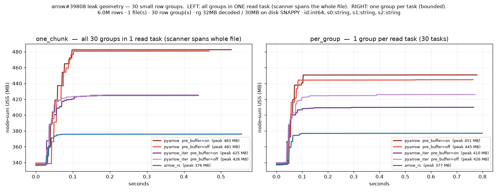
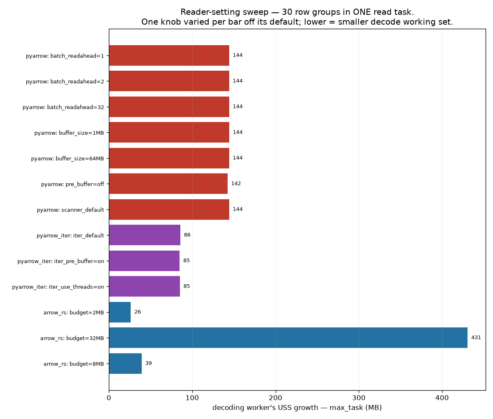

# arrow-rs Parquet reader — measurement archive (superseded detail)

This file holds the **historical record** moved out of [Agents.md](Agents.md) when that
doc was compressed (2026-07-28). Everything here is *true as measured at the time* but
superseded as evidence: the macOS-era numbers (per-PID RSS / windowed node-sum USS
metrics, both since retired) reproduced later on Linux under the metric of record
(Agents.md §5.10), which is the citable result. Section numbers are preserved from
Agents.md — a `§5.7` reference in either file means the same section; Agents.md keeps a
short stub with the load-bearing conclusion, this file keeps the full data and narrative.

---

## §3.5.1 (full) — The Linux relapse: how the windowed-incremental metric lied

The mac harness plotted **absolute** USS; when the suite moved to the Linux workspace,
`bench_suite.py` switched to **windowed incremental node-sum USS** (peak minus each
worker's first-in-window sample, summed over workers) to cancel the idle pre-started
workers of a shared many-core node. That rebuilt the import-ramp trap in a subtler form,
and it bit: one layout run reported arrow-rs **6.8× worse** on a many-small-groups file
(153 vs 22 MB) — a result every other measurement contradicted.

The postmortem killed three hypotheses in a row, each by direct measurement rather than
another theory: **(1)** per-row-group crate-call overhead — dead: a Ray-free probe
(`micro_alloc_probe.py`) decoding the *same file* showed one-call-for-all-groups and
one-call-per-group within 1 MB of each other; **(2)** allocator retention (glibc vs
PyArrow's jemalloc) — dead: the same probe under `LD_PRELOAD` jemalloc moved nothing,
and arrow-rs standalone peaked at **38 MB vs PyArrow's 89 MB** on that very file;
**(3)** lazy extension import multiplying per worker — dead: import+init measured **zero**
(baseline 27.7 MB = import-and-touch 27.7 MB). What remained: the metric itself. A read
landing on a **cold** worker pays its ~100 MB import ramp *inside* the window; a **warm**
worker's baseline *hides* warmup-retained heap — and retention scales with the reader's
own working set, so baseline subtraction **systematically flatters whichever reader
retains more** (PyArrow) and penalizes the other. Decisive on small fixtures (~90 MB
signal vs ~100 MB bias), negligible on big ones. The anomalous run's traces were
destroyed by its own rerun (`_run_dir` wipes per run); every reproducible source —
mac (§5.5), Ray-free probe, fresh per-worker Linux traces (arrow-rs Δ89.1 vs PyArrow
Δ98.7, one worker each) — shows parity-to-better.

Retired as verdict metrics: windowed incremental USS (node-sum and per-worker), peak
bars, and summary scalars (peak ratio, CV) — single numbers invite selective reading;
the time series is the claim. An earlier revision also drew a constant
E = 2×target_max_block_size expected line from `context.py:44`; retired — it is a design
heuristic nothing enforces; the measured decomposition (floor + compressed-in-flight +
one block) answers the actual question. One trap for future instrumentation:
`BlockExecStats.start_time_s` is `perf_counter`-based despite its docstring
(`block.py:264`) — it cannot be aligned with epoch-stamped samples; that is why the
worker hook logs epoch windows itself.

---

## §5.0 (full) — One variable swept at a time (macOS memory-over-time galleries)

Each image holds **5 panels — one variable swept across 5 levels, everything else held
fixed** — with both readers overlaid, node-sum USS sampled at 5 ms, and the x-axis
trimmed to the measured read window. Each panel's title carries the two peaks and the
ratio. Generated by `bench_suite.py <sweep>` → `summarize.py` (`sweep_size`,
`sweep_schema`, `sweep_rowgroup`, `sweep_files`, `sweep_batch[_dd]`).

**Sweep 1 — file size (the headline).** Flat int64 table, one big row group, 14 MB → 1.4 GB.

Parity at 14 MB (368 / 358 MB, 1.0×), widening monotonically to **4.4× at 1.4 GB (2825 →
646 MB)**. arrow-rs's peak is nearly flat (~360 → 646 MB) while PyArrow's scales linearly
with the group it must fully materialize.

**Sweep 2 — where the gap lives (row-group layout).** *Same 400 MB of data* every panel;
only the row-group chunking changes.

Many tiny groups → the one regime arrow-rs was **slightly behind on macOS** (0.9×). As
the groups grow the gap opens — 1.6× → 1.6× → 1.6× → **2.7× at one whole-file group**.
The win is a function of *row-group size*, not file size.

**On that first panel (the 0.9× loss) — the observation stood; the first diagnosis did
not.** Per-worker, arrow-rs's high-water in the many-tiny-groups regime was actually
*lower* than PyArrow's (163 vs 171 MB); the node-sum gap lived in the tail — PyArrow
workers gave ~30–40 MB back before exiting while arrow-rs workers held their peak to
exit, and ~80 churning workers overlapped near their held peaks. We initially
generalized this into an **allocator-retention theory** (glibc holding freed pages vs
PyArrow's jemalloc decaying them) and wired two Linux levers to fix it. The Linux
Ray-free probe then **disproved the allocator theory** (§5.10): on the many-small-groups
file, per-group calls retain nothing beyond one-call decode, `LD_PRELOAD` jemalloc
changes nothing, and arrow-rs standalone uses **2.3× less** than PyArrow (38 vs 89 MB).
The mac tail-release behavior was real as observed but is not an arrow-rs memory
problem; the "loss" lived entirely in the no-pressure regime under a since-retired
node-sum metric. The crate's allocator build features were later removed outright
(§6.9); `LD_PRELOAD`/`MALLOC_ARENA_MAX` remain as harness-side A/B knobs (§7.8).

**Sweep 3 — column dtype.** 2 M rows, one big row group, five schemas.

int / float / wide-string cluster at 1.2×; `large_str` hits **4.0× (2835 → 707 MB)**.
arrow-rs stays flat (~490–707 MB) across all five.

**Sweep 4 — file count (the single-node overcommit).** One big row group per file, 1 → 8
files read across 4 workers.

Both rise with concurrency, but arrow-rs holds a steady **~1.6–1.8×** edge at every file
count. At 8 files: 2683 → 1611 MB.

**Sweeps 5–6 — the decode-budget knob (and its honest limit).** *Same 400 MB group*;
only `decode_budget_bytes` changes (1 → 64 MB). Left: `iter_batches`. Right: `decode_drop`.

Locally the budget knob **barely moves** arrow-rs's peak (flat ~680 MB retained /
~500 MB dropped across every budget). With K=1 the sync reader reads the *whole* row
group before decoding, so the working-set floor is dominated by the group buffer, not
the decode batch. The real lever locally is decode-and-release vs retain-whole-table
(~180 MB gap between modes), not the budget. (The budget matters where the reader can
stream a fraction of the group: the K-split and S3 async paths.) Against all of it,
PyArrow sits at ~1960 MB — **~3–4×** higher regardless of the knob.

## §5.1 (full) — Huge single row group (8 M rows, 1 file, 1 row group, 3 string cols ×48, ~800 MB decoded)

`iter_batches` (realistic — full output materialized):

| reader | peak single-worker | total | wall | vs PyArrow |
|---|---|---|---|---|
| PyArrow | **2332 MB** | 2327 MB | 8.15 s | — |
| arrow-rs K=1, budget 8 MB | **519 MB** | 520 MB | **5.14 s** | **4.5× less mem, 1.6× faster** |
| arrow-rs K=4 | 660 MB | 661 MB | 5.11 s | more mem, ~same speed |
| arrow-rs K=8 | 663 MB | 665 MB | 4.88 s | more mem, ~same speed |

**K costs memory (+140 MB K=1→4) for essentially no local speed.** K=1 is the clear
local default.

Same fixture, `decode_drop` (touch every column, drop output — isolates raw decode CPU):

| reader | total retained | wall (two runs) |
|---|---|---|
| PyArrow | **~1.4–1.5 GB** | **0.86–0.94 s** |
| arrow-rs K=1 | ~0–1 MB | 1.22–1.25 s |
| arrow-rs K=8 | ~29 MB | 1.15 s |

(a) even decoding-and-dropping, PyArrow holds the whole ~1.4–1.5 GB row group resident
while arrow-rs retains ~nothing; (b) arrow-rs raw decode is ~25–40% slower *here* — but
per §5.7 that is the wide-string worst case with PyArrow using threads a Ray worker
wouldn't have; at matched 1 thread the gap is ~1.5× on this schema and ~parity on
moderate strings. The single-worker RSS for arrow-rs in decode_drop mode is a macOS
measurement artifact — read the `total` column for those rows.

> Reconciling (a) vs the first table: decode-drop PyArrow is *fast* (~0.9 s) but *heavy*
> (~1.4 GB); `iter_batches` PyArrow is *slow* (8.15 s) and *heavier* (2.3 GB). Moving
> the full 800 MB through the object store and materialization path makes PyArrow's
> giant peak pay a memory-pressure tax that arrow-rs's streaming avoids — the raw-decode
> CPU deficit is more than repaid the moment output is actually consumed.

## §5.2 (full) — Medium single row group (2 M rows, ~200 MB), `iter_batches`

| reader | peak single-worker | wall |
|---|---|---|
| PyArrow | 682 MB | 0.95 s |
| arrow-rs (any budget 1–16 MB, K=1) | **~500–518 MB** | 0.90–1.05 s |

1.3× less memory, speed within noise. The memory win shrinks as the row group shrinks
(the *ratio* grows with file size). `decode_drop` on the same fixture: arrow-rs
**~184 MB vs PyArrow 465 MB (2.5×)**, near speed parity.

## §5.3 (full) — Multi-fragment layouts

Multi-row-group single file and 8-file fixtures: peak single-worker at **parity** with
PyArrow (122 vs 118; 106/132 vs 102/129 — all macOS noise). When Ray splits the work
across workers, neither reader has a big row group to blow up on; arrow-rs neither
helps nor hurts.

## §5.4 (full) — Knob summary (macOS)

- **decode budget:** flat above ~1 MB in `iter_batches` (128 MB coalesce + retention
  dominate); visible in `decode_drop`. 8 MB was the safe default at the time.
- **K (local):** scales memory **up** ~linearly (~15–35 MB/level), negligible local
  speed benefit → **K=1 local default**.

## §5.5 (full) — Expanded suite (the macOS-decisive axes)

Harness: `release/nightly_tests/dataset/arrow_rs_memtrace/bench_suite.py` (`layout`,
`schema`, `tuning`, `leak`, `mixed`). All wall times `iter_batches`, K=1, 4 CPUs, warm.

**Layout (5 file/row-group shapes, wide-string schema).** arrow-rs at parity on every
shape; the only >1.0 is the lone big row group (the K=1 decode-CPU gap):

| layout | PyArrow | arrow-rs | rs/pa |
|---|---|---|---|
| small, 1 row group | 0.118 s | 0.123 s | 1.04 |
| small, many row groups | 0.202 s | 0.202 s | 1.00 |
| one large row group | 0.608 s | 0.675 s | 1.11 |
| many large row groups | 1.044 s | 1.032 s | 0.99 |
| **mixed large+small groups** | 1.133 s | 1.147 s | **1.01** |

The last row matters: alternating 500 K/20 K row groups is the exact shape that exposed
an **O(n²) reader-rebuild trap** in a *different* (standalone-Linux) codebase —
rebuilding the reader per batch with a growing `RowSelection` skip. Our crate is at
1.01× there, because `RowGroupSeqReader` builds **one** reader per row group at a
footer-computed byte-budget batch size and streams it; the trap is structurally absent.

**Tuning (`decode_budget_bytes` sweep on the one-large-row-group file).**

| budget | wall | vs PyArrow |
|---|---|---|
| 1 MB | 0.795 s | 1.26× |
| 2 MB | 0.732 s | 1.16× |
| 4 MB | 0.665 s | 1.05× |
| **8 MB** | 0.638 s | **1.01×** |
| 16 MB | 0.646 s | 1.02× |
| 32 MB | 0.616 s | 0.97× |

**Mixed-schema, multi-file (6 files: int, float, wide_str, large_str, huge_str, + a
struct file — one dataset).** The 5 flat files route native, the struct file routes to
PyArrow fallback, in a single read, with no breakage. arrow-rs wins on both wall (25%
faster) and memory (1.42×):

| reader | wall | node-sum peak | path |
|---|---|---|---|
| PyArrow | 1.350 s | 996 MB | — |
| arrow-rs | **1.010 s** (0.75×) | **700 MB** (1.42×) | 5 native / 1 fallback (struct) |

**Leak (8 repeated reads of the same file in one session).** Both readers hold a flat
USS floor across all 8 reads — no ratchet. arrow-rs's steady state ~80 MB lower (~527 vs
~610 MB). Per-iter wall flat-to-declining for both.

**Schema coverage / path parity (8 dtypes).** Every dtype byte-identical between
readers; the support gate routed 8/8 correctly after a fix — pyarrow's canonical
`fixed_shape_tensor` originally slipped the gate (not `isinstance(pa.ExtensionType)` in
pyarrow 24); fixed by rejecting any type with an `extension_name` at every level of the
type tree. (Since superseded: §6.8 made all extension types native.)

## §5.6 (full) — Scaling (O(n) proof) and single-node concurrency

Two distinct "regressions," only one real: (1) the O(n²) reader-rebuild trap — a
different codebase, structurally absent here; (2) a single-thread decode-CPU gap —
real, schema-dependent (§5.7).

Single row group, wide-string, `iter_batches`, sweeping row count at fixed 8 MB budget:

| rows | PyArrow µs/row | arrow-rs µs/row | rs/pa wall |
|---|---|---|---|
| 1 M | 0.322 | 0.355 | 1.10 |
| 2 M | 0.317 | 0.327 | 1.03 |
| 4 M | 0.404 | **0.313** | **0.77** |
| 8 M | 0.450 | **0.290** | **0.65** |

PyArrow's peak climbs linearly (596 → **2314 MB**); arrow-rs's byte budget holds it flat
(527 → 725 MB) — the ratio widens to **3.2× at 8 M rows**. arrow-rs's µs/row *falls* as
the file grows (O(n), amortizing fixed overhead — an O(n²) rebuild would make it rise);
PyArrow's rises; the curves cross near ~3 M rows and arrow-rs ends 35% faster at 8 M.

**Single-node concurrency — the actual overcommit.** N files, each one big row group,
across K workers; node-sum peak USS:

| fixture (per-file group) | CPUs | PyArrow node-sum | arrow-rs node-sum | pa/rs | walls (pa / rs) |
|---|---|---|---|---|---|
| medium, 8×1 M (~100 MB) | 4 | 792 MB | 709 MB | 1.12× | 2.46 / 2.15 s |
| **big, 4×4 M (~400 MB)** | 2 | 2496 MB | 1235 MB | **2.02×** | 6.68 / 5.19 s |
| **big, 4×4 M (~400 MB)** | 4 | **3066 MB** | **1727 MB** | **1.78×** | 5.98 / 5.07 s |

The gap tracks per-file row-group size and grows with worker count (PyArrow's node-sum
climbs 2.50 GB at 2 CPUs → 3.07 GB at 4) — §3.2's packing-toward-OOM behavior observed.

## §5.7 (full) — Raw decode CPU, isolated (Ray-free)

`standalone_decode_bench.py` drives the crate's decode loop and PyArrow's
`iter_batches` directly (no Ray), decoding every batch and dropping it:

1. **PyArrow's decode speed is mostly multi-threading, which Ray disables per worker.**
   Standalone PyArrow uses all cores; pinned to one thread it is 3–4× slower. A Ray read
   worker runs `pa.cpu_count()==1` — so the fair comparison is 1-thread:

   | 8 M rows, decode+drop | wall | vs pyarrow-1thread |
   |---|---|---|
   | pyarrow, 18 threads (standalone only) | 0.14–0.19 s | 0.26–0.44× |
   | pyarrow, **1 thread** (what a Ray worker gets) | 0.43–0.53 s | 1.00× |
   | arrow-rs k=1 | 0.52–0.68 s | **0.98× (16-char) … 1.56× (48-char)** |
   | arrow-rs k=4 | 0.48–0.62 s | 0.72× … 1.43× |

2. **The 1-thread gap scales with string width, not with n.** Moderate strings (6 cols ×
   16 chars): parity (0.98×); wide strings (3 × 48): ~1.56× slower — the deficit lives in
   arrow-rs's **wide-string decode kernel**, the concrete thing to optimize. K-split
   partially closes it (1.56→1.43×) and beats 1-thread PyArrow on moderate schemas
   (0.72×).

Iterate on the crate with `standalone_decode_bench.py --budgets … --ks …` before
confirming in the Ray suite.

## §5.8 (full) — Is the gap missing pipelining? (No, locally — yes on S3) and best-tuned

Hypothesis: PyArrow overlaps I/O with decode (`pre_buffer` prefetch) while the local
`RowGroupSeqReader` is synchronous. **Empirically no, locally:** `cpu/wall` is **1.00**
on every warm-cache k=1 run — no I/O stall to hide; on a warm page cache the "read" is a
memcpy. The residual gap is the string kernel. (`cpu/wall` climbs above 1 only when k>1
adds decode threads — 2.75 at 2 M / k=4 — CPU parallelism, not I/O overlap.)

On S3 / cold cache it is the opposite — per-request latency is tens of ms; that is why
the S3 path is async and windowed, and why `prefetch_windows` (default 2) exists: within
one stream, up to `prefetch_windows` fetch windows are fetched+decoded concurrently
(each its own tokio task into a depth-1 channel) and drained in row order — window N+1's
GET in flight while window N decodes; the bounded, memory-first analog of `pre_buffer`.
Memory bound ≈ `k × prefetch_windows × fetch_window` compressed in flight. A moto test
(`prefetch_windows ∈ {1,2,4}`) asserts the look-ahead never reorders rows.

**Best-tuned, not single-thread-crippled:**

| 2 M rows, huge_str, decode+drop | wall | vs pyarrow-1thread |
|---|---|---|
| pyarrow, 1 thread (Ray-representative) | 0.107 s | 1.00× |
| arrow-rs k=1, 8 MB | 0.161 s | 1.50× |
| **arrow-rs k=4, 32 MB (best)** | **0.074 s** | **0.69× (faster)** |

Tuned arrow-rs beats the PyArrow a Ray worker gets on a moderate single big group. The
tuning does **not** hold at 8 M (best 1.44×): the depth-2, strictly-ordered range
channels serialize the K threads (`cpu/wall` 2.75 → 1.22) — the deliberate
memory-bounding design (§4.8/§6.3), a known bounded speed cost with a clear
optimization path (bounded-reorder buffer).

## §5.9 (full) — S3 correctness un-gating (the phase log)

What landed in this phase (all still-current design; summarized in Agents.md):

- **Config fidelity.** The reader recovers the full S3 connection config from the
  pyarrow `S3FileSystem` — `fs.__reduce__()[1][0]` round-trips `endpoint_override`,
  `access_key`/`secret_key`/`session_token`, `region`, `force_virtual_addressing` — and
  passes it to the crate's `AmazonS3Builder`. Previously the crate rebuilt a default
  client from ambient env, silently ignoring explicit endpoints/static creds (MinIO /
  moto / credentialed buckets would have broken). Subtlety: pyarrow's `scheme` stays
  `"https"` even for an `http://` endpoint override, so `allow_http` is derived from
  the endpoint URL, not `scheme`.
- **Gate un-gated.** `_arrow_rs_supported` admits `S3FileSystem`; the same schema rules
  apply, so a struct column over S3 fell back exactly as locally (later ungated §6.8).
- **Tested on a moto server** (real HTTP S3 mock — the crate's `object_store` client
  speaks raw S3 HTTP): full-scan parity, projection parity, `ds.sum()` over S3,
  struct-fallback over S3, `_s3_config` recovery unit test, native-path assertion.
- **One real FFI bug found + fixed by these tests:** the S3 path reported the *full*
  file schema while streaming *projected* batches → `ArrowArray struct has 1 children,
  expected 4`. Fixed by building the projected stream once and reporting its schema.
- **Windowed, byte-budgeted, memory-first S3 path.** Ports `main.rs`'s async reader but
  memory-first: each row group's rows are sliced into fetch **windows** so only
  ~`fetch_window_mb` of compressed bytes are in flight per stream; decode is
  byte-budgeted; S3 peak ≈ `window + decode_budget`, flat in row-group size. It does
  **not** copy `main.rs`'s unconditional K-way fan-out: K concurrent GET streams only
  for a lone row group above `split_threshold_bytes` — so crate-K and Ray's 4-thread
  pool never multiply into 16 concurrent GETs. Order-preserving (per-unit tokio
  channels drained in order, depth-2 backpressure), covered by a moto K-split order
  test (K∈{2,4,8}). One shared process-wide tokio runtime (was: per-fragment).
- **`prefetch_windows`** intra-unit look-ahead — see §5.8.

Measurement was deferred to Linux + real S3 and has since run: Agents.md §5.10.

## §5.11 (full) — Reproducing the arrow#39808 leak geometry inside Ray

The `leak_multigrp` axis: 6 M rows of fat strings, `row_group_size=200_000` ⇒ 30 row
groups (~32 MB decoded each, ~900 MB total), read two ways via
`ctx.parquet_chunker_target_chunk_size`: **`one_chunk`** (all 30 groups in one read task
— the leak geometry) and **`per_group`** (one row group per task — V2's normal shape).

Isolation matters: a first run came back flat ~500 MB across every reader — the fixture
fit in one 128 MB output block, so every worker held it whole regardless of decoder. Fix:
fixture ≫ one block, `ctx.target_max_block_size = 8 MiB`, `decode_drop` consume. Metric:
`max_task` = the decoding worker's USS growth above its warm floor.

| chunk_mode | pyarrow (scanner) | pyarrow_iter | arrow-rs |
|---|---|---|---|
| **one_chunk** (30 groups, 1 task) | **144 MB** | 85 MB | **39 MB** |
| **per_group** (1 group/task) | 110 MB | ~78 MB | 39 MB |

1. The #39808 tiering reproduces end-to-end in Ray: scanner > `iter_batches` > arrow-rs.
2. **V2's scanner does not catastrophically leak:** in `one_chunk` it holds ~144 MB of a
   ~900 MB file (~4–5 groups of readahead) — it streams; the chunker + 
   `fragment_readahead=1` bound the classic "holds the whole file" #39808.
3. A real but bounded residual: bundling groups raises the scanner 110→144 MB —
   chunk-size-dependent growth. `iter` and arrow-rs are flat across both modes.

## §5.12 (full) — Sweeping the PyArrow reader's own settings ("just tune PyArrow")

`reader_settings` (`bench_suite.py`) sweeps one setting per run in the `one_chunk`
geometry. Env knobs added for this: `RAY_DATA_PARQUET_PRE_BUFFER`,
`RAY_DATA_PARQUET_ITER_USE_THREADS`, `RAY_DATA_PARQUET_FRAGMENT_READAHEAD`
(`batch_readahead` / `buffer_size` were already env-wired).

| reader | knob swept | `max_task` |
|---|---|---|
| pyarrow (scanner) | `batch_readahead` 1 / 2 / 8 / 32 | **144 / 144 / 144 / 144 MB — flat** |
| | `buffer_size` 1 / 8 / 64 MiB | **144 MB — flat** |
| | `pre_buffer` on / off | 144 / 142 MB — flat |
| pyarrow_iter | `pre_buffer` on / off | 85 MB — flat |
| | `use_threads` off / on | 85 MB — flat |
| arrow-rs | `decode_budget` 2 / 8 / 32 MiB | **26 / 39 / 431 MB — moves** |

**PyArrow exposes no knob that lowers its decode floor** — the scanner is a rigid
~144 MB, `iter_batches` a fixed ~85 MB (≈ one row group). (Verified the knobs genuinely
reach the workers — the flatness is real, not a plumbing bug.) arrow-rs is the only
reader with a working memory knob (26 MB @ 2 MiB budget). Caveats: (a) `pre_buffer` is
an S3 I/O-coalescing knob, not a local memory lever (144 vs 142 MB); (b) the
`budget=32 MiB → 431 MB` non-linear cliff is an open anomaly (see TODO.md) — not a
number to quote as clean.

---

## §6.1–§6.6 (full) — Phase 1–2 fixes (macOS integration + measurement hardening)

**6.1 Removed reader-side block accumulation (§4.3).** The headline fix. −25 lines,
eliminated a full second block-sized buffer per worker, brought multi-fragment
peak-single-worker RSS from ~1.4× PyArrow down to parity.

**6.2 Fixed benchmark memory attribution.** Per-PID min→max RSS, self-baselined against
the same PID's minimum (a global-baseline subtraction had produced a spurious ~0 MB
single-worker reading). Added the `decode_drop` consume mode to isolate the decode
working set from output retention — what made the 2.5× decode-layer memory win (and the
decode-CPU gap) visible instead of masked by the shared 128 MB coalesce buffer.

**6.3 Tuned K and found its local ceiling (the important negative result).** Swept
K∈{1,2,4,8} × budget∈{1,2,4,8,16 MB} up to 800 MB. K-split does not pay off locally: it
costs memory for ~no speed, and even the speed it gives (1.25→1.15 s at K=8) is far
short of K×. Root cause is a deliberate correctness design (§4.8): ordered drain +
depth-2 bounded channels stall ranges 1..K-1 after 2 batches until range 0 drains.
Ordered output + bounded memory + parallel contiguous-range decode = pick two. Locally
there is also no network latency to hide. **K=1 local; K-split reserved for S3.**

**6.4 Added the K-split parity+order test** (`test_kspilt_parity_and_order`): forces the
split path on a single big row group, asserts byte-identity to the sequential path and
to PyArrow, and that `id` comes back exactly `0..n-1`. Plus the broader suite: local
parity/projection, gate fallbacks, `ds.sum()` parity, and the S3 moto suite incl. the
windowed S3 K-split order test (K∈{2,4,8}).

**6.5 Diagnosed and retired a biased memory metric** (see §3.5.1 above).

**6.6 Built the metric-of-record instrumentation.** Worker hook patches
`FileReader.read` to log epoch task windows (one shared patch point for both readers);
each run records `meta.json` (reader, block size, knobs, warmup boundary, max row-group
compressed size); `task_mem.py` renders per-task absolute USS vs each reader's
expected-without-decode line, bracketing sub-sampling-interval windows so no task is
dropped. Support instruments: `micro_alloc_probe.py` (Ray-free crate-vs-PyArrow A/B,
allocator `LD_PRELOAD` + import-cost modes) and `inspect_run.py` (per-worker drill-down).
The hook imports `ray.data` at worker startup to equalize import floors; node-sum
absolute peak kept only as an alive-gated sanity column.
