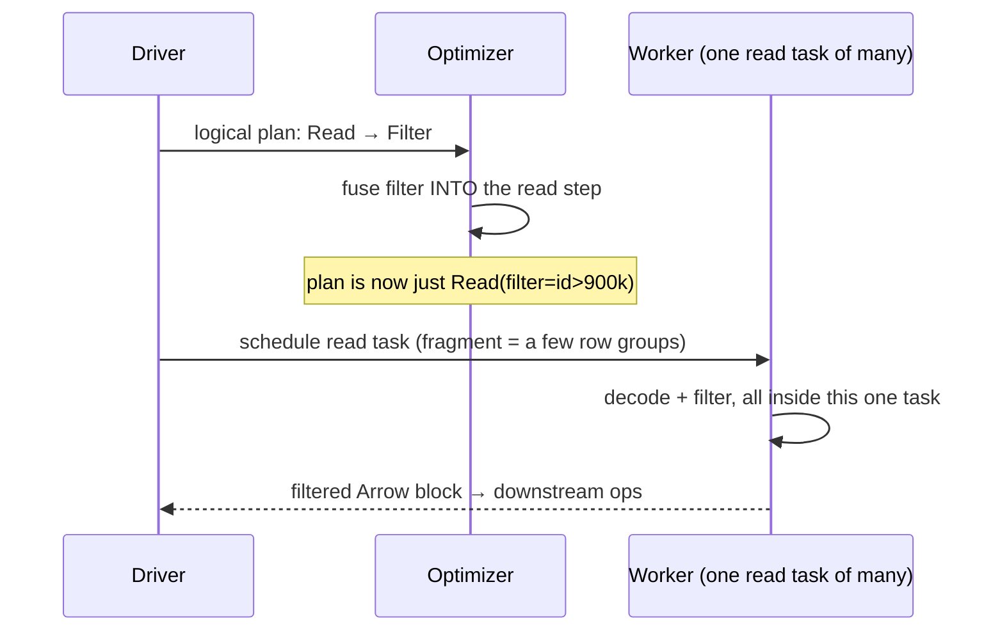
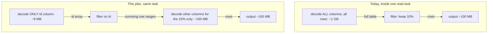
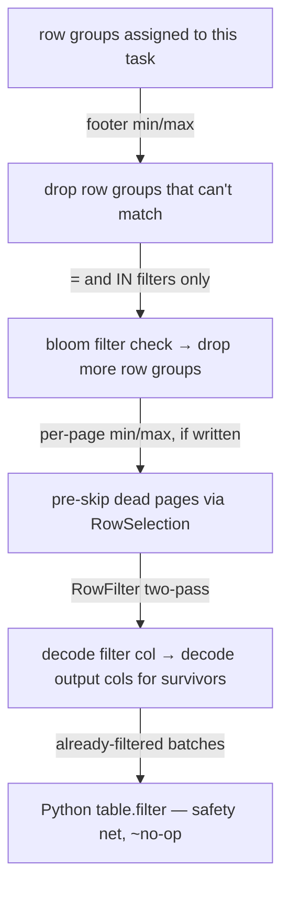

# Implementation plan: statistics pruning + late materialization in the arrow-rs reader

Companion to `Agents.md` §7.9 (background + rationale). This file is the
*execution* plan: what we build, in what order, and how we know each step
worked.

## Status (2026-07-22, code-verified)

- **Phase 1 (row-group stats pruning) is already DONE** — and not as a Rust
  reimplementation. The arrow-rs reader mirrors the base PyArrow path
  line-for-line: `fragment.subset(filter=filter_expr)` prunes row groups on
  footer min/max, the surviving ids flow through to the crate as `row_groups=`,
  and Rust opens only those groups. Verified chain:
  `arrow_rs_parquet_file_reader.py:388` (`subset`) → `:390` (surviving ids) →
  `:428`/S3 `read_row_groups(_s3)(row_groups=…)` →
  `native/…/src/lib.rs:419` (`selected`) → `:262` (`.with_row_groups(vec![rg])`).
  Identical to `parquet_file_reader.py:401` on the base path — true parity, zero
  extra I/O (footer already parsed). **So Phase 1 below is superseded: do not
  build `prune_row_groups` in Rust.** pyarrow is always present; a Rust copy
  buys nothing.
- **Late materialization (Phase 2) is deferred, and its home is the query
  planner, not the reader.** The optimizer already fuses the predicate into the
  Read op (`PredicatePushdown`); the clean design is for the planner to pass the
  pushdown as a *hint* the reader forwards to arrow-rs's `RowFilter`, so the
  decision of which conjuncts are safe/worth pushing lives with the plan and the
  reader stays dumb. Not building it in the reader now.
- **Correctness asymmetry to keep in mind.** The Python safety-net
  `table.filter` only catches over-*inclusion* (rows kept that should drop). It
  cannot recover rows a buggy *prune* dropped — over-*exclusion* is
  unrecoverable. Late materialization (Phase 2) is the safe half (it yields
  exactly the rows `table.filter` would). The page-index / bloom prunes
  (Phases 3, 5) are the correctness-critical, low-availability half.

The phases below are kept as the original design of record; read them through
the status above.

## 0. The idea in one paragraph

When a query has a filter like `id > 900_000`, today's reader decodes **every
column of every row** and then throws away the rows that fail the filter.
That wasted decode costs CPU and memory. The fix has two halves:

1. **Prune before decoding** — use metadata that's already in the file
   (min/max stats, bloom filters, page index) to skip whole row groups and
   pages that can't contain matching rows.
2. **Late materialization** — for whatever survives pruning, decode *only the
   filter's column* first, evaluate the filter on it, and then decode the
   remaining (usually much wider) columns only for the rows that passed.

Every mechanism in this plan only removes rows the filter would remove
anyway, and the existing Python `table.filter` still runs at the end as a
safety net. So if any stage can't run (metadata missing, operator we don't
support), it silently passes everything through and the results are still
correct.

## 1. How this fits into Ray's execution (read this first)

A confusion worth killing up front: Ray Data is lazy, but "lazy" only means
the *plan* is built without running anything. Once you consume the dataset,
the plan runs front to back — and **decoding Parquet is the first step, not
the last**. Downstream operators (map, groupby, join) only ever see decoded
Arrow blocks.

Also, the filter is not a separate stage by the time we run. The optimizer's
`PredicatePushdown` rule fuses the filter *into the read task* before
execution starts:



This already works today — the filter expression arrives inside our reader
at `readers/arrow_rs_parquet_file_reader.py:330-338` and is applied
post-decode at `:402`.

**So this plan adds no tasks, no stages, and no scheduling changes.** It only
reorders work *inside* a read task that already exists — and does less of it:



Same task, same node, same output. The left path decoded ~1 GB to produce
100 MB; the right path decoded ~108 MB. CPU and peak memory both drop,
because the doomed rows never exist as Arrow arrays at all.

## 2. The core mechanism: arrow-rs `RowFilter`

We do **not** hand-write the two-pass decode. arrow-rs's reader builder — the
same one we already call in `RowGroupSeqReader::build_group_reader`
(`native/ray_data_arrow_rs/src/lib.rs:251-267`) — has it built in, via
`.with_row_filter(...)`. Per row group, the builder:

1. Decodes only the filter's columns (a `ProjectionMask` with just those —
   the same mask type we already build at `lib.rs:141-158`).
2. Calls our closure on each decoded batch → a boolean array.
3. Compresses the booleans into a `RowSelection` — literally
   `[skip 3000, select 200, skip 4800, ...]`. Same type we already use for
   K-split (`lib.rs:324`); there we compute it by arithmetic, here the data
   computes it.
4. Decodes the output columns with that selection applied.

Two clarifications that tripped us up in review:

**"Per-row" semantics, batch-at-a-time execution.** Yes, every row of the
filter column (in the row groups/pages that survived pruning) is decoded and
checked. But there is no row-at-a-time loop: the column is decoded in the
same ~2 MiB batches everything already uses, and the check is one vectorized
kernel call per batch (`id > 900_000` over a whole contiguous array). That's
the same cost class as the `table.filter` we run today — just pointed at one
narrow column instead of the full-width table. The check is the cheap part;
skipping the wide-column decode is where the win is.

**What "skip N rows" actually costs in pass 2.** The selection is run-length
ranges, and the cost of a skipped run depends on where it falls:

| Skip run covers | Cost |
|---|---|
| Whole pages, page index present | ~free — pages never read (on S3: never fetched) |
| Rows inside a live page | cheap — page is decompressed, but values are fast-forwarded, no Arrow arrays built |
| (`select` runs) | normal decode, only for those rows |

This is also why the pruning stages below matter: every row group or page
eliminated *before* pass 1 means the filter column isn't decoded there
either.

## 3. The pruning cascade (coarse → fine)

Each stage is cheaper than the next and only shrinks the work the next stage
sees. A stage whose metadata is missing just passes everything through.



What each stage needs from the file, and how often it's there:

| Stage | Metadata | Availability |
|---|---|---|
| Row-group prune | column-chunk min/max in the footer | almost always written |
| Bloom prune | per-column-chunk bloom filter | only if writer opted in (Spark/arrow-rs can; pyarrow can't) |
| Page prune | page index (`write_page_index=True`; parquet-mr ≥ 1.11 default) | often absent from pyarrow-written files |
| Late materialization | nothing | always available |

## 4. Where the pieces already are

| Piece | Location | Status |
|---|---|---|
| Filter arrives at reader | `arrow_rs_parquet_file_reader.py:330-338` | done (pushdown works) |
| Post-decode filter (being demoted to safety net) | same file, `:402` | keep |
| Row-group pruning, both paths | `parquet_file_reader.py:401` and `arrow_rs_parquet_file_reader.py:388` (`fragment.subset`) | **done, at parity** — native path prunes the same groups as PyArrow (superseded Phase 1) |
| `RowSelection` use in crate | `lib.rs:324` (K-split), `:576` (S3 windows) | done — same primitive |
| Projection masks in crate | `lib.rs:141-158` | done — reused for the filter's columns |
| Footer metadata in crate | `lib.rs:419` (local), `:674` (S3) | done — stats pruning needs no extra I/O |
| Page index load policy | `lib.rs:413-418` | change: load `Optional` whenever a filter is pushed |

## 5. Getting the filter into Rust: a tiny JSON IR

Rust needs to know what the filter *is*. The pyarrow expression in
`scanner_kwargs["filter"]` is a black box (can't be inspected from Python),
but `self._predicate` — Ray's own expression tree — is ours to walk. So:
Python walks the Ray expression, writes it as small JSON, and passes that
string as one new optional argument to `read_row_groups`. Rust parses it
with serde.

Supported nodes (v1); literals are int / float / string / bool / null:

```json
{"op": "and", "args": [...]}          {"op": "or", "args": [...]}
{"op": "not", "arg": ...}
{"op": "gt|ge|lt|le|eq|ne", "col": "id", "value": 900000}
{"op": "is_null|is_not_null", "col": "x"}
{"op": "in", "col": "user_id", "values": [1, 5, 9]}
```

**Partial pushdown:** split the top-level `AND` into pieces ("conjuncts") and
push only the pieces we support. The Python safety-net filter applies the
*full* expression, so unpushed pieces still filter correctly. Pushing a
subset is always safe — a piece of an AND can only remove rows the whole
filter would also remove.

**Gate:** we only push when `_arrow_rs_supported` already said yes — and it
already checks the filter's columns, because `_resolve_read_columns` folds
them into the read set.

## 6. Phases

Ordered by value ÷ effort. Each is independently shippable and benchmarkable.

### Phase 0 — IR translation (Python only, no behavior change)

New module `_internal/datasource_v2/native/predicate_ir.py` with
`expr_to_ir(expr) -> Optional[dict]` walking `ray.data.expressions` classes.
Any unsupported node → that conjunct is dropped from the IR (not the whole
filter). Unit tests per operator; mixed supported/unsupported AND keeps the
supported piece.

*Done when:* pure-Python tests pass; nothing else changes.

### Phase 1 — Row-group pruning in the crate (SUPERSEDED — already done in Python)

**Do not build this.** See the Status block at the top: row-group pruning is
already live on the native path via `fragment.subset(filter=filter_expr)`
(`arrow_rs_parquet_file_reader.py:388`), identical to the base PyArrow path, and
the surviving row-group ids are passed straight to the crate. The premise below
— "our native path doesn't prune" — was wrong; it does, at parity, with zero
extra I/O. A Rust reimplementation would only duplicate what pyarrow's footer
reader (always present) already gives us. The original design is retained below
for the record only.

- Add `predicate_ir: Option<String>` to both crate entry points; parse into
  an enum.
- New `prune_row_groups(meta, pred, selected) -> Vec<usize>`: for each row
  group, check each conjunct against the footer's per-column min/max and
  null count. Drop the group only when the stats *prove* no row can match.
  Missing stats or an operator we can't reason about → keep the group.
  The footer is already parsed (`ArrowReaderMetadata`), so this needs zero
  extra I/O.
- Type care: compare stats to the IR literal with numeric widening
  (int literal vs int32 column etc.). String stats only for UTF-8 columns,
  byte-wise (that's how Parquet orders them).

*Done when:* on a file sorted by `id` with 8 row groups, `id > 900_000`
builds a reader for exactly 1 group; results match the PyArrow path at 0%,
~10%, 100% selectivity, plus all-null and no-stats columns.

### Phase 2 — `RowFilter` late materialization (local path)

The core (mechanism in §2).

- Evaluator `eval_pred(&PredExpr, &RecordBatch) -> BooleanArray` using arrow
  compute kernels (`arrow_ord::cmp::*`, `and_kleene` / `or_kleene` / `not`,
  `is_null`). `IN` = fold of `eq` + `or_kleene` (fine for the short lists
  Ray pushes). Cast the literal to the column's type once, up front.
  - Nulls must behave like SQL (and like `pyarrow.compute`): use the
    `_kleene` kernels, and a null filter result means the row is dropped —
    same as `table.filter`.
- Build `RowFilter::new(vec![ArrowPredicateFn::new(pred_mask, closure)])`.
  `ArrowPredicateFn` is just a struct holding a projection mask plus a
  closure `RecordBatch -> BooleanArray` — think "callback object". The
  builder does the two-pass internally; we never hand-roll it.
- Wire into `build_group_reader` (`lib.rs:251`). The builder is consumed per
  row group and `RowFilter` isn't clonable, so keep the parsed expression in
  the reader struct and construct the filter fresh per group.
- **v1 keeps the output columns unchanged** (user columns ∪ filter columns,
  like today), so the Python safety-net filter always finds its columns.
  Shrinking the output to user columns only — filter-only columns would then
  never cross the FFI boundary at all — is a follow-up after the golden
  tests pass.
- **K-split:** when a filter is pushed, force the sequential path (skip the
  branch at `lib.rs:431`). Composing the filter's `RowSelection` with K
  range selections is a follow-up; K=1 is the default everywhere anyway.
- Memory: pass-1 batches obey the same `byte_budget_rows` clamp, pass-2
  batches are strictly smaller than today's. Peak should *drop* on selective
  filters.

*Done when:* results row-for-row identical to the PyArrow path across
selectivity {0, 1, 10, 50, 100}%, null-heavy columns, string + numeric
filters, AND/OR/NOT/IN — and output row order is preserved (selections are
ordered, so it is).

### Phase 3 — Page pruning (page index → pre-seeded `RowSelection`)

- Load the page index whenever a filter is pushed: local policy at
  `lib.rs:413-418` becomes `Optional` when `predicate_ir.is_some() || k > 1`
  (S3 already loads it).
- New `page_prune_selection(meta, rg, pred) -> Option<RowSelection>`: walk
  each page's min/max for range conjuncts; pages that can't match become
  `skip` runs (row ranges come from the offset index). Intersect across
  conjuncts. `None` when there's no index or no range conjuncts.
- Apply with `.with_row_selection(sel)` — arrow-rs composes it with a
  `RowFilter` (selection first, filter refines), so this stacks on Phase 2
  with no new code path.

*Done when:* on a fixture written with `write_page_index=True` (one fat
sorted row group), decode work measurably drops vs Phase 2 alone; identical
results.

### Phase 4 — S3 async path

- Same `predicate_ir` param on `read_row_groups_s3`; same `RowFilter` on the
  stream builder in `drive_unit` (`lib.rs:578-583`).
- The S3 window already installs a `RowSelection` (`lib.rs:576`); intersect
  it with the Phase-3 selection (`RowSelection::intersection`).
- This is where pruning pays twice: skipped pages are **never fetched** —
  bytes off the wire drop, not just decode CPU. The
  `fetch_window + decode_budget` memory ceiling is unchanged.

*Done when:* moto suite extended with all Phase-2 correctness cases over S3;
the Linux/real-S3 bench records bytes-fetched vs selectivity.

### Phase 5 — Bloom filters (`=` / `IN` on unclustered columns)

Bloom filters answer the one question min/max can't: "is value 42 *actually
in* this row group?" on a column where min/max spans everything. No false
negatives, so "bloom says absent" → skip the row group, zero data read.
Last because fixtures are awkward: pyarrow's writer can't emit bloom
filters — generate fixtures with the arrow-rs writer (small Rust test
helper) or check in a Spark-written file.

- In `prune_row_groups`, for groups stats couldn't prune and `eq`/`in`
  conjuncts: if the footer records a `bloom_filter_offset` for that column,
  read the `Sbbf` and `check()` each value (sync API:
  `SerializedRowGroupReader::get_column_bloom_filter`; async needs a ranged
  fetch — **verify exact API against the pinned parquet crate first**).
- Cost control: the bloom bitmap is a separate small read (it's not in the
  footer bytes) — on S3, one extra GET per (row group, column). Only issue
  it when an `eq`/`in` conjunct survived stats pruning.

*Done when:* a point lookup on a high-cardinality unsorted fixture prunes
~all non-matching row groups; zero change on files without bloom filters.

### Phase 6 (parallel track, Python-only) — prune at listing time

`ParquetFileChunker.generate_chunk_metadatas`
(`chunkers/file_chunker.py:220-286`) already reads every footer at listing
time. Evaluate the filter there and don't emit chunks whose row groups all
fail min/max → pruned work is never scheduled as a task at all. Helps the
PyArrow path too. Needs the filter plumbed to the chunker (available at
plan-optimization time). Independent of the crate work.

## 7. Test plan (cumulative)

- **Golden equivalence:** every filtered read compared row-for-row against
  the PyArrow path. Parametrize: selectivity {0, 1, 10, 50, 100}%, dtype
  {int64, float64, string, bool}, nulls {none, 50%, all}, layout {1 fat rg,
  many small rgs}, conjuncts {single, AND, OR, NOT, IN, is_null}, page index
  {on, off}.
- **Fallback:** unsupported IR node → conjunct dropped → still correct
  (safety net catches it); native path still taken (assert via
  `RAY_DATA_ARROW_RS_PATH_TRACE`).
- **Ordering:** filtered output preserves file row order.
- **S3:** all of the above through moto (extends the existing 22-test suite).

## 8. Benchmark plan

Add a `filter_selectivity` axis to the memtrace harness
(`release/nightly_tests/dataset/arrow_rs_memtrace/bench_suite.py`): 1M rows ×
(int64 `id` + 1KB string `payload`), sweep selectivity, measure wall time +
per-worker peak USS, arrow-rs vs PyArrow. Expected shape: today arrow-rs
filtered reads cost the same at every selectivity (decode everything, filter
after); after Phase 2 cost should scale with survivors. The existing §3.3
filter workload (2.37× memory win despite wasted decode) is the
before/after headline.

## 9. Risks

- **Matching pyarrow's semantics exactly** (nulls, NaN, string ordering,
  integer casts). Mitigated by Kleene kernels, the golden test matrix, and
  the always-on safety net. Float min/max stats with NaN are unreliable —
  don't prune on them (the parquet crate flags this); let `RowFilter` handle
  floats.
- **Bloom API surface** in the pinned parquet crate needs verification
  before Phase 5 is coded.
- **Filter columns decoded twice** when they're also output columns —
  acceptable in v1; newer arrow-rs caches predicate columns.
- **K-split × RowFilter** deferred; K=1 default means no regression today.
- **Concurrent Agents.md experiment:** this file is standalone, so the
  running benchmark's Agents.md rewrites can't clobber it.
